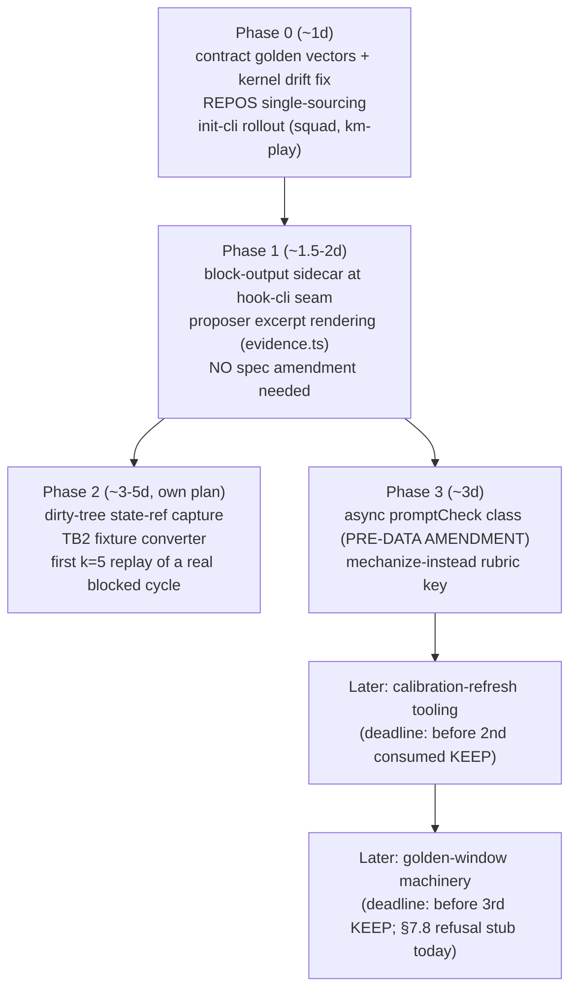

# kkamak enhancement roadmap (2026-07-30, architect-reviewed)

**Status:** ROADMAP — no phase started, no plan docs written yet. Each phase
gets its own brainstorm → plan (`docs/superpowers/plans/`) → SDD execution
with per-task reviews before any build token is spent.
**Origin:** strategic review (MacBook session 2026-07-30) + code-architect
verification pass (every claim below cited to code by the reviewing agent;
corrections applied). Predecessor state: §4.3 build sealed (HISTORY.md GA4),
first dogfood day (GA5), MacBook setup done (resume.md top block).

## Why this roadmap

The §4.3 trial machinery is built and sealed, but the loop is
**event-starved**: ~10 real-work cycles/day on one repo, block-class base
rate ~0.2, so live trials at the registered floors (MIN_N=20/arm) detect
only ~36-point swings — they are a harm ratchet, not an improvement finder
(by design). The bench (TB2) remains the sharp instrument; the daily loop's
jobs are (a) harm-veto on deployment and (b) evidence generation for the
proposer. Both are currently under-fed. Separately, the prose-bullet
actuator is historically weak (R1–R8 null/reject/abstain; only the big seed
prompt ever certified), and the proposer's evidence input is
counts-plus-log, too thin to derive non-junk candidates (round-1 rejection).

This roadmap attacks: offline event amplification, proposer evidence
richness, instrument density, actuator triage — in that order — without
touching any registered verdict semantics.

## Two cross-cutting constraints (bind EVERY phase)

**F1 — calibration-staleness tripwire.** `km-crank/src/calibration.ts`
(`MECHANISM_PATHS`) covers `cc-gate-plugin/src/core/` and
`cc-gate-plugin/vendor/` as directories. Any commit touching them stales the
§4.3 calibration registry → every verdict refused (`pending
calibration-stale`), live trial abandoned at T_MAX. **All capture/emission
work in this roadmap must live at the `hook-cli.ts` seam or new modules
outside those paths** (precedent: reinject/forced/pluginVersion stamping
already lives in hook-cli). Each phase adds a test asserting the feature
branch leaves `git log -- <MECHANISM_PATHS>` unchanged.

**F2 — snapshot-export one-way door.** `scripts/km-sensors-sync.sh` exports
`gate-outcomes` + `trial-arms` for all REPOS into git-tracked
`evidence/kkamak-sensors/<host>/`, deduped by full-line identity, with
refuse-on-shrink. Any data written into `gate-outcomes.ndjson` therefore
reaches the committed snapshot and **can never be retroactively stripped**
(a stripped snapshot line matches no local line → export refuses forever).
Consequence: check-output excerpts and any code-bearing text go in
**sidecar files that are never added to the sync script's `FILES` list** —
asserted by test.

## Phases

### Phase 0 — prerequisites + free events (~1d)

1. **Sensor-contract golden vectors** shared with `~/z2/kkamak`
   (PREREQUISITE, escalated by architect): the reimplemented kernel emits
   `sessionId` and **omits `marker`**, so km-crank's parser
   (`scan.ts` required-field check) silently drops every kernel-emitted
   line — the dogfood repo would contribute zero events despite being in
   REPOS. Fix the kernel to the frozen contract (`sessionID`, `marker`;
   decide `pluginVersion`/`forced` porting) + a golden-vector fixture
   (canonical NDJSON lines) consumed by BOTH repos' suites. Logged in the
   kkamak dogfood log 2026-07-30 (`f9a832e`).
2. **Single-source the REPOS list** — today duplicated in `crank.ts` and
   `km-sensors-sync.sh` (admitted mirror comment); any repo expansion edits
   two places. Cheap hardening before rollout.
3. **init-cli rollout**: `gate.json` + gitignored `.km/` into `~/z2/squad`
   (+ any other real work repos). Note: this yields sensor collection
   (evidence + volume). §4.3 *trial eligibility* additionally requires the
   CC-adapter injection/enrollment seam for that repo — separate decision.

### Phase 1 — proposer evidence enrichment (~1.5-2d, NO amendment)

Block-time capture **sidecar**: the block branch (`core/stop.ts` →
`hook-cli.ts`, which already sees `rawOut`, 64KB-capped) currently
**discards** the failing check output after delivering it to the agent.
New `.km/check-output.ndjson` sidecar keyed `(sessionID, ts, round)` with
size-capped excerpts, written at the hook-cli seam (F1-safe), never
exported (F2-safe by construction). `km-crank/src/evidence.ts` renders
excerpts beside counts for the proposer. Because the gate-outcomes stream
is untouched, **no 5th pre-data amendment is needed** — register the
sidecar as evidence-only in a docs note.
Rationale: turns "5 catches" into "3 of 5 are the same missing-await
pattern" — directly attacks the junk-bullet problem. Cross-host caveat:
sidecar is host-local; the proposer runs where the live `.km/` is —
acceptable.

### Phase 2 — blocked-cycle → bench-fixture harvest (~3-5d, own plan)

The event amplifier: convert rare live blocked cycles into permanent
offline TB2 fixtures, replayable at k=5 forever. Components:
- **Repo state ref** at block time: temp-index `GIT_INDEX_FILE` +
  `git add -A` + `write-tree` + `update-ref refs/kkamak/fixtures/<ts>`
  (non-mutating, anchors against gc; bail out mid-rebase/mid-merge).
- **Fixture record**: state ref + failing check output (from Phase 1
  sidecar) + prompt context (Stop payload carries `transcript_path`,
  currently unread — needs CC-transcript JSONL parsing).
- **TB2 converter**: fixture → `task.toml` + `environment/Dockerfile` +
  `tests/` verifier on the shared ubuntu-24.04 bench image. Real fidelity
  work (macOS Bun repo → container, network installs). Fixtures travel via
  git (podman is office-side; CLAUDE.md git-only rule) — dogfood code text
  enters the repo deliberately: **private-repo fixtures need an explicit
  inclusion decision per repo.**
- No §4.3 ceremony: bench is a separate instrument; candidates it produces
  still enter propose → review → trial.
Kept separate from Phase 1 so converter overruns can't hold the cheap
proposer value hostage (architect: original 1-2d estimate was ~3× low).

### Phase 3 — instrument density + actuator triage (~3d)

1. **Async promptCheck** (PRE-DATA AMENDMENT, skippedStop amendment as
   template): on `edited && !gating` at UserPromptSubmit, spawn the check
   **detached** (gauge double-fork pattern at the same hook; sync is
   unacceptable — it would delay every queued prompt by up to
   checkTimeoutMs). Recovers measurement from the ~1/3 of the stream that
   queued prompts currently destroy (13 skippedStop vs 25 cycles, day 1).
   Amendment must pin: new sensor class excluded from §4.3 verdict metrics
   AND density; `classifyCycle` precedence BEFORE the gauge-only
   `rounds:[]` branch (else swallowed and density-included);
   `joinAndExclude` exclusion rule 8; `newLineCount` volume-contest
   discount; interaction with the skippedStop line at the same trigger
   (replace vs accompany). Emission in hook-cli only (F1).
2. **Mechanize-instead rubric key** in the review gate (5th `RUBRIC_KEYS`
   entry + `computeVerdict` conjunction): a proposed bullet expressible as
   a runnable check → REJECT "mechanize instead"; rejected ledger already
   preserves the reason text as the check-candidate log. Abstain-on-reject
   semantics (do not let the revise seat rephrase around it). Harmonizes
   with spec §4 rule 3 (FA-relevance triage). No calibration impact
   (`minimal/review.ts` not in MECHANISM_PATHS).

### Later (deadline-driven, not next)

- **Calibration-refresh tooling** — spec §4 cadence: fresh calibration arm
  every 2 consumed KEEPs / 60d while a trial is active. Zero KEEPs exist;
  build before the 2nd consumed KEEP. Comes BEFORE golden (cadence-collision
  rule: calibration first).
- **Golden-window machinery** — currently a registered refusal stub
  (`explicitly-not-now.md` §7.8; `runTrialScan` refuses `golden:true`).
  The anti-ratchet against compound tie-drift. Build before the 3rd KEEP.

## Rejected / deferred (with reasons — do not silently resurrect)

- **Exemplar-style playbook payloads** — REJECTED as a direct injection
  class: the review gate's layer-1 leak guard (>60 words, path-like tokens,
  backticks — the ONLY leak guard by design) hard-fails exemplars by
  nature; passing them = bypassing the guard or building a new governance
  class. Also contradicts mechanize-first triage. Salvage: mined exemplars
  feed Phase 2 fixtures and Phase 1 proposer evidence instead.
- **Gauge-routed conditional injection** — v1+ mechanism class; blocked on
  gauge v2 passing M1v2 (class-C precision ≥90%).
- **Skills-library actuator class** — real candidate, needs its own
  registration; after §4.3 has consumed at least one trial.
- **Bandits / sequential stopping** — stays dead per explicitly-not-now
  §7.5.
- **Lowering §4.3 floors** — deciding on noise with ceremony. No.

## Strategy reminders (from the review that produced this)

- Prefer **high-contrast candidates** (seed-scale playbook rewrites) over
  single-bullet tweaks for live trials — low event rates only detect large
  effects; one high-contrast trial beats five undetectable ones.
- **Check-vs-prose doctrine:** anything expressible as a check becomes a
  check, never a bullet (Phase 3.2 mechanizes this).
- **CLAUDE.md is the human fast-lane** for same-day single-incident fixes —
  outside the measured loop, no ceremony; the evidence bar governs machine
  adoption only.
- No new §4.3 machinery of any kind until a trial has consumed data.
