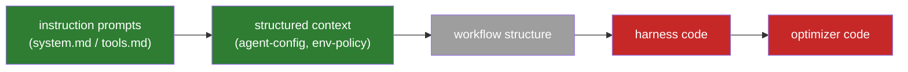

# Explicitly NOT Now

The deliberate non-decisions of the evolution loop — everything we chose *not* to
build, why, what it costs us, and the concrete trigger that reopens each one.

> Companion to [evolution-loop.md](evolution-loop.md) (architecture) and
> [enhancement-roadmap.md](enhancement-roadmap.md) (what we DID build). This doc
> exists so a deferral is a recorded decision with an expiry condition, not a
> forgotten TODO.

**Rule of thumb used throughout:** defer when (a) the blast radius is unreviewable
at solo-dev scale, (b) the mechanism only pays off at a scale we haven't reached,
or (c) a cheaper mechanism already covers the need. Every entry names which.

---

## 1. Where the deferrals sit

The field's search-target progression (Weng): each rung is a strictly larger
search space with a higher ceiling. We stopped, deliberately, after the second rung.

Green = evolved today. Grey = partially reachable (workflow rules can be expressed
as playbook bullets, but structure itself isn't searched). Red = explicitly not now
(§2.1).

---

## 2. The big three (Phase 4 "explicitly NOT now")

### 2.1 Full harness-code self-modification

**What it would be.** The proposer edits the harness itself — runner code, plugin
hooks, tool implementations — the way Self-Harness [2606.09498] and DGM do. The
strongest TB2 numbers in our own research digest came from exactly this
(Self-Harness: +15–21pp on TB2 via *code* changes, not prompt rules). And it is
what this repo's own founding paper does: Meta-Harness [2603.28052] (whose TB2
artifact this repo forks — `stanford-iris-lab/meta-harness-tbench2-artifact`)
searches *harness code* with an agentic proposer reading source, scores, and
traces of all prior candidates through a filesystem; its discovered harnesses
beat the best hand-engineered TB2 baselines. The upstream `agent.py` in this
very repo is a product of that code-space search.

**Why not now.** Unreviewable blast radius (criterion *a*). A bad prompt rule
degrades pass-rate and auto-reverts; a bad code edit can corrupt the store, break
the sandbox contract, or silently disable the selection gate — the one component
the literature says must sit *outside* the loop. A solo dev cannot hand-review
every generated diff, and the maker-checker role is load-bearing here.

**What it costs.** This is the single biggest ceiling on the system. Prompt-space
search has demonstrably lower headroom than code-space search on TB2.

**Revisit trigger / how it would ship.** Reopen when the prompt-space loop
plateaus account-wide (report-loop plateau across ≥2 split rotations at the
account layer). Ship the bounded version, not the general one:

- **AlphaEvolve-style `EVOLVE-BLOCK` regions** — the proposer may emit diffs only
  inside explicitly marked regions of whitelisted files (e.g. the env-snapshot
  probe list, tool-description strings, retry policy constants). Everything
  outside the markers is mechanically rejected.
- Candidate code runs in a **throwaway git worktree** (the pattern Harness
  Evolver already uses), validated by the existing `ab` gate + smoke tiers before
  a human merges it. The gate and store code themselves are permanently outside
  every evolvable region.

### 2.2 DGM parent-sampling / Pareto candidate archives

**What it would be.** Instead of single active-vs-candidate hill-climbing, keep an
archive of candidates; sample parents ∝ performance and ∝ 1/offspring (DGM), or
keep any candidate that is best on ≥1 task (GEPA per-instance Pareto). Preserves
diverse partial wins; resists lucky-config collapse.

**Why not now.** Scale (criterion *b*). With <100 candidates ever generated, an
archive is bookkeeping with no selection pressure to exploit. DGM's own ablation
shows the archive matters when search is long and open-ended — we are neither yet.

**What it costs.** Little today; later, hill-climbing can converge on a local
optimum and discard a bullet that was the best answer for a task minority.

**Revisit trigger.** Any layer's `candidates/` exceeds ~100 versions, or
meta-metrics shows repeated accept→revert oscillation (a hill-climbing signature).
The store layout already keeps every candidate on disk, so the archive is
retroactively constructible — nothing is lost by waiting.

### 2.3 Embedding-based novelty rejection

**What it would be.** ShinkaEvolve-style: embed each candidate, reject
near-duplicates by cosine similarity before spending eval budget on them.

**Why not now.** Covered by a cheaper mechanism (criterion *c*). The Phase 3
curator already deduplicates/merges bullets with an LLM, and at ≤3 ops per
proposal the duplicate rate is low. An embedding pipeline adds a dependency for
savings measured in single ab runs.

**Revisit trigger.** Proposal volume grows to where duplicate candidates
measurably burn ab budget (meta-metrics: repeated `inconclusive` on near-identical
diffs), or the search space widens to code (§2.1) where near-duplicate diffs are
harder for an LLM curator to spot.

---

## 3. Dropped and scoped-down knobs (Phase 4 decisions)

| Decision | Why | Revisit trigger |
|---|---|---|
| **Permission-mode knob DROPPED** | Security: the loop must never autonomously widen its own permissions. This is a permanent design invariant, not a deferral. | Never (by design). |
| **Evolvable knobs are project-layer only** (`agent-config.json`, `env-policy.json`) | Bench `ab` runs the inert build agent, so account-layer knob changes cannot be measured — an unmeasurable knob would ride the gate unvalidated. | Bench runner gains the ability to exercise the knobs (e.g. `ab` running a live opencode agent config), making account-layer measurement real. |
| **Dense judge default OFF** | Judge is only trustworthy after calibration (≥20 sessions, ≥80% human agreement); shipping it on-by-default would gate decisions on an uncalibrated signal. | Per-user opt-in via `judgeModel` config is the mechanism; stays opt-in. |
| **Progressive-disclosure render knob default-off** (Phase 3) | Playbooks are nowhere near the 25-bullet budget; ranking bullets by helpful−harmful before injection solves a bloat problem we don't have yet. | Any layer consistently at its bullet budget with curation unable to prune further. |

---

## 4. Soft requirements awaiting hardening

These shipped as warnings instead of hard failures because they depend on
proposer-LLM output compliance, which had to be observed first.

| Item | Current state | Hardening trigger |
|---|---|---|
| `diagnosis.json` before rule (Phase 2) | Soft-required — `triggerPropose` warns if missing | Prompt compliance is reliably ~100% over a window of proposals → make missing diagnosis a hard reject |
| `bulletAssessments` counter attribution (Phase 3) | Soft — counters only move when the proposer emits assessments | Same compliance condition as diagnosis |
| Curator "add-not-allowed" | Soft prompt instruction only | Curator observed adding bullets (audit `ops.json` history) → enforce mechanically in `applyPlaybookOps` |

---

## 5. Known races and gaps accepted as-is

| Gap | Why accepted | Revisit trigger |
|---|---|---|
| `score.json` concurrent-writer race (no flock) | Race loses ≤1 session entry and is recoverable from per-session `traces/`; verdict writes are already atomic. Proportionate-fix principle from the storage decision. | A real concurrent-writer scenario appears (e.g. routine parallel interactive + bench scoring on the same layer). Fix is an advisory flock, already designed. |
| Two concurrent `ab` invocations race the shared store/meta-metrics | The podman sandbox isolates *task execution* (fresh container per attempt), deliberately not the store — declared a non-goal in `term-bench2/README.md`. | Same as above: routine concurrent `ab` runs. |
| `proposerVariant` is provenance-only | opencode's `session.prompt` API exposes `model` but no thinking variant — the STOP-critical part (model pinning) is live; effort pinning is not possible from a plugin. | opencode API gains a variant/effort field on `session.prompt`. |
| Interactive trajectory events lack tool *args* | `tool.execute.after` hook doesn't expose them; bench-side trajectories are unaffected. | opencode hook API exposes call args. |
| `/mh-status` doesn't surface `diagnosis.json` | Candidate `meta.json` already shows in status; diagnosis surfacing was judged redundant UI for now. | Diagnosis becomes hard-required (§4) — at that point it's first-class state worth showing. |

### 5.1 Fleet depth-1 deferrals (2026-07-13, from the squad E2E final review)

Documented as v1 limitations in `docs/fleet-integration.md` §10; registered
here so each has an owner-of-record trigger, not just a warning label.

| Deferral | Why deferred | Reopen trigger |
|---|---|---|
| `SquadDef.slots` never read at runtime — drives resolve model/platform from `roles.ts` defaults; `validateSlots` die-guards reject unsupported bindings loudly | Wiring it = half a feature until the CC persona probe passes (spec §5 precondition) and recursion machinery exists (spec §8.4); today's only def (`STANDARD_SQUAD`) agrees with the manifest, so nothing mis-drives | CC persona probe passes → wire `slot.model`/`slot.platform` into `squad-cli`'s prod DriveFn and remove the claude-code die-guard in the same change. ALSO hard-required before any tier-2 evolution of squad defs (an evolver mutating `slot.model` today gets a silent no-op) |
| Delta re-entry (`flow.reentry: "delta"`) unimplemented — all backward edges re-drive with first-visit prompts | Cost optimization, not correctness (spec §3.8 files it under mitigations); prompt-template design should follow evidence from live squad runs, not precede it | First live slices show re-entry churn (R2/R3 spent on regenerate-from-scratch drift) in meta-metrics — then implement `{prior artifact + question}` inputs in `inputFor` |
| Pending/checkpoint gc — escalated + absolved drives never archived, `done` checkpoints never cleaned | Orphans only accumulate across many live runs of one project; zero live slices so far; files are tiny JSON and correct-by-design (never-scored is intentional) | Routine live fleet use on a real project (pending dir visibly accumulating), or the first time `listPending` output confuses a human |
| Coverage gaps: `run.ts` auth/transient die paths, `squad-cli` invalid `--gate-answer` path, `materializeDesign` output | All hand-traced in review; untested branches are die-and-stop, not silent corruption | First regression touching any of these files, or the first live-run auth failure behaving unexpectedly — add the test with the fix |

---

## 6. Storage: no SQLite (decided 2026-07-09)

Plain files (md/JSON/JSONL) remain the source of truth. KB–MB scale, no joins in
hot paths, git-versioned project store (diff/blame/revert of evolved rules for
free), human inspectability is load-bearing for the maker-checker role, and files
are the zero-dependency cross-language contract between the TS plugin and the
Python runner.

**Revisit triggers (from the original decision):** >~50k session records,
routinely concurrent writers, or measurably slow stratified queries. Even then:
mirror into DuckDB/SQLite as a *derived, read-only* analysis layer — never as
source of truth.

---

## 7. Not ported to the opencode plugin (pre-dates the loop)

From the original Python→TS port (see AGENTS.md); deferred because each needs
opencode *source* changes, not plugin hooks:

- **Exact marker polling** (`__CMDEND__N__`) — needs the bash tool's execution
  loop; the plugin-level timeout heuristic is the best hook-reachable
  approximation.
- **`task_complete` double-confirmation checklist** — no equivalent session-loop
  hook exists.
- **Context summarization / unwind** — superseded by opencode's own compaction
  (`experimental.session.compacting`); intentionally not a gap.

**Revisit trigger:** upstream opencode grows the relevant hooks, or the marker
heuristic shows up as a root cause in trajectory diagnoses.

---

## 8. Reading this doc in six months

Ask, per entry: did the trigger fire? If yes, the entry graduates into the next
roadmap phase. If no, the deferral stands — and the burden of proof stays on the
feature, not on the status quo. The one permanent entry is the permission-mode
knob (§3): that is an invariant, not a deferral.
