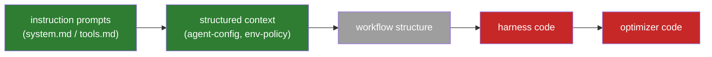

# Explicitly NOT Now

The deliberate non-decisions of the evolution loop — everything we chose *not* to
build, why, what it costs us, and the concrete trigger that reopens each one.

> Companion to [evolution-loop.md](evolution-loop.md) (architecture) and
> [enhancement-roadmap.md](enhancement-roadmap.md) (what we DID build). This doc
> exists so a deferral is a recorded decision with an expiry condition, not a
> forgotten TODO.

**Rule of thumb used throughout:** defer when (a) the blast radius is unreviewable
at solo-dev scale, (b) the mechanism only pays off at a scale we haven't reached,
or (c) a cheaper mechanism already covers the need. Every entry names which.

---

## 1. Where the deferrals sit

The field's search-target progression (Weng): each rung is a strictly larger
search space with a higher ceiling. We stopped, deliberately, after the second rung.

Green = evolved today. Grey = partially reachable (workflow rules can be expressed
as playbook bullets, but structure itself isn't searched). Red = explicitly not now
(§2.1).

---

## 2. The big deferrals (Phase 4 "explicitly NOT now")

### 2.1 Full harness-code self-modification

**What it would be.** The proposer edits the harness itself — runner code, plugin
hooks, tool implementations — the way Self-Harness [2606.09498] and DGM do. The
strongest TB2 numbers in our own research digest came from exactly this
(Self-Harness: +15–21pp on TB2 via *code* changes, not prompt rules). And it is
what this repo's own founding paper does: Meta-Harness [2603.28052] (whose TB2
artifact this repo forks — `stanford-iris-lab/meta-harness-tbench2-artifact`)
searches *harness code* with an agentic proposer reading source, scores, and
traces of all prior candidates through a filesystem; its discovered harnesses
beat the best hand-engineered TB2 baselines. The upstream `agent.py` in this
very repo is a product of that code-space search.

**Why not now.** Unreviewable blast radius (criterion *a*). A bad prompt rule
degrades pass-rate and auto-reverts; a bad code edit can corrupt the store, break
the sandbox contract, or silently disable the selection gate — the one component
the literature says must sit *outside* the loop. A solo dev cannot hand-review
every generated diff, and the maker-checker role is load-bearing here.

**What it costs.** This is the single biggest ceiling on the system. Prompt-space
search has demonstrably lower headroom than code-space search on TB2.

**Revisit trigger / how it would ship.** Reopen when the prompt-space loop
plateaus account-wide (report-loop plateau across ≥2 split rotations at the
account layer). Ship the bounded version, not the general one:

- **AlphaEvolve-style `EVOLVE-BLOCK` regions** — the proposer may emit diffs only
  inside explicitly marked regions of whitelisted files (e.g. the env-snapshot
  probe list, tool-description strings, retry policy constants). Everything
  outside the markers is mechanically rejected.
- Candidate code runs in a **throwaway git worktree** (the pattern Harness
  Evolver already uses), validated by the existing `ab` gate + smoke tiers before
  a human merges it. The gate and store code themselves are permanently outside
  every evolvable region.

### 2.15 Composite / per-tenant sub-master (fleet spec D8.5)

**What it would be.** A fleet where a squad-node can itself be a full sub-fleet
with its OWN master — an authority that recurses, each sub-master holding its own
credential scope, gateway, and durable-state slice. The opposite of the decided
**singleton-authority + composite-scheduling** model (`2026-07-13-fleet-squad-integration-design.md §9.4`, D8).

**Why not now.** Blast radius + scale (criteria *a*, *b*). One master already
scales to many *projects* under one owner via a project namespace (per-project
isolation + fair-share under a global cap, D8.3) — validated by OpenClaw (one
Gateway, many isolated agents) and Temporal (one service, many namespaces).
Composite *authority* = N persistent daemons + N credential roots → fragmented
durable state and a multiplied security surface, for no gain until there is a
real trust boundary to separate.

**What it costs.** Nothing today (one owner, one host). The cost of the
singleton is purely an availability ceiling — a master-process crash pauses all
projects (recoverable: durable state resumes them, §9.5 D9).

**Revisit trigger (a genuine *trust* boundary — multi-tenant, NOT multi-project).**
Projects with a different **owner / org / host / credential domain**, OR an
availability SLA a single restartable daemon cannot meet. Then build a
per-tenant sub-master with its own credential scope. Project *count* alone never
fires this.

### 2.2 DGM parent-sampling / Pareto candidate archives

**What it would be.** Instead of single active-vs-candidate hill-climbing, keep an
archive of candidates; sample parents ∝ performance and ∝ 1/offspring (DGM), or
keep any candidate that is best on ≥1 task (GEPA per-instance Pareto). Preserves
diverse partial wins; resists lucky-config collapse.

**Why not now.** Scale (criterion *b*). With <100 candidates ever generated, an
archive is bookkeeping with no selection pressure to exploit. DGM's own ablation
shows the archive matters when search is long and open-ended — we are neither yet.

**What it costs.** Little today; later, hill-climbing can converge on a local
optimum and discard a bullet that was the best answer for a task minority.

**Revisit trigger.** Any layer's `candidates/` exceeds ~100 versions, or
meta-metrics shows repeated accept→revert oscillation (a hill-climbing signature).
The store layout already keeps every candidate on disk, so the archive is
retroactively constructible — nothing is lost by waiting.

### 2.3 Embedding-based novelty rejection

**What it would be.** ShinkaEvolve-style: embed each candidate, reject
near-duplicates by cosine similarity before spending eval budget on them.

**Why not now.** Covered by a cheaper mechanism (criterion *c*). The Phase 3
curator already deduplicates/merges bullets with an LLM, and at ≤3 ops per
proposal the duplicate rate is low. An embedding pipeline adds a dependency for
savings measured in single ab runs.

**Revisit trigger.** Proposal volume grows to where duplicate candidates
measurably burn ab budget (meta-metrics: repeated `inconclusive` on near-identical
diffs), or the search space widens to code (§2.1) where near-duplicate diffs are
harder for an LLM curator to spot.

### 2.4 Target-model / content-generality axis — BUILD + multi-model panel gate

**What it would be.** A new, evolvable **content-generality** dimension on
playbook bullets — `universal → vendor → model` — orthogonal to the existing
`global → role` scope axis, so a rule that only earns its place for one
vendor/model family (opencode ships ten per-provider prompts as proof) is scoped
there instead of injected blindly onto every model. Full design in
[target-model-axis.md](target-model-axis.md): additive-only merge (no override),
one global budget over the resolved coordinate set, and — the second, coupled
mechanism — an **N-model panel `ab`** with a **worst-case-nonregression**
decision-combination policy, since today's `ab` runs a single model on both arms
(`cmd-ab.ts:106`) and so can only *assert*, never *prove*, that a candidate is
universal.

**Why not now.** Gall's law (a mix of criteria *b* and *c*). The simple
single-model loop is not yet shown to work — loop-1's account-global **v1** has
not cleared its `ab` verdict (the standing blocker, `docs/loop-1-state.md`). A
second axis before the first loop produces one accepted candidate is complexity
with no measured payoff. And a vendor/model axis is *unfalsifiable* while only
one primary-loop model runs: there is nothing for a `vendor:X` bullet to be
scoped away from, so the store's current model-agnostic (all-universal) playbook
already covers today's regime. The multi-model panel is a materially new runner
capability whose cost is only justified once a real second model exists.

**What it costs.** Until built, every account-global bullet is injected for every
model regardless of the model family it actually compensates — a candidate gated
on the one model `ab` happens to run can silently regress an unmeasured model.
The seed corpus's 2 VENDOR + 3 MODEL bullets
(`external-prompts-cc-opencode.md`) have nowhere to live and stay unseeded. The
cost is bounded precisely *because* only one primary model runs today — it grows
the moment a second does.

**Status update (2026-07-16) — tag CAPTURE shipped, BUILD still deferred.** The
first, smallest slice of this deferral has shipped: `PlaybookBullet` now
carries optional `generality`/`slice` claim fields, the proposer emits them,
and they roll up into candidate meta + `/mh-status`
([target-model-axis.md §7.0](target-model-axis.md)). This is **capture only** —
no new scope keys, no `layersFor(worktree, agent, model)` routing, no injection
change (a tagged bullet renders byte-identical), no gate change. It does
**not** satisfy this entry's revisit trigger below and does **not** reopen this
deferral: the **12-coordinate routing** (§2/§4 of the spec) and the **N-model
panel gate** remain fully deferred, gated on the same two preconditions. The
distinction matters precisely because it is the kind of thing that could be
mistaken for progress toward the BUILD trigger — it is not; it is a zero-cost,
mechanically-inert precursor.

**Revisit trigger (BOTH required for the build; either fires the reconsideration).**
- **loop-1 `ab` accepted** — account-global v1 clears its verdict, proving the
  single-model loop produces an accepted candidate (Gall's-law precondition).
- **a second primary-loop model goes live** — an actual second model in the
  primary loop, making vendor/model divergence observable and the axis
  falsifiable. Build **`vendor` level first**, `model` level only when a vendor
  cell demonstrably needs splitting.
The multi-model **panel gate** (N-model `ab` + worst-case-nonregression) is its
own sub-deferral inside this one: it reopens with the second-model trigger, since
a single model cannot exercise a panel. Additive-only override forbiddance
(§3.2 of the spec) reopens *only* on measured evidence that a real
in-store contradiction cannot be handled by demote-the-universal — not
speculatively.

#### 2.4.1 Nested soft requirement — promote playbook-preservation (found 2026-07-16)

**What it would be.** `promote`'s legacy/grace path (`propose.ts`'s
`newPlaybook = undefined` branch) stages a raw `system.md` and skips writing a
`playbook.json` for the candidate. When that candidate is later promoted and
activated, `activateCandidate` reads the candidate's (absent) playbook as
`null` and passes it through to `writeActive`'s playbook parameter, whose
pre-existing tri-state contract (`harness-store.ts`: `undefined` = leave alone,
object = write, `null` = remove) then **deletes** the active layer's
`playbook.json`. The layer silently reverts from playbook-structured to legacy
plain text, discarding every bullet's helpful/harmful counters — and now its
`generality`/`slice` claim tags too — that were tracked on the playbook it
replaces.

**Current gap.** This is a **pre-existing** gap (the tri-state contract and the
legacy/grace path both predate this axis) that the tag-capture increment above
makes newly *costly*: before generality/slice existed, a promote-triggered
revert-to-legacy only lost counters; now it can silently erase generality
claims too, with nothing today surfacing the loss. The fix is for `promote` to
migrate its own staged `system` text into a playbook (one bullet per line,
counters/tags reset — the same shape `migrateSystemToPlaybook` already
produces) instead of leaving `newPlaybook` undefined, so activation never hits
the null case for a promote-originated candidate.

**Reopen trigger.** When the tag feature makes lost tags **observable** — i.e.
once something (a human reading `/mh-status`'s `gen[...]` rollup, or a future
automated check) can actually notice a playbook's generality tags vanishing
across a promote+activate. Not before: while generality/slice stays
capture-only and unrouted (§7.0 of the spec), a reverted-to-legacy layer costs
nothing observably different from before this axis existed.

---

## 3. Dropped and scoped-down knobs (Phase 4 decisions)

| Decision | Why | Revisit trigger |
|---|---|---|
| **Permission-mode knob DROPPED** | Security: the loop must never autonomously widen its own permissions. This is a permanent design invariant, not a deferral. | Never (by design). |
| **Evolvable knobs are project-layer only** (`agent-config.json`, `env-policy.json`) | Bench `ab` runs the inert build agent, so account-layer knob changes cannot be measured — an unmeasurable knob would ride the gate unvalidated. | Bench runner gains the ability to exercise the knobs (e.g. `ab` running a live opencode agent config), making account-layer measurement real. |
| **Dense judge default OFF** | Judge is only trustworthy after calibration (≥20 sessions, ≥80% human agreement); shipping it on-by-default would gate decisions on an uncalibrated signal. | Per-user opt-in via `judgeModel` config is the mechanism; stays opt-in. |
| **Progressive-disclosure render knob default-off** (Phase 3) | Playbooks are nowhere near the 25-bullet budget; ranking bullets by helpful−harmful before injection solves a bloat problem we don't have yet. | Any layer consistently at its bullet budget with curation unable to prune further. |

---

## 4. Soft requirements awaiting hardening

These shipped as warnings instead of hard failures because they depend on
proposer-LLM output compliance, which had to be observed first.

| Item | Current state | Hardening trigger |
|---|---|---|
| `diagnosis.json` before rule (Phase 2) | Soft-required — `triggerPropose` warns if missing | Prompt compliance is reliably ~100% over a window of proposals → make missing diagnosis a hard reject |
| `bulletAssessments` counter attribution (Phase 3) | Soft — counters only move when the proposer emits assessments | Same compliance condition as diagnosis |
| Curator "add-not-allowed" | Soft prompt instruction only | Curator observed adding bullets (audit `ops.json` history) → enforce mechanically in `applyPlaybookOps` |

---

## 5. Known races and gaps accepted as-is

| Gap | Why accepted | Revisit trigger |
|---|---|---|
| `score.json` concurrent-writer race (no flock) | Race loses ≤1 session entry and is recoverable from per-session `traces/`; verdict writes are already atomic. Proportionate-fix principle from the storage decision. | A real concurrent-writer scenario appears (e.g. routine parallel interactive + bench scoring on the same layer). Fix is an advisory flock, already designed. |
| Squad-def `score.json` (channel 2) inherits the same race — account-global store shared across all instances of a squad type | Same proportionate-fix rationale; write is atomic (temp+rename), only the read-modify-write window races. | Parallel `squad-run` invocations become routine (fleet-scale slice processing). Same advisory-flock fix covers both sinks. |
| `squad-run --resume` re-derives `--squad-type` from the flag (not persisted in checkpoint) — omitting it on resume of a non-default-type run targets the wrong squad store | Only one squad type exists today (`standard`); mis-resume is currently impossible in practice. | A second squad type ships → persist `squadType` in `SquadState`/checkpoint. |
| Fleet drive layer only half-honors D3's AgentDriver seam — parse/classify route through `opencodeDriver`, but spawn argv is hardcoded `["opencode","run",...]` (`run.ts:206`), so a slot's `platform` field can't select a binary | opencode-first v1; CC leaf gated on the persona probe anyway (spec §5). | CC persona probe passes → dispatch spawn through the driver seam so `platform` picks the binary; pairs with wiring `SquadDef.slots`. |
| `squad-propose` spawns raw `opencode run` (`squad-propose.ts:361`), bypassing the host abstraction — on a CC-only host (no opencode on PATH) tier-2 squad-propose fails to spawn, with no die-guard | This machine runs opencode; the cc-adapter `claude -p` proposer transport exists but the fleet proposer doesn't route through it. | meta-harness runs tier-2 under a CC-only host, OR a driver-neutral proposer transport is wanted → route squad-propose through the host/driver seam (or add a loud die when opencode is absent). |
| `score.ts:102` hardcodes `driver: "opencode"` in fleet provenance | Only driver in the fleet path today; cosmetic until a second exists. | A CC (or other) fleet leaf ships → derive the provenance driver from the slot's platform. |
| Two concurrent `ab` invocations race the shared store/meta-metrics | The podman sandbox isolates *task execution* (fresh container per attempt), deliberately not the store — declared a non-goal in `term-bench2/README.md`. | Same as above: routine concurrent `ab` runs. |
| `proposerVariant` is provenance-only | opencode's `session.prompt` API exposes `model` but no thinking variant — the STOP-critical part (model pinning) is live; effort pinning is not possible from a plugin. | opencode API gains a variant/effort field on `session.prompt`. |
| Interactive trajectory events lack tool *args* | `tool.execute.after` hook doesn't expose them; bench-side trajectories are unaffected. | opencode hook API exposes call args. |
| `/mh-status` doesn't surface `diagnosis.json` | Candidate `meta.json` already shows in status; diagnosis surfacing was judged redundant UI for now. | Diagnosis becomes hard-required (§4) — at that point it's first-class state worth showing. |
| Baseline/ab run 43 tasks, not the full TB2 89 (decided 2026-07-14) | 43 = the validated-to-stage subset; enough to find a difficulty band + drive `ab`. 89 buys 14pp→11pp min-detectable-effect — doesn't cross the ~sub-10pp threshold realistic gains live at (paper: 5pp needs ~500 pairs), so 2× cost buys unusable power. The other ~46 tasks aren't staging-validated → `setup_failed` roulette. Mechanism unproven → prove cheap first (Gall). | The loop produces ONE accepted candidate → re-run baseline-vs-evolved on the full 89 for the leaderboard-comparable, generalizable number ("measure once, measure right"); forces the staging-validation / vendor-the-rest work (python-elimination §5). |
| Proposer failure retrieval is importance×taxonomy-**diversity**, not semantic **similarity** (2026-07-14, `failure-retrieval.ts`) — no query-task, no embeddings, no vector store | Current regime = structured signals + coverage over a small corpus; §6 already rejects even SQLite; propose has no query task. | Retrieval becomes query-driven ("find failures whose *content* resembles THIS task/error") over a large corpus → add task-identity to `SessionRecord`, then **BUY not build** (see §6.1 pre-scoped candidates) — NOT a standalone vector DB, NOT from scratch. |

### 5.05 Two memory/knowledge axes — keep separate

The system has TWO distinct retrieval needs; do not conflate them:

- **Experience memory** (past failures/outcomes, for the PROPOSER — "learn from
  what failed"): structured ranker today (`failure-retrieval.ts`); semantic
  upgrade pre-scoped in §6.1 (buy `mcp-memory-libsql`, gated).
- **Domain knowledge** (facts/docs/code, for the WORKER agents — "know how to
  do the task"): the row below.

### 5.06 Domain-knowledge RAG for worker agents (evaluated 2026-07-14)

| Consumer | Need it? | Why / mechanism |
|---|---|---|
| Benchmark agents (TB2 solvers) | **No** | Self-contained tasks + knowledgeable models; the paper's proven coding win was env-snapshot bootstrapping, not KB-retrieval (its RAG win was *math* reasoning — domain-gated, not TB2-coding). Adding a KB = infra + context cost for uncertain gain. |
| Fleet squad on a REAL repo | **Yes, eventually — COMPOSE, don't build** | Wire existing retrieval MCPs into roles: **serena** (code RAG), **context7** (library-docs RAG), + optional project KB over the repo's own `docs/`. Nothing to build from scratch. |

Key property: **which KB/tools each role gets is a per-role, EVOLVABLE config
decision** (designer→docs-RAG, implementer→code-RAG, evaluator→both), living in
each role's tools.md/agent-config + the target's MCP setup — tunable by the same
loop that evolves role prompts. Not a monolithic "add RAG."

**Gap today:** the fleet role manifest carries frontmatter/permission but no
tools/KB surface, and targets run plugin-off — so *which MCP tools a squad role
gets is undefined*. Deferred correctly (depth-1 demo used bare roles).

**Reopen trigger:** the squad runs on a real repo (not a toy slice) → add a
per-role MCP-tool/KB surface to the role manifest, wire serena/context7, and let
selection find which roles actually benefit. Read LEGOMem (2510.04851,
memory-landscape §4) first — modular per-role procedural+knowledge memory for
multi-agent workflows is exactly this shape.

### 5.1 Fleet depth-1 deferrals (2026-07-13, from the squad E2E final review)

Documented as v1 limitations in `docs/fleet-integration.md` §10; registered
here so each has an owner-of-record trigger, not just a warning label.

| Deferral | Why deferred | Reopen trigger |
|---|---|---|
| `SquadDef.slots` never read at runtime — drives resolve model/platform from `roles.ts` defaults; `validateSlots` die-guards reject unsupported bindings loudly | Wiring it = half a feature until the CC persona probe passes (spec §5 precondition) and recursion machinery exists (spec §8.4); today's only def (`STANDARD_SQUAD`) agrees with the manifest, so nothing mis-drives | CC persona probe passes → wire `slot.model`/`slot.platform` into `squad-cli`'s prod DriveFn and remove the claude-code die-guard in the same change. ALSO hard-required before any tier-2 evolution of squad defs (an evolver mutating `slot.model` today gets a silent no-op) |
| Delta re-entry (`flow.reentry: "delta"`) unimplemented — all backward edges re-drive with first-visit prompts | Cost optimization, not correctness (spec §3.8 files it under mitigations); prompt-template design should follow evidence from live squad runs, not precede it | First live slices show re-entry churn (R2/R3 spent on regenerate-from-scratch drift) in meta-metrics — then implement `{prior artifact + question}` inputs in `inputFor` |
| Pending/checkpoint gc — escalated + absolved drives never archived, `done` checkpoints never cleaned | Orphans only accumulate across many live runs of one project; zero live slices so far; files are tiny JSON and correct-by-design (never-scored is intentional) | Routine live fleet use on a real project (pending dir visibly accumulating), or the first time `listPending` output confuses a human |
| Coverage gaps: `run.ts` auth/transient die paths, `squad-cli` invalid `--gate-answer` path, `materializeDesign` output | All hand-traced in review; untested branches are die-and-stop, not silent corruption | First regression touching any of these files, or the first live-run auth failure behaving unexpectedly — add the test with the fix |

---

## 6. Storage: no SQLite (decided 2026-07-09)

Plain files (md/JSON/JSONL) remain the source of truth. KB–MB scale, no joins in
hot paths, git-versioned project store (diff/blame/revert of evolved rules for
free), human inspectability is load-bearing for the maker-checker role, and files
are the zero-dependency cross-language contract between the TS plugin and the
Python runner.

**Revisit triggers (from the original decision):** >~50k session records,
routinely concurrent writers, or measurably slow stratified queries. Even then:
mirror into DuckDB/SQLite as a *derived, read-only* analysis layer — never as
source of truth.

### 6.1 Semantic memory: pre-scoped buy-decision (evaluated 2026-07-14)

The §5 row above defers query-driven *semantic-similarity* failure retrieval.
When it triggers, **buy not build** — a survey of SQLite-backed vector-memory
MCP servers was done so the future decision is fast, not re-litigated:

- **Front-runner: `mcp-memory-libsql`** (libSQL, npm). Chosen because our topology
  is SHARED (spec §7 / D6: one store per role NAME across all depths, nodePath =
  provenance), and its Turso mode has the server arbitrate writes — the ONLY
  candidate that escapes the single-writer WAL contention we already hit
  (score.json race, §5) at squad scale. Standard MCP entities/relations KG +
  vector similarity.
- **Local alternative: `@aeriondyseti/vector-memory-mcp`** (Bun/TS, sqlite-vec) —
  best stack fit, but single-file WAL contention + MiniLM-384. Pick only if we
  accept local + isolated (contradicts D6's shared topology).
- **Rejected on stack:** the Python servers (sqlite_mcp/vertexhub/cornebidouil) —
  we finished python-elimination; do not reintroduce Python. (sqlite_mcp's
  Qwen3-0.6B/1024-dim embedder is noted below as the quality bar, not adopted.)

**Hard requirements for whatever is adopted:**
1. **Embedder floor = Qwen3-0.6B-class (1024-dim) or stronger.** MiniLM-384 (the
   default across most of these) is too weak for code/technical retrieval — it
   would not beat our existing structured ranker (`failure-retrieval.ts`).
2. **Complementary, not a replacement.** The harness store stays files-only
   source of truth (this §6). A vector server is a *derived semantic index*
   over failure content, exactly like the "derived read-only analysis layer"
   caveat above — never the fitness/store source of truth.

**The unresolved tension (decide only when triggered):** D6 says memory is
SHARED across the squad hierarchy → points at libSQL/**Turso** (remote,
server-arbitrated, solves concurrency). But Turso is a *remote* store (network,
auth token, off-machine), which breaks §6's files-only / git-inspectable /
offline / zero-dependency ethos. Shared-topology vs local-git-truth is a real
fork that is NOT yet forced — the structured ranker covers today's regime, so
this stays deferred until a query-task + large corpus actually exist.

---

## 7. Not ported to the opencode plugin (pre-dates the loop)

From the original Python→TS port (see AGENTS.md); deferred because each needs
opencode *source* changes, not plugin hooks:

- **Exact marker polling** (`__CMDEND__N__`) — needs the bash tool's execution
  loop; the plugin-level timeout heuristic is the best hook-reachable
  approximation.
- **`task_complete` double-confirmation checklist** — no equivalent session-loop
  hook exists.
- **Context summarization / unwind** — superseded by opencode's own compaction
  (`experimental.session.compacting`); intentionally not a gap.

**Revisit trigger:** upstream opencode grows the relevant hooks, or the marker
heuristic shows up as a root cause in trajectory diagnoses.

---

## 7.5 SPRT / sequential McNemar gate (deferred 2026-07-21, distance-to-verdict rule)

Sequential-stopping version of the statistical gate (pre-registered SPRT boundaries
on paired discordants; stop early on significance OR futility; ~half the trials of
fixed-k on average). Deliberately deferred: **loop-1 gates fine with fixed-k
McNemar** (existing machinery), and the rule distilled with the user 2026-07-21 is
a hard tooling freeze until the first opus loop reaches a gated verdict — every
task must shorten distance-to-verdict or land here. Ad-hoc peeking without a
pre-registered spec is NOT an interim option (alpha inflation destroys the gate's
credibility — the project's one claimed edge).

**Revisit trigger:** loop-1 gated verdict delivered AND a second loop iteration is
being planned (the spec pays for itself across recurring gates), OR gate-trial cost
becomes the binding constraint on loop cadence.

---

## 7.6 Automatic task / curriculum generation (deferred 2026-07-27, gap analysis)

The one strategic gap nothing on the roadmap addresses: we depend on a fixed
TB2 band; at saturation, signal dries up. Field has task-synthesis /
curriculum methods (targeted tasks at diagnosed failure classes = proven
effective). Deferred anyway because of the **oracle-squared trap**: a
synthesized task needs a synthesized grader, and our entire false-accept
watch-item (every real fail across C2+C1+G1 = agent-side checker accepted,
grader failed) demonstrates what un-vetted checkers do — a task generator
with that bug class feeds the loop pure noise while looking productive.
**Trigger to revisit:** band saturation (screen shows no 0<pass<1 tasks
left) AND spec-coverage/metamorphic verification tech (resume.md ranked
item 1) proven — the same tech that vets agent verify.sh can vet generated
graders. Until both: fixed band + Cat-A reserves.

## 7.7 §4.3 trial-mode (completion-gate-outcome trials) deferrals (registered 2026-07-29)

Non-goals carried over verbatim from the §4.3 pre-registration's own §10
(`docs/superpowers/specs/2026-07-29-trial-mode-gate-outcomes-preregistration.md`),
mirrored here per this doc's deferral-register convention so each has a
recorded reopen trigger, not just a footnote in the design doc:

| Item | Why deferred (v0 scope) | Reopen trigger |
|---|---|---|
| Numeric false-accept discounting | The calibration rate's Wilson CI (`[3%, 31%]`) is too wide to subtract from a metric without manufacturing false precision | Calibration N large enough that the CI width < the minimum-effect floor |
| Sequential stopping for trial verdicts | Already deferred — see §7.5; not duplicated here | See §7.5's own reopen trigger |
| Concurrent trials | v0 = one live trial at a time, enforced per-layer by the `readTrial` guard and, across repos/hosts, by declared operational convention only | The first mechanical cross-repo/host trial lock ships (last row below) |
| opencode-session arms | v0 = Claude Code sessions only | Playbook-class trial demand appears on opencode sessions |
| Account-global / role-layer trials | v0 = project-global layer only | Project-global v0 produces ≥1 sound verdict |
| Gauge-as-reward | Gauge fields stay tripwire-only, never a reward input | km-gauge M0–M3 verdict passes all four metrics |
| Automated cross-host sensor sync | v0 sync is a manual, surgical snapshot script | Manual snapshot cadence proves insufficient ≥2 times |
| Composite reward scores | Each metric stays separately reported, never combined into one number | Never, without a pre-registered weighting design |
| Auto trial-start | v0 keeps trial start human-go (the human starting a trial is the concurrency lock) | km-crank's legacy-mode review-gate bypass is closed |
| Mechanism-class generalized trial slots | v0 = playbook class only; the mechanism class keeps bespoke §4b-style pre-registrations | A second §4.3-style registration extends this machinery to the mechanism class |
| Mechanical cross-repo/host trial lock | v0 = declared operational convention only, not a mechanism | The convention is violated once, or more than one operator exists |

## 8. Reading this doc in six months

Ask, per entry: did the trigger fire? If yes, the entry graduates into the next
roadmap phase. If no, the deferral stands — and the burden of proof stays on the
feature, not on the status quo. The one permanent entry is the permission-mode
knob (§3): that is an invariant, not a deferral.
