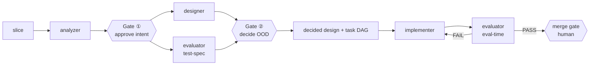

# The Fleet — context for meta-harness

> **Status update (2026-07-13):** integration decisions now live in
> [superpowers/specs/2026-07-13-fleet-squad-integration-design.md](superpowers/specs/2026-07-13-fleet-squad-integration-design.md)
> (D1–D7 all closed) — that spec supersedes this briefing where they
> disagree. Corrections to this doc's claims: the 4-role opencode personas
> described below were an UNCOMMITTED rework (its branch
> `feat/analysis-design-phase` and plan file no longer exist); oc-test
> **main** actually has a 3-role doctrine (`architect` [analysis+design
> fused] / `implementer` / `evaluator` + `master`) with an OpenClaw adapter
> only. The 4-role split is the DECIDED target (spec D1); the doctrine on
> main is the import source pending that split. The `shell:`→`bash`
> permission-key bug is now flagged in oc-test's `KNOWN-ISSUES.md` (D7).

Briefing on the **OpenClaw dev-fleet** (repo `~/z2/oc-test`, `agents-fleet/`), written
for meta-harness dev sessions. The fleet is meta-harness's sibling: same
**mutation + empirical selection** DNA, applied to *shipping features* rather than
*evolving prompts*.

## What it is + goals

An autonomous dev team. Goals: **automation** (human only reviews/approves),
**max parallelism** (~5 projects / 1 person), **cost-effective without quality loss**.
Lives on branch `feat/analysis-design-phase`.

## Architecture (B) — the runtime a meta-harness dev touches

- **OpenClaw runs only the `master`** orchestrator — owns Slack `#oc`, the human gates,
  `.fleet/state.json`, ambient `gh` (sole remote-writer), and drives the roles.
- **OpenCode runs the squad** — the four roles `analyzer / designer / evaluator /
  implementer` (collectively the **squad**; the master orchestrates it but is not part
  of it) as `.opencode/agent/*.md`, **`mode: all`**, permission-scoped (design roles
  read-only; implementer write+shell).
- **Drive seam:** `opencode run --agent <name> --model <model> "<input>"`,
  **stdout = the role's payload**. `--model` at drive time selects subscription
  (`anthropic/…`, via the `opencode-claude-auth` plugin) vs OpenRouter (`openrouter/…`).

## The loop (one "slice" = one unit of work)

Two human gates for *intent*; everything else autonomous within bounds
(circuit-breaker, no-progress, cost guards).

## Philosophy — why it's meta-harness's sibling

- **`design→build→evaluate` is fractal** — recurses at every scale; iteration + parallelism
  are the same recursion (depth vs breadth).
- **Verification trusts only empirical results** (TDD floor; the evaluator runs tests and
  cites output, never "looks correct"). Identical to meta-harness keeping only rewrites that
  provably raise pass-rate.
- **Intent is checked at DESIGN, not result** — the human gate is on the approved design;
  **tests derive from the approved intent** (evaluator authors the test spec from the
  functional spec, not the code — closes the self-graded-test circularity).

## The role prompts (the evolvable artifacts)

Four self-contained OpenCode personas (`agents-fleet/opencode/agent/`), each = YAML
frontmatter (mode/model/permission) + a body that *replaces* OpenCode's base persona:

| Role | Job | Permission |
|---|---|---|
| **analyzer** | NL procedure → Cockburn use cases + functional spec; escalates genuine intent-forks (`## Clarify`) | read-only |
| **designer** | approved spec → 2–3 OOD alternatives (patterns + CRC + Mermaid + trade-offs) for a human decision → decided OOD + task DAG | read-only |
| **evaluator** | design-time: author test spec from intent · eval-time: run checks, emit adversarial `VERDICT: PASS\|FAIL` | read + shell |
| **implementer** | decided design → minimal tested code, commits locally, never pushes | read/write/shell |

All four **validated standalone** via `opencode run --agent` (analyzer + designer confirmed
producing correct payloads on the eval harness).

## Integration surface with meta-harness (the point)

1. **The fleet's roles *are* meta-harness roles.** `analyzer/designer/evaluator/implementer`
   map onto `mh-*` agents; their prompts become evolvable `system.md`/`tools.md` layers
   instead of monolithic bodies.
2. **The fleet emits fitness signal for free.** Gate-① / Gate-② approve-vs-revise and the
   merge PASS/FAIL are exactly `/mh-score good|bad` — dense, real-work signal, no synthetic
   bench needed.
3. **Meta-harness's 4-layer store answers the fleet's open DRY question** (shared vs per-role
   prompt text): `account/project × global/role`, composed general→specific — cleaner than
   "FLEET.md via `opencode.json` instructions."
4. **The OpenCode plugin + `term-bench2` are directly reusable** — env-bootstrap/caching for
   the workers; the bench tasks + `ab` referee to gate role-prompt changes objectively.
5. **The tension to design around:** fleet role bodies are currently *self-contained*
   (validated that way); adopting meta-harness means splitting them into layered, evolvable
   rules under the selection gate.

## Where it lives

- `~/z2/oc-test` · branch `feat/analysis-design-phase`
- Roles: `agents-fleet/opencode/agent/*.md` · master: `agents-fleet/doctrine/master.md`
- Approved (B)-rework plan: `~/.claude/plans/fluffy-strolling-melody.md`
  (Tasks 10–15 pending: installer two-runtime rework, repo initializer, spec/plan revision,
  cleanup).

> Composed general→specific like meta-harness's own layers — the fleet is what happens when
> you point the same evolutionary machinery at *building software* instead of *building the
> builder*.
