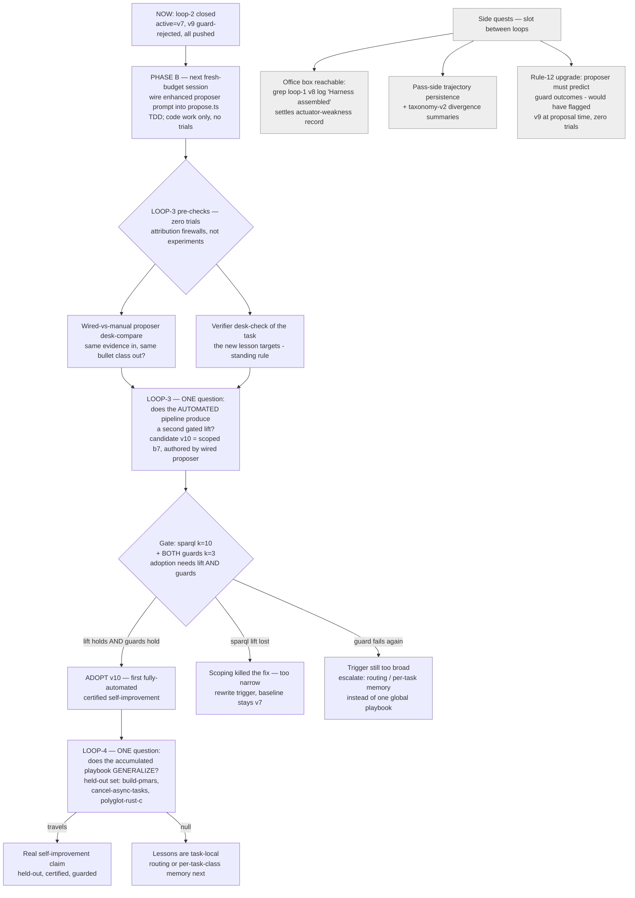

# Evolution-loop roadmap (as of 2026-07-22, post loop-2)

Canonical forward plan after loop-2 closed. State details: [`resume.md`](resume.md) (top
block) · verdict history: [`reboot.md`](reboot.md) (bottom sections) · proposer design:
[`proposer-lesson-prompt.md`](proposer-lesson-prompt.md).

## Where we are

- **Loop-1 (07-21):** v8 (ORDER-BY lesson) — provable null, rolled back. Post-mortem
  desk-check reversed the diagnosis (grader ignores order, grades on a held-out graph).
- **Loop-2 (07-22):** v9 (interpretation-enumeration lesson b7) — **sparql lift certified**
  (7/10 vs 1/10 same-host, Fisher p = 0.020) but **guard-rejected**
  (configure-git-webserver 0/3: b7's "literal wording" made agents trust the task's false
  "I'll setup login" promise and skip sshd). v7 active. v9 kept as
  certified-on-sparql / guard-rejected candidate.
- **Core finding:** no universal interpretation policy across graders — sparql's grader
  rewards literalism, configure-git-webserver's punishes it. Lessons need scoped triggers.
- Both halves of the machine are now proven: the gate certified a real lift AND the guard
  caught a real regression, each with a trajectory-level mechanism.

## Forward plan

## Branch logic (why three outcomes at the loop-3 gate)

| Outcome | Reading | Next move |
|---|---|---|
| Lift + guards hold | Scoped trigger is "just right"; factory (wired proposer) validated | Adopt v10; proceed to loop-4 |
| Sparql lift lost | Scoping cut too deep — the fix needed the broad trigger | Rewrite trigger wording; another candidate through the same gate; v7 stays |
| Guard fails again | Trigger scoping insufficient — one global playbook line cannot serve opposed graders | Stop rewording; escalate to routing (per-task-class bullets) or per-task memory |

## Standing rules (accumulated, all evidence-backed)

1. **One manipulated variable per loop.** Everything else is a zero-trial pre-check or
   free post-verdict bookkeeping. (Loop-2's attribution clarity came from this.)
2. **Desk-check the verifier before distilling or trusting any lesson.** Free, and it has
   beaten every LLM input mode so far (loop-1 reversal, guard mechanism).
3. **Forensics audit before any verdict math.** Auth-error grep, turns=0 classification,
   near-wall elapsed. (Both loop-2 arms + guards ran clean.)
4. **Adoption = target lift AND guard non-regression.** Either alone is insufficient
   (v9: certified lift, still rejected).
5. **Candidate system.md must contain the lesson line** — composeHarness silently falls
   back to flat system.md when playbook and system.md disagree. Check
   "Harness assembled (N chars)" at launch (v7 = 394, v9 = 717).
6. **Cross-host confounds act only through timeout margin and podman env** — both
   auditable; when inert, arms pool across hosts (v7 4/20 used this).
7. **tmux-only detach; `META_HARNESS_HOME=$PWD/.meta-harness` on every store command;
   script FILES not inline `bun -e` for store mutations** (apostrophe trap).
