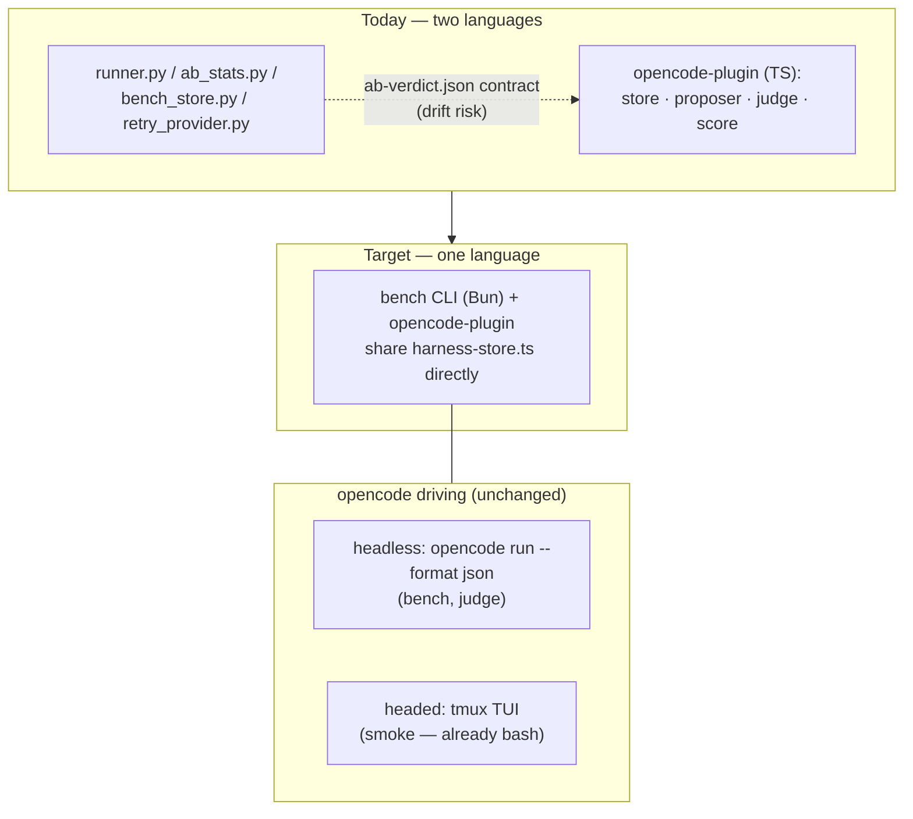

# Eliminating the Python Dependency

Plan to make the meta-harness loop single-language (TypeScript/Bun), removing the
host-side Python implementation entirely.

> Companion to [evolution-loop.md](evolution-loop.md) (architecture) and
> [explicitly-not-now.md](explicitly-not-now.md) (deferral register). Status:
> **complete** — verified feasible 2026-07-11 against the upstream TB2 clone.
>
> **Done (2026-07-12):** ported to `opencode-plugin/src/bench` (Bun/TS), running
> under the podman sandbox; the host-side Python (`runner.py`, `ab_stats.py`,
> `bench_store.py`, `gen_setup_deps.py`, `test_*.py`) is deleted. The harbor
> leaderboard-publish path (`agent.py`, `anthropic_caching.py`) is retained,
> out of the loop.

---

## 1. Why this is possible

Three facts, each verified in this repo or the TB2 clone at
`../terminal-bench-2` (91 task dirs):

1. **TB2's verifier contract is language-free and uniform.** All 89 tasks with
   tests follow the same shape: run `bash /tests/test.sh` → read
   `/logs/verifier/reward.txt` (`0`/`1`, plus `ctrf.json`). 82/89 test scripts
   even self-bootstrap their pytest (`uvx -p 3.13 -w pytest==8.4.1 …`) inside
   the task env — the harness never supplies Python, not even in-sandbox.
   Metadata is declarative `task.toml` (schema 1.1) — parseable by `Bun.TOML`.
2. **TS is already the reference implementation** for everything except the
   bench runner: store/layers/trial/activation (`harness-store.ts`), proposer/
   promoter/curator (`propose.ts`), judge (`judge.ts`), scoring (`score.ts`).
   `bench_store.py` is documented as a *port of* `harness-store.ts` — the
   Python side is the copy, not the original.
3. **Both opencode driving modes are subprocess-shaped, and one is already
   Python-free.** Headless: `opencode run --format json` → NDJSON events
   (`runner.py:run_opencode`, also the judge). Headed: the real TUI driven via
   tmux from plain bash (`smoke/lib/oc-driver.sh` — zero Python today).
   Python's entire role in agent execution is being the subprocess wrapper;
   `Bun.spawn` replaces it directly.

The architectural win is bigger than dropping a language: deleting
`bench_store.py` collapses the dual store implementation, so the
`ab-verdict.json` cross-language contract — a standing drift risk — becomes
single-source.

---

## 2. What Python is today — three surfaces

| Surface | Files | Disposition |
|---|---|---|
| In-sandbox (TB2's own) | pytest + task deps, self-provisioned by each task's `test.sh` | **Stays; was never ours.** Invisible to the harness. |
| Host-side bench tooling | `runner.py` (~3k lines), `ab_stats.py`, `bench_store.py`, `retry_provider.py`, `test_*.py` | **Port to Bun.** Verified stdlib-only — no pip deps; the port is mechanical. |
| Published harbor scaffold | `agent.py`, `anthropic_caching.py` | **Decouple.** harbor is a Python framework; keep as a leaderboard-publishing side-door (`pip install harbor` only when publishing) or archive. Not part of the loop. |

Stragglers: `run-parallel.sh:63` (`python3 -c` JSON read → `jq`/bun one-liner);
`gen_setup_deps.py` (one-shot codegen, outputs committed — its logic folds into
the Bun CLI, which should read `task.toml` directly rather than only the
generated `manifest.json`).

---

## 3. Migration phases (oracle-gated)

Ordering principle: every phase is verified **token-free** before any phase that
spends LLM budget.

1. **`ab-stats.ts`** — pure math, no I/O. Port `mcnemar_exact_one_sided`
   (binomial tail), `bootstrap_task_ci`, `futility_stop`, `decide`; translate
   the 16 unit tests to `bun test`, keeping the hand-computed anchors
   (b=6, c=0 → p≈.0156). Gotcha: vendor a tiny seedable PRNG (xorshift) — JS
   `Math.random` can't reproduce the bootstrap tests.
2. **Runner port, `oracle` first.** `oracle` runs `solve.sh` + `test.sh` with
   zero tokens, so it is a free **equivalence gate**: run all 43 baseline tasks
   through `runner.py oracle` and the Bun runner, demand identical rewards.
   Port `check-concurrency.sh` (flip `python3 runner.py` → `bun runner.ts`) and
   the isolation tests. This gate covers exactly the risky part — the ~3k lines
   of hard-won sandbox behavior (unshare/bwrap flags, `/usr/local/bin` symlink
   farm, EXDEV layout, `MH_BENCH_WORK`-under-`$HOME` guard).
3. **`run`, `ab`, `split`, `report-loop`, `judge-audit`** — importing
   `harness-store.ts` directly; **delete `bench_store.py`**. Keep CLI
   subcommands and flags byte-identical so `docs/usage-manual.md`,
   `run-parallel.sh`, and the smoke suite stay valid. `retry_provider.py`
   folds in as a flag or a small TS module.
4. **Tests** — `test_*.py` → `bun test` next to the plugin's existing suite;
   one test runner for the whole repo.
5. **Decouple surface 3** — README section: Python appears only at
   leaderboard-publishing time, via `pip install harbor`, outside the loop.

**End state:** zero Python in the meta-harness loop. Python remains only inside
task sandboxes (TB2's own, self-provisioned) and optionally at
harbor-publishing time.

---

## 4. Porting gotchas

- **Process trees.** `subprocess` timeout/kill vs `Bun.spawn`: killing a
  timed-out task must kill the whole `unshare` tree (process group / setsid),
  not just the leader. This is the one behavioral risk the oracle gate might
  not catch (oracle tasks rarely time out) — add an explicit kill-tree test.
- **Seedable randomness** for `bootstrap_task_ci` reproducibility (see Phase 1).
- **`harnessHash`** (sha256 of rendered text) must stay byte-identical with the
  TS side — trivially true once both sides *are* the TS side.
- **`task.toml`** parsing via `Bun.TOML`; prefer it over `manifest.json` for
  timeouts, `allow_internet`, resources.
- **Verifier hygiene.** The runner scrubs pytest bytecode (`__pycache__`,
  `*.pyc`) left in `/tests` by a prior verifier run (`runner.py:1212`) so stale
  caches can't contaminate the next trial — preserve this. Result harvesting
  itself is language-free: `test.sh` runs pytest in-sandbox and writes
  `/logs/verifier/reward.txt`; the runner only reads that file (plus optional
  `ctrf.json`, plain JSON).
- **The TB2 clone is a runtime input, not just reference.** Vendored
  `tasks/<task>/` dirs hold only the generated `setup_deps.sh`; `/tests`,
  `solution/solve.sh`, and `instruction.md` are staged from `TB_ROOT`
  (default `../terminal-bench-2`) at run time. The Bun CLI keeps the same
  `--tb-root` contract.
- The docs' `datetime.fromisoformat` Z-suffix caveat (Python 3.11+) simply
  disappears.

---

## 5. Side opportunity: the unvendored 30

The TB2 clone has 91 task dirs; only 59 are vendored in `term-bench2/tasks/`
(43 in the baseline). Vendoring the rest is the cheapest attack on the loop's
#1 statistical limit (43 pairs ≈ 14pp minimum detectable effect — power scales
with tasks). Do it as part of Phase 2–3, with the Bun CLI's `task.toml`-native
prep replacing `gen_setup_deps.py`.
