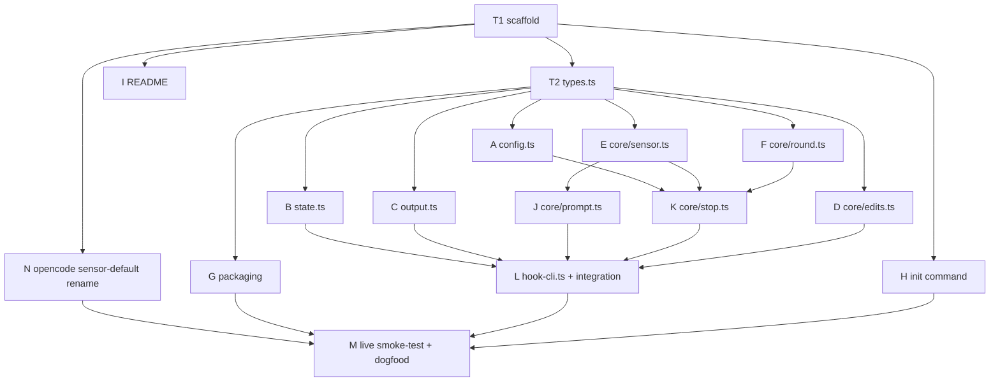

# kkamak for CC v0.1 — Claude Code completion-gate plugin

## Context

kkamak's product wedge is the completion gate: the agent cannot say "done" until a repo-configured check passes. The opencode version (`gate-plugin/`) is built and shipped; CC is the second host — and the richer one, since the user's daily sessions are largely CC (the §4.3 evolution loop feeds on that sensor data). CC's native Stop hook is a cleaner interception seam than opencode's session.idle echo-timing workaround. Plugin name is **`kkamak`** (user-decided: the name is shared across all host adapters; each host has its own registry so no collision). Config (`gate.json`) is host-neutral and shared. **kkamak's runtime artifacts use the `km-`/`.km/` prefix** (product naming; the legacy `.meta-harness/` store belongs to the engine — the project itself is being renamed meta-harness → **kkamak-harness**, future housekeeping): the sensor is `.km/gate-outcomes.ndjson`, **per-machine** (gitignored/host-local), so CC and opencode sessions on the *same machine* share one stream (distinguished by the `app` tag), while cross-machine aggregation for §4.3 is future work. The `host` tag exists so merged streams stay attributable when that day comes. **Parity requirement:** the opencode gate-plugin's sensor default is updated to `.km/gate-outcomes.ndjson` in the same build (DAG node N) — the two hosts must write one stream.

v0.1 scope (user-approved): Stop-hook gate with mutants=0 (parity with opencode v1), sensor ndjson, `gate.json` opt-in (marker default OFF per C2 verdict), `/kkamak:init` command, human-preemption stand-down, fail-open everywhere. NOT in scope: mutation/FA probes, engine/proposer wiring, marketplace packaging (relative imports into `minimal/` mean dev-install only; vendoring deferred to the public-repo split).

## Verified contracts (do not re-derive)

- **Stop hook input:** session_id, prompt_id, transcript_path, cwd, permission_mode, effort, hook_event_name, last_assistant_message, stop_reason. No `stop_hook_active` in current docs — round bounding is our own persisted counter.
- **Blocking:** `{"decision":"block","reason":...}` on stdout OR exit 2 + stderr. **Design-critical uncertainty:** whether block-reason reaches Claude as continuation context — resolved by the live smoke-test via the delivery seam (below). `hookSpecificOutput.additionalContext` injects context non-blocking — **confirmed documented for the Stop hook specifically** (review round 1 verified; marker delivery viable as designed).
- Stop fires on EVERY assistant turn end; subagents fire `SubagentStop` (we don't register it → excluded for free); Stop blocks work in `claude -p` headless too. Hook timeout field in seconds (default 600).
- **`systemMessage`** (warning surfaced to the user from hook output): working precedent in this repo — `opencode-plugin/src/adapters/claude-code/dispatch.ts:241-244` uses it from CC hooks today. Rendering on Stop specifically is included in the smoke-test delivery probe alongside block-evidence.
- Packaging: `.claude-plugin/plugin.json` (name/version/description), `hooks/hooks.json`, `commands/init.md` → `/kkamak:init`. `${CLAUDE_PLUGIN_ROOT}` in hook commands. Dev install: `claude --plugin-dir …`.

## Reused code (paths verified)

- `minimal/complete-gate.ts` — `runCompletionGate(io, {rounds, mutants})`, `GateIO`, outcome vocabulary (`accepted|no-verify|verify-failed|…`).
- `minimal/session2.ts` — `HYGIENE_MARKER`.
- `gate-plugin/src/core.ts` — config schema, sensor field names, edit/interrupt contracts to keep identical; `gate-plugin/test/core.test.ts` — test style to mirror (pure core + fakeDeps, zero host client in tests).
- `opencode-plugin/src/adapters/claude-code/hook-cli.ts` — fail-open entrypoint pattern (always exit 0 on internal error); `file-state.ts` — atomic per-session file state pattern.

## File layout — new `cc-gate-plugin/` at repo root

```
cc-gate-plugin/
  .claude-plugin/plugin.json   # {"name":"kkamak","version":"0.1.0",...}
  hooks/hooks.json             # Stop (timeout 600), PostToolUse (matcher "Edit|MultiEdit|Write|NotebookEdit", 30),
                               # UserPromptSubmit (30) → bun ${CLAUDE_PLUGIN_ROOT}/src/hook-cli.ts <Event>
  commands/init.md             # /kkamak:init — inspect repo, propose gate.json, ask approval, write it
  src/types.ts                 # ALL shared contracts: CcGateState + INITIAL_STATE, GateConfig, CoreDeps,
                               #   StopDecision, RoundOutcome re-export, EDIT_TOOLS constant, SensorLine type
  src/config.ts                # parseGateConfig: {check (req), rounds=2, marker=false,
                               #   sensor=".km/gate-outcomes.ndjson", checkTimeoutMs=300000}
  src/core/edits.ts            # PURE: handlePostToolUse (edit marking)
  src/core/sensor.ts           # PURE: buildSensorLine (schema parity + host/app tags)
  src/core/round.ts            # PURE-ish: runSingleRound capture-and-refuse wrapper over runCompletionGate
  src/core/prompt.ts           # PURE: handleUserPromptSubmit (preemption)
  src/core/stop.ts             # PURE: handleStop (the state machine's Stop transition)
  src/output.ts                # buildStopOutput(block-decision, mode) — the delivery seam; allow-family mode-independent
  src/state.ts                 # FileStateStore (atomic same-dir tmp+rename; corrupt→initial; rate-limited 7d sweep)
  src/hook-cli.ts              # stdin JSON → MH_CHILD/KM_CHILD guard → load state → handler → persist → sensor → emit; catch-all: exit 0
  test/{config,state,edits,sensor,round,prompt,stop,output,cli}.test.ts   # one test file per module (parallel-safe)
  package.json / tsconfig.json # mirror gate-plugin (type module, @tsconfig/node22, strict); no @opencode-ai dep
  README.md                    # config reference, delivery-mode note, "keep check cheap"
```

Imports reach up: `../../minimal/complete-gate.ts`, `../../minimal/session2.ts` (repo convention; no workspaces).

## State machine (file: `<cwd>/.km/cc-gate/<sanitized session_id>.json`)

**Config location (explicit):** `gate.json` is read from `path.join(input.cwd, "gate.json")` — repo root, exactly where the opencode plugin reads it (`gate-plugin/src/index.ts:13`), NOT under `.km/`. Cross-host parity depends on this. Limitation (accepted, documented in README + risks): launching `claude` in a subdirectory misses a root gate.json; no walk-up in v0.1.

**Engine-child exclusion:** first thing in `hook-cli.ts`: if `process.env.MH_CHILD` **or `process.env.KM_CHILD`** is set → exit 0, no-op. `MH_CHILD=1` is what the engine's CC adapter *actually sets today* (`opencode-plugin/src/adapters/claude-code/cc-host.ts` spawns detached `claude -p` children with it); `KM_CHILD` is accepted defensively for the engine's coming rename (project meta-harness → **kkamak-harness**, future housekeeping outside this build). Without this guard, kkamak would gate the engine's own proposer/curator children (the CC analog of gate-plugin's `[meta-harness]` I1 exclusion).

```ts
interface CcGateState { v:1; edited:boolean; gating:boolean; round:number;
  outcomes:RoundOutcome[]; cycleStartedAt:number; failStreak:number; updatedAt:number }
```
Absent/corrupt file = initial state; saving an initial-equivalent state deletes the file.

**Concurrency & crash policy (explicit, v0.1-accepted):** state writes are atomic (tmp+rename) with **last-writer-wins** — no lock/CAS; overlapping hook processes for one session can lose an update but never corrupt (test asserts this). Internal exception mid-cycle (e.g. runCheck throws) → emit allow (fail-open) and **leave cycle fields unchanged** (no round consumed, no reset — cycle resumes next Stop), **except a persisted `failStreak` counter increments**. `failStreak` resets to 0 on any successfully completed check run. **Backoff: `failStreak >= 3` → gate disarms for the session** (reset state incl. `edited=false`, allow with systemMessage "kkamak: gate disabled for this session after 3 consecutive internal errors") — a persistently-throwing check must not retry on every Stop for the session's lifetime, and the disarm is visible via systemMessage but **NOT sensor-recorded** (the sensor schema has no shape for it — same rationale as the config-removed case; do not force it into accepted/gateExhausted). Crash between persist and emit (round advanced, block never delivered) → the gate reaches exhausted one real failure early; accepted risk, documented in README (a pending-emit protocol is v2 territory). State schema gains `failStreak:number`.

- **PostToolUse** (Edit/MultiEdit/Write/NotebookEdit, exact case): `edited=true`.
- **UserPromptSubmit:** if `gating` → preemption: append sensor line (`interrupted:true, gateExhausted:true, accepted:true, rounds:outcomes`), full reset incl. `edited=false`. (Skip the sensor line if gate.json unreadable at that moment — reset only.) Not gating → no-op. NOTE: `accepted:true, gateExhausted:true` on an interrupted cycle deliberately mirrors the opencode plugin's refused-reinject shape — do not "fix" it; schema parity is the point.
- **Stop:** fast-path allow if `!edited && !gating`. No/invalid gate.json → allow (keep `edited`; reset cycle if one was open — **intentionally NOT sensor-recorded** in v0.1: config-removed-mid-cycle abandonment is invisible to the sensor stream, accepted for schema parity with opencode; revisit if §4.3 needs it). Else run one round:
  - **accepted** → sensor line, reset; `marker:true` → allow + `additionalContext=HYGIENE_MARKER`, else plain allow.
  - **failed, round < rounds** → block with evidence; `round++`, push outcome, `gating=true`, persist.
  - **failed, round >= rounds** → exhausted: sensor line (`accepted:true, gateExhausted:true`), reset, allow with loud `systemMessage`.
- Round counter resets only on cycle end (accept/exhaust/preempt). Default rounds=2 → max 3 check runs, 2 blocks (same as runCompletionGate semantics).
- **Handler ordering in hook-cli: persist state → append sensor → emit decision.** If persist fails → emit allow (fail-open), never block with an unrecorded round (a broken state dir must not produce unbounded blocks). **Sensor writes are owned by `hook-cli.ts`** (core stays pure and only builds the line): `mkdirSync(dirname, {recursive:true})` before `appendFileSync` — the exact pattern from `gate-plugin/src/index.ts:30-34`. A sensor-append failure is logged and swallowed; it never changes the emitted decision.
- Stale sweep on Stop, **rate-limited**: a **`.last-swept`** marker file (dotfile — deliberately outside the sweep's `*.json` glob so it is never parsed as session state) in the state dir; sweep only if it's >1h old (Stop fires every assistant turn — an unthrottled readdir per turn per session is pointless IO). Delete `*.json` state files with `updatedAt` > 7 days old (fail-open).

**Sensor line** — identical fields to opencode gate-plugin + union tags:
`{ts, sessionID, check, accepted, gateExhausted, rounds:outcome[], interrupted, marker, durationMs, host, app:"claude-code"}`

## Core reuse trick — `runSingleRound`

Call `runCompletionGate(io, {rounds:1, mutants:0})` per Stop invocation with `reinject: (m) => { evidence = m; return false }` (capture-and-refuse). Use ONLY `rounds[0].outcome` + captured evidence; ignore the harness's accepted/gateExhausted — persistent state owns the multi-round loop. This keeps evidence wording, outcome vocabulary, and future mutants>0 support identical to the bench/opencode gate. (`rounds:1` not 0 — with 0 the loop exits before reinject is ever called and evidence is lost.)

## Delivery seam (`src/output.ts`)

**Scope: the seam applies to BLOCK decisions only.** `DeliveryMode = "block-json" | "exit2-stderr" | "block-json+context"`; `buildStopOutput(decision, mode) → {stdout?, stderr?, exitCode: 0|2}`. Mode from env `KKAMAK_DELIVERY`, default `block-json`. The smoke-test determines which mechanism actually delivers evidence to Claude; the winner becomes the shipped default (one-line change). **Allow-family decisions are mode-INDEPENDENT and never touch the mode switch:** plain allow → exit 0 empty; allow-with-marker → `hookSpecificOutput.additionalContext = HYGIENE_MARKER`, exit 0; allow-exhausted → `{systemMessage}`, exit 0 — always identical regardless of KKAMAK_DELIVERY (a delivery-mode flip during smoke testing must never turn an accepted/exhausted turn into an exit-2 block or drop its payload).

## Check execution (adapter)

`Bun.spawn(["bash","-c",cmd], {cwd, stdout/stderr pipe})`, combined output capped 64KB (evidence uses complete-gate's 600-char tail). Internal timeout `checkTimeoutMs` (default 300s, half the hook budget): kill + return `{code:124, out: tail + "[kkamak: check timed out…]"}` → **treated as verify-failed, not fail-open** (a hanging check is the check's behavior; rounds bound caps damage). Fail-open handling of our own exceptions is two-tier: **spawn/runCheck exceptions are caught INSIDE `handleStop`** (they never escape to the top-level hook-cli catch-all) and returned as a normal result carrying the failStreak increment per the state-machine backoff rule; only errors outside a gate cycle (state-load, stdin parse, JSON) fall to the plain no-persist fail-open catch-all (allow, exit 0, stderr log).

## Task DAG (TDD per node; nodes in the same wave run in PARALLEL — disjoint files, no merge conflicts)



**Wave 0 (serial):** **T1 scaffold** — package.json/tsconfig mirroring gate-plugin; `bun test` + `tsc --noEmit` clean.
**Wave 1 (serial):** **T2 types.ts** — every shared contract in one file so later nodes depend only on it, never on each other: `CcGateState` + `INITIAL_STATE` + `failStreak`, `GateConfig`, `CoreDeps`, `StopDecision`, `RoundOutcome` (re-export from complete-gate), `EDIT_TOOLS` constant, `SensorLine`. Compile-only test.

**Wave 2 (up to 9 in parallel — each node owns exactly its listed files):**
- **A config.ts** (+test) — parity defaults with gate-plugin + `checkTimeoutMs`; missing/malformed → undefined; unknown fields ignored.
- **B state.ts** (+test) — roundtrip; absent/corrupt → initial; initial-equivalent save deletes; session-id sanitization (no path escape); sweep: skip case (marker fresh) AND positive case (marker stale → >7d files deleted, `.last-swept` never parsed/deleted); concurrent-write safety (two interleaved load→save → last-writer-wins, never corrupt).
- **C output.ts** (+test) — every (block × mode) cell; allow-family mode-independent: plain allow → exit 0 empty; allow-with-marker → additionalContext payload; allow-exhausted → systemMessage — each asserted IDENTICAL under all three KKAMAK_DELIVERY modes.
- **D core/edits.ts** (+test) — handlePostToolUse: exact-case EDIT_TOOLS set; non-edit tools ignored.
- **E core/sensor.ts** (+test) — buildSensorLine: field-name parity with gate-plugin schema + host/app tags; interrupted/exhausted shapes.
- **F core/round.ts** (+test) — runSingleRound capture-and-refuse semantics: rounds:1, evidence captured on failure, none on accept; outcome from rounds[0].
- **G packaging** (+test) — .claude-plugin/plugin.json, hooks/hooks.json, JSONs parse, hook command paths exist, matcher string equals EDIT_TOOLS (single-source + assert).
- **H init command** — commands/init.md; v0.1 scope: detect from package.json scripts / `bun test` only (Makefile/pyproject/justfile deferred); propose; ask approval; write gate.json. Review-only, no unit test.
- **I README** — config reference, delivery-mode note, "keep check cheap", bun-on-PATH prereq, accepted risks (crash window, subdir launch).
- **N opencode sensor-default rename** (touches `gate-plugin/` only — disjoint from all other nodes): gate-plugin's default sensor path `.meta-harness/gate-outcomes.ndjson` → `.km/gate-outcomes.ndjson` (one default in `gate-plugin/src/core.ts` + its tests) so both hosts write one stream post-rename. Existing dogfood sensor data: start fresh (or `cat` old into new once) — no migration machinery.

**Wave 3 (2 in parallel):**
- **J core/prompt.ts** (+test; needs E) — handleUserPromptSubmit: gating → sensor line + full reset; not gating → no-op; gate.json unreadable → reset only, no sensor.
- **K core/stop.ts** (+test; needs A, E, F) — the big suite: fast path; no/invalid gate.json; accept (+sensor fields incl. host/app, state reset); marker verbatim; marker:true + exhausted → NO additionalContext, only systemMessage; fail→block round 1→2; third fail → exhausted (rounds:["verify-failed"×3]); fail→pass (durationMs spans invocations); runCheck rejection → fail-open allow, no sensor, cycle fields UNCHANGED but failStreak incremented; failStreak reaches 3 → disarm (state reset incl. edited=false, systemMessage, NOT sensor-recorded); failStreak resets on a completed check run; config removed mid-cycle → cycle reset, NO sensor line, edited unchanged; mid-cycle edit doesn't re-arm after accept; multi-session isolation; two overlapping handleStop invocations → lossy but never crash/corrupt.

**Wave 4 (serial):** **L hook-cli.ts + integration** (needs B, C, D, J, K) — test/cli.test.ts spawning the CLI in tmp repos: unknown event/malformed stdin → exit 0; MH_CHILD=1 (and KM_CHILD=1) → exit 0 no-op before any state/config IO; blocked Stop end-to-end with state advance (persist→sensor→emit order asserted); accept+marker end-to-end (additionalContext rendered); exhausted end-to-end (systemMessage rendered); fresh repo with no `.km/` → sensor file created via mkdir-recursive; timeout kill; unwritable state dir → exit 0 allow; `KKAMAK_DELIVERY=exit2-stderr` → exit 2 + stderr (block only).

**Wave 5 (serial, live):** **M live smoke-test** (checklist below; needs G, H, L), then dogfood install on this repo + squad.

**Parallel-execution rules:** each node edits only its own files (test file included) — the file layout above is the ownership map; `types.ts` is frozen after Wave 1 (a needed contract change = stop, amend types, re-fan-out); wave N starts only when all its dependency nodes' tests are green; total suite (`bun test` + `tsc --noEmit`) must be green at every wave boundary.

## Verification

- `bun test` in cc-gate-plugin (all tasks) + `tsc --noEmit`; existing suites untouched (no shared-file edits).
- **Live smoke-test** in a scratch repo (`gate.json` check = `test -f done.txt` with a run-count log):
  1. `claude --plugin-dir …/cc-gate-plugin`; `/kkamak:init` visible; **hook process finds `bun` on PATH (GUI/launchd-spawned shells differ from terminals — verify a hook actually executes before testing gate logic)**.
  2. **Delivery probe (critical):** edit turn with failing check → stop blocked, Claude continues; verify evidence text reaches Claude; flip `KKAMAK_DELIVERY` modes until the winner found → make it default.
  3. Rounds bound: exactly 2 blocks then exhausted-allow with visible systemMessage; sensor `gateExhausted:true`, rounds len 3.
  4. Fix path: `rounds:["verify-failed","accepted"]`, all sensor fields incl. host/app; check ran expected count.
  5. No-edit turn → no check run, no sensor line.
  6. Preemption: Esc + new prompt after a block → `interrupted:true`, new turn clean.
  7. Subagent turn → no gate at SubagentStop; main Stop gates once.
  8. Headless `claude -p` → gate blocks/continues; sensor written.
  9. `marker:true` → additionalContext carries HYGIENE_MARKER on accept.
  10. Fail-open: malformed gate.json, chmod-0 state dir → session unaffected, exit 0.
- Record outcomes (esp. the winning delivery mode) in docs/resume.md; HISTORY.md entry only if something verdict-worthy emerges.

## Risks (accepted/mitigated)

Stop-per-turn frequency → edited-flag fast path + "keep check cheap" docs · evidence-delivery uncertainty → seam + smoke step 2 · long suites → 300s internal timeout as verify-failed · edit-tool name drift → single-sourced set, MultiEdit defensive · stale state → 7d sweep · concurrent sessions → per-session files, append-only sensor · arbitrary shell in check → user's own opt-in repo config (same trust as opencode version) · bun-on-PATH prerequisite documented; compiled binary deferred.
