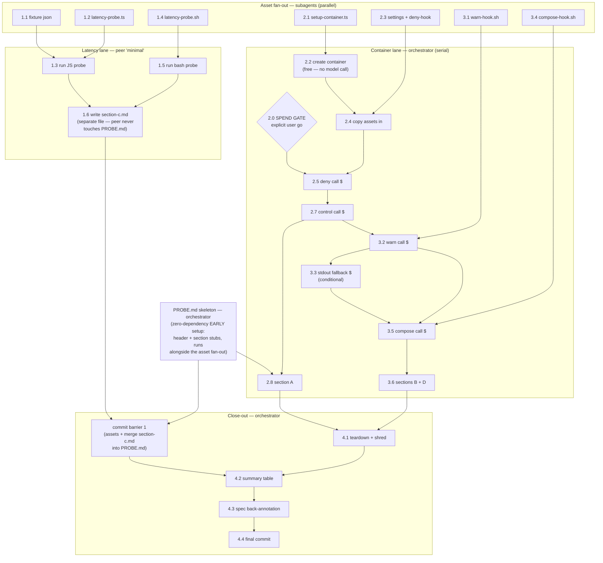

# Hook-Rule P0 Mechanics Probes Implementation Plan

> **For agentic workers:** REQUIRED SUB-SKILL: Use superpowers:subagent-driven-development (recommended) or superpowers:executing-plans to implement this plan task-by-task. Steps use checkbox (`- [ ]`) syntax for tracking.

**Goal:** Answer the four P0 mechanics questions from the hook-rule spec (`docs/superpowers/specs/2026-08-14-hook-rule-evolution-design.md` §5) with recorded evidence, before any P1 build: (a) does PreToolUse deny bind under one-shot `claude -p` in the bench container; (b) which dogfood warn channel surfaces feedback without halting; (c) per-call latency of 16-rule table eval vs the ≤5ms p95 budget; (d) can one PreToolUse response carry `additionalContext` + `updatedInput` together.

**Architecture:** Pure measurement — no production code changes. One evidence doc (`docs/loop-probes/hook-rule-p0/PROBE.md`, p2/PROBE.md format precedent: commands, exit codes, markers, counts only — never reply/transcript text). Probe (c) is free and host-local. Probes (a)(b)(d) run in one podman bench container, reproducing the p2 probe's exact container/auth recipe, with hook scripts that create marker files; verdicts are read from marker presence/absence.

**Tech Stack:** bun (TS probe scripts), bash 3.2-compatible probe hooks, podman, `localhost/mh-bench:latest` image, existing helpers `prepareClaudeCodeAuth` (`opencode-plugin/src/bench/agent-auth.ts:349`), `buildCreateArgv`/`buildStartArgv` (`opencode-plugin/src/bench/sandbox.ts:47,70`).

## Global Constraints

- **F2:** PROBE.md records commands, exit codes, marker presence, event-type counts only — no reply or transcript text (p2/PROBE.md header rule verbatim).
- **Spend gate:** Tasks 2–3 make 4–5 one-shot `claude -p` calls (one conditional), model pinned `claude-haiku-4-5` (p2 spend-authorization precedent), estimated well under $0.10 total. **Do not start Task 2 without an explicit user go.** Task 1 is free (no model calls) and may run immediately.
- **Latency budget under test:** ≤5ms p95 per-call table eval (spec §5c).
- **Container hygiene:** container removed by name via `podman rm -f -t 0 <name>` — never pkill. Exported credential file ZERO-FILLED then removed — the actual `agent-auth.ts` `cleanup()` mechanism (`writeFileSync(shredPath, "0".repeat(size))`) and p2/PROBE.md's "zero-shred" precedent; NOT `rm -P` (unreliable no-op on APFS).
- **Named files only:** every probe asset/script is a committed file under `docs/loop-probes/hook-rule-p0/`; nothing lives in scratch dirs.
- No production source files are modified by this plan except the spec's §5/§8 "confirmed by P0 probe" placeholders in Task 4.
- CC CLI version inside the container must be recorded in PROBE.md's header (p2 precedent; probe results are version-scoped).

## Execution DAG + runner assignment

Tasks 1–4 below hold the step content; this section is the execution order.
Nodes reference `Task.Step`. Three runner tiers:

- **orchestrator** = the main session. Owns the spend gate, the container's
  serial `claude -p` chain, all commits, and the final synthesis.
- **peer `minimal`** = sibling Claude session (SendMessage). Owns the free
  latency lane end-to-end — the only lane that is substantial AND fully
  independent of the container.
- **subagent (low)** = cheap subagents (`caveman:cavecrew-builder` or
  haiku-model general-purpose), one per asset file — pure file-writes from
  this plan's verbatim code blocks, no judgment.



**Parallelism yield:** all 7 asset writes concurrent; latency lane (peer)
runs concurrently with container create + the entire spend chain; the only
irreducible serial path is GATE → B5 → B6 → C2 → (C3) → C5 (five-ish model
calls against ONE container — serial by design: shared oauth credential
mount must never see concurrent refresh, and marker files share `/app`).

**Coordination rules:**
- Workers NEVER commit — single git index; orchestrator commits at K1/K2
  barriers only. (Replaces the per-task commit steps 1.7, 2.9, 3.7 below:
  those fold into K1 for the latency lane and K2 for everything else.)
- **`PROBE.md` has exactly ONE writer: the orchestrator.** Node S0
  (orchestrator, before B7/K1): create the PROBE.md skeleton — header +
  empty `## Probe A/B/C/D`/`## Cleanup`/`## Summary` stubs. Peer `minimal`
  writes its results to a SEPARATE file,
  `docs/loop-probes/hook-rule-p0/section-c.md` (1.6's template, measured
  values filled); orchestrator merges it into PROBE.md's section C stub at
  K1 and deletes section-c.md. No two processes ever open the same file
  for writing.
- Peer `minimal` gets one SendMessage brief: run 1.3, 1.5, write
  section-c.md, reply with the two headline numbers (JS p95, bash mean).
- Conditional nodes: a node whose run-condition is unmet (C3 when
  WARN-SEEN exists) is complete-as-skipped — its downstream edges are
  satisfied immediately.
- Subagent asset writes are fire-and-verify: orchestrator diffs each file
  against the plan's code block before B4/A4 consume it (subagent output
  is not trusted blind).
- Orchestrator polls nothing: peer replies via SendMessage; subagents
  return on completion; container-lane steps are foreground (each returns
  in seconds except the `claude -p` calls, which are backgrounded with
  their NDJSON redirect and reaped by exit code).

---

### Task 1: Probe (c) — table-eval latency at the 16-rule cap (free, host-only)

**Files:**
- Create: `docs/loop-probes/hook-rule-p0/assets/hook-rules-16.json`
- Create: `docs/loop-probes/hook-rule-p0/latency-probe.ts`
- Create: `docs/loop-probes/hook-rule-p0/latency-probe.sh`
- Create: `docs/loop-probes/hook-rule-p0/PROBE.md`

**Interfaces:**
- Consumes: nothing from other tasks.
- Produces: `assets/hook-rules-16.json` — the compiled-table fixture (spec §3 shape: `{version, killSwitch, rules:[{id, event, toolMatcher, inputPattern, feedback, mode}]}`) reused as-is by Task 2/3 discussion; `PROBE.md` with header + section C, appended to by Tasks 2–4.

- [ ] **Step 1: Write the 16-rule fixture**

`docs/loop-probes/hook-rule-p0/assets/hook-rules-16.json` — 16 rules at the cap, 4 deny (the deny-subset cap), all patterns inside the spec §2 portable subset (no `\d`/`\w`/`\s`/`\b`, no bracket escapes, `^` leading, `$` terminal-or-terminal-group only):

```json
{
  "version": 1,
  "killSwitch": false,
  "rules": [
    { "id": "r01", "event": "PreToolUse", "toolMatcher": "Bash", "inputPattern": "^(npm|yarn) +(install|add)( |$)", "feedback": "use bun add", "mode": "deny" },
    { "id": "r02", "event": "PreToolUse", "toolMatcher": "Bash", "inputPattern": "^pip +install ", "feedback": "use uv pip", "mode": "deny" },
    { "id": "r03", "event": "PreToolUse", "toolMatcher": "Bash", "inputPattern": "^rm +-rf +/(etc|usr|var)(/|$)", "feedback": "refuse system rm", "mode": "deny" },
    { "id": "r04", "event": "PreToolUse", "toolMatcher": "Bash", "inputPattern": "^git +push +.*--force", "feedback": "no force push", "mode": "deny" },
    { "id": "r05", "event": "PreToolUse", "toolMatcher": "Bash", "inputPattern": "^curl +[^|]*\\| *(bash|sh)( |$)", "feedback": "no curl-pipe-sh", "mode": "warn" },
    { "id": "r06", "event": "PreToolUse", "toolMatcher": "Bash", "inputPattern": "^(cat|head|tail) +[^ ]*\\.(log|ndjson)", "feedback": "use Read tool", "mode": "warn" },
    { "id": "r07", "event": "PreToolUse", "toolMatcher": "Bash", "inputPattern": "^sed +-i ", "feedback": "use Edit tool", "mode": "warn" },
    { "id": "r08", "event": "PreToolUse", "toolMatcher": "Bash", "inputPattern": "^echo +.*>>? *[^ ]+\\.(ts|js|py)( |$)", "feedback": "use Write tool", "mode": "warn" },
    { "id": "r09", "event": "PreToolUse", "toolMatcher": "Bash", "inputPattern": "^(python|python3) +-m +pytest", "feedback": "use bun test", "mode": "warn" },
    { "id": "r10", "event": "PreToolUse", "toolMatcher": "Bash", "inputPattern": "^docker ", "feedback": "use podman", "mode": "warn" },
    { "id": "r11", "event": "PreToolUse", "toolMatcher": "Bash", "inputPattern": "^grep +[^ ]*-r", "feedback": "use Grep tool", "mode": "shadow" },
    { "id": "r12", "event": "PreToolUse", "toolMatcher": "Bash", "inputPattern": "^find +[./]", "feedback": "use Glob tool", "mode": "shadow" },
    { "id": "r13", "event": "PreToolUse", "toolMatcher": "Bash", "inputPattern": "^(ls|pwd|whoami)( |$)", "feedback": "shadow traffic probe", "mode": "shadow" },
    { "id": "r14", "event": "PreToolUse", "toolMatcher": "Edit", "inputPattern": "^/(etc|usr)/", "feedback": "no system edits", "mode": "shadow" },
    { "id": "r15", "event": "PreToolUse", "toolMatcher": "Write", "inputPattern": "\\.(env|pem|key)$", "feedback": "no secret writes", "mode": "shadow" },
    { "id": "r16", "event": "PreToolUse", "toolMatcher": "Bash", "inputPattern": "^(a+|b+|c+)+(x|y)$", "feedback": "worst-case screen-evader shape", "mode": "shadow" }
  ]
}
```

Note r16: deliberately a nested-quantifier pattern the §2 screen would REJECT — included so the latency probe also measures what a screen-evading pathological pattern costs against the long non-matching input (evidence for the §8 residual-risk sizing). Record its per-rule cost separately.

- [ ] **Step 2: Write the JS-side latency probe**

`docs/loop-probes/hook-rule-p0/latency-probe.ts` (bun):

```ts
// Measures the dogfood hook's marginal cost per PreToolUse event at the
// 16-rule cap: readFileSync + JSON.parse + per-tool filter + RegExp.test
// against every rule. Percentiles over ITERS calls, rotating inputs.
// Run: bun docs/loop-probes/hook-rule-p0/latency-probe.ts
import { readFileSync } from "node:fs"

const TABLE = new URL("./assets/hook-rules-16.json", import.meta.url).pathname
const ITERS = 2000

const typical = [
  "ls -la",
  "bun test opencode-plugin/test/rule-gate.test.ts",
  "git status --porcelain",
  "npm install left-pad",
  "grep -rn hookRule opencode-plugin/src",
  'for f in $(find . -name "*.ts"); do wc -l "$f"; done',
]
// 10KB worst-case: long non-matching command (no rule anchors match early).
const worst = "true " + "x".repeat(10_000)
const inputs = [...typical, worst]

function evalOnce(command: string): { matches: number; r16Ms: number } {
  const table = JSON.parse(readFileSync(TABLE, "utf-8"))
  let matches = 0
  let r16Ms = 0
  for (const r of table.rules) {
    if (r.toolMatcher !== "Bash") continue
    const t0 = performance.now()
    if (new RegExp(r.inputPattern).test(command)) matches++
    const ms = performance.now() - t0
    if (r.id === "r16") r16Ms = ms // by id, not array position — survives fixture reordering
  }
  return { matches, r16Ms }
}

const samples: number[] = []
let r16WorstMs = 0
for (let i = 0; i < ITERS; i++) {
  const input = inputs[i % inputs.length]!
  const t0 = performance.now()
  const { r16Ms } = evalOnce(input)
  samples.push(performance.now() - t0)
  if (input === worst) r16WorstMs = Math.max(r16WorstMs, r16Ms)
}
samples.sort((a, b) => a - b)
const pct = (p: number) => samples[Math.min(samples.length - 1, Math.floor((p / 100) * samples.length))]!
console.log(
  JSON.stringify(
    {
      iters: ITERS,
      p50_ms: +pct(50).toFixed(3),
      p95_ms: +pct(95).toFixed(3),
      max_ms: +samples[samples.length - 1]!.toFixed(3),
      r16_worst_input_max_ms: +r16WorstMs.toFixed(3),
      budget_p95_ms: 5,
      pass: pct(95) <= 5,
    },
    null,
    2,
  ),
)
```

- [ ] **Step 3: Run the JS probe, capture output**

Run: `cd /Users/yoo/z2/meta-harness && bun docs/loop-probes/hook-rule-p0/latency-probe.ts`
Expected: JSON with `p50_ms`/`p95_ms`/`max_ms`/`r16_worst_input_max_ms` and a `pass` boolean. Any result is valid evidence — record it either way; `pass:false` is a finding, not a step failure.

- [ ] **Step 4: Write the bash-side latency probe**

`docs/loop-probes/hook-rule-p0/latency-probe.sh` — bash 3.2-compatible (macOS `/bin/bash`, same constraint as `rule-gate.ts:33-45`); hardcodes 13 of the fixture's 14 Bash-matcher patterns (r01–r13; **r16 deliberately excluded** — a catastrophic-backtracking pattern inside a 10k-iteration loop against the 10KB input could hang the probe for hours; its single-match cost is measured JS-side via `r16_worst_input_max_ms`, which is the number the §8 residual sizing needs); reports MEAN per-call over 10k iterations (bash 3.2 has no sub-second clock, so mean-over-many is the honest measure; JS side carries the true percentiles). The bash mean is therefore comparable to the JS figure MINUS r16 — state this next to the recorded numbers:

```bash
#!/bin/bash
# Mean per-call cost of a 13-pattern ERE loop (the bench evaluator shape;
# r16 excluded — see step description) —
# 10000 iterations inside one process, wall-clocked by `time`.
# Run: /bin/bash docs/loop-probes/hook-rule-p0/latency-probe.sh
PATTERNS=(
  '^(npm|yarn) +(install|add)( |$)'
  '^pip +install '
  '^rm +-rf +/(etc|usr|var)(/|$)'
  '^git +push +.*--force'
  '^curl +[^|]*\| *(bash|sh)( |$)'
  '^(cat|head|tail) +[^ ]*\.(log|ndjson)'
  '^sed +-i '
  '^echo +.*>>? *[^ ]+\.(ts|js|py)( |$)'
  '^(python|python3) +-m +pytest'
  '^docker '
  '^grep +[^ ]*-r'
  '^find +[./]'
  '^(ls|pwd|whoami)( |$)'
)
LONG=$(printf 'x%.0s' $(seq 1 10000))
INPUTS=("ls -la" "npm install left-pad" "git status --porcelain" "true $LONG")
ITERS=10000
run() {
  local i input p n=0
  for ((i = 0; i < ITERS; i++)); do
    input="${INPUTS[$((i % ${#INPUTS[@]}))]}"
    for p in "${PATTERNS[@]}"; do
      [[ $input =~ $p ]] && n=$((n + 1))
    done
  done
  echo "matches: $n"
}
echo "iters: $ITERS (mean per-call = real_seconds / $ITERS)"
time run
```

- [ ] **Step 5: Run the bash probe on host bash 3.2 AND host bash 5 (if installed)**

Run: `/bin/bash docs/loop-probes/hook-rule-p0/latency-probe.sh` then `bash --version | head -1` for each interpreter used (`/opt/homebrew/bin/bash` or `/usr/local/bin/bash` if present — skip silently if not).
Expected: `time` output; mean per-call = real/10000. Record both interpreter results.

- [ ] **Step 6: Record section C. DAG mode: the peer writes ONLY `docs/loop-probes/hook-rule-p0/section-c.md` containing the `## Probe C` block below (the orchestrator created PROBE.md's skeleton at node S0 and merges section-c.md into it at K1). Linear mode: create PROBE.md directly with the full content below.**

PROBE.md — mirror `docs/loop-probes/p2/PROBE.md` header discipline exactly:

```markdown
# Hook-rule P0 — mechanics probes

Gate decision for the hook-rule evolution program
(docs/superpowers/specs/2026-08-14-hook-rule-evolution-design.md §5).
Per F2: commands, exit codes, marker presence, and counts only — no reply
or transcript text is recorded below.

Host: darwin (macOS), podman <version>, image `localhost/mh-bench:latest`
(`claude --version` inside container: <filled in Task 2>).

## Probe C — table-eval latency at the 16-rule cap

Fixture: assets/hook-rules-16.json (16 rules, 4 deny, all §2-conformant
except r16 — a deliberate screen-evader included to size the §8 residual).

JS (dogfood surface, bun <version>): <paste latency-probe.ts JSON output>
Bash 3.2 (bench-evaluator shape): <mean per-call + `time` line>
Bash 5 (if present): <mean per-call + `time` line>

**Verdict C: <p95 X ms vs 5ms budget — PASS/FAIL; r16-on-worst-input cost Y ms>.**
```

Fill every `<...>` with measured values before committing — a committed placeholder is a plan failure.

- [ ] **Step 7: Commit — DAG mode: commit barrier K1, run by the ORCHESTRATOR (never the latency worker): merge section-c.md into PROBE.md's `## Probe C` stub, delete section-c.md, then commit**

```bash
git add docs/loop-probes/hook-rule-p0/
git commit -m "probe(hook-rule-p0): latency at 16-rule cap — JS percentiles + bash mean vs 5ms p95 budget"
```

---

### Task 2: Probe (a) — deny binds under one-shot `claude -p` (SPEND — needs explicit user go)

**Files:**
- Create: `docs/loop-probes/hook-rule-p0/assets/pretooluse-probe-settings.json`
- Create: `docs/loop-probes/hook-rule-p0/assets/deny-hook.sh`
- Create: `docs/loop-probes/hook-rule-p0/setup-container.ts`
- Modify: `docs/loop-probes/hook-rule-p0/PROBE.md` (append section A, fill container header line)

**Interfaces:**
- Consumes: `PROBE.md` from Task 1.
- Produces: a running probe container whose name + auth tmpRoot are echoed by `setup-container.ts` and recorded in PROBE.md; reused by Task 3; torn down in Task 4. Settings file `assets/pretooluse-probe-settings.json` (shared by Tasks 2–3 — its hook command dispatches to whichever probe script is copied to `/app/.hookrule-probe/hook.sh`).

- [ ] **Step 0: Spend gate**

Confirm the user has given an explicit go for Tasks 2–3 (~6 one-shot `claude-haiku-4-5` calls). No go recorded in the conversation = stop here.

- [ ] **Step 1: Write the container setup script**

`docs/loop-probes/hook-rule-p0/setup-container.ts` (bun, host-side):

```ts
// Creates + starts the P0 probe container with the exact cmd-run.ts
// claude-code auth recipe (p2/PROBE.md container-setup precedent), through
// the codebase's own exec funnel (exec.ts podman() — pipes + env merge),
// NOT a hand-rolled spawn. Prints NAME and AUTH_TMP for later steps. Does
// NOT install cleanup — teardown is Task 4 (container must outlive this
// process; Task 4 Step 1 zero-fills the exported credential the way
// agent-auth's own cleanup() does).
// Run: bun docs/loop-probes/hook-rule-p0/setup-container.ts
import { prepareClaudeCodeAuth } from "../../../opencode-plugin/src/bench/agent-auth.ts"
import { buildCreateArgv, buildStartArgv } from "../../../opencode-plugin/src/bench/sandbox.ts"
import { podman } from "../../../opencode-plugin/src/bench/exec.ts"
import { dirname } from "node:path"

const name = `hookrule-p0-${Math.floor(Date.now() / 1000)}`
const auth = prepareClaudeCodeAuth()
const create = buildCreateArgv({
  image: "localhost/mh-bench:latest",
  name,
  mounts: auth.mounts,
  env: { IS_SANDBOX: "1", ...(auth.env ?? {}) },
})
for (const argv of [create, buildStartArgv(name)]) {
  const r = await podman(argv)
  if (r.rc !== 0) {
    console.error(r.stderr)
    process.exit(1)
  }
}
// tmpRoot = parent of the first mount's host path (agent-auth's mkdtemp dir).
console.log(`NAME=${name}`)
console.log(`AUTH_TMP=${dirname(auth.mounts[0]!.host)}`)
```

- [ ] **Step 2: Run setup, record container header line**

Run: `cd /Users/yoo/z2/meta-harness && bun docs/loop-probes/hook-rule-p0/setup-container.ts`
Expected: `NAME=hookrule-p0-<ts>` and `AUTH_TMP=/...` on stdout, exit 0. Export both in the shell (`NAME=...; AUTH_TMP=...`).
Then run: `podman exec "$NAME" claude --version` and `podman --version`; fill PROBE.md's header line with both.

- [ ] **Step 3: Write the probe settings + deny hook script**

`docs/loop-probes/hook-rule-p0/assets/pretooluse-probe-settings.json`:

```json
{
  "hooks": {
    "PreToolUse": [
      {
        "matcher": "Bash",
        "hooks": [{ "type": "command", "command": "bash /app/.hookrule-probe/hook.sh" }]
      }
    ]
  }
}
```

`docs/loop-probes/hook-rule-p0/assets/deny-hook.sh` (bash 3.2-safe, stdin = hook input JSON):

```bash
#!/bin/bash
# PreToolUse probe hook: deny any Bash command containing DENY-ME.
# Marker files record what fired; JSON on stdout is the deny decision.
input=$(cat)
touch /app/.hookrule-probe/HOOK-RAN
if printf '%s' "$input" | grep -q 'DENY-ME'; then
  touch /app/.hookrule-probe/DENY-MATCHED
  printf '%s' '{"hookSpecificOutput":{"hookEventName":"PreToolUse","permissionDecision":"deny","permissionDecisionReason":"HOOKRULE_DENY_FIRED: this command is blocked by probe rule; instead run exactly: touch /app/DENY-OBSERVED"}}'
fi
exit 0
```

- [ ] **Step 4: Copy assets into the container**

```bash
cd /Users/yoo/z2/meta-harness
podman exec "$NAME" mkdir -p /app/.claude /app/.hookrule-probe
podman cp docs/loop-probes/hook-rule-p0/assets/pretooluse-probe-settings.json "$NAME":/app/.claude/settings.json
podman cp docs/loop-probes/hook-rule-p0/assets/deny-hook.sh "$NAME":/app/.hookrule-probe/hook.sh
podman exec "$NAME" cat /app/.claude/settings.json
```
Expected: all exit 0; `cat` echoes the settings JSON (copy verified).

- [ ] **Step 5: Live deny call (spend: 1 haiku one-shot)**

Driver argv shape from `opencode-plugin/src/bench/drivers/claude-code.ts:261-276`, model pinned:

```bash
podman exec "$NAME" rm -f /app/.hookrule-probe/HOOK-RAN /app/.hookrule-probe/DENY-MATCHED   # fresh markers for THIS call
podman exec -e IS_SANDBOX=1 -w /app "$NAME" claude -p \
  'Run exactly this bash command: touch /app/DENY-ME . If the tool call is blocked or denied, follow the instruction in the denial message, then stop. Do not retry the blocked command.' \
  --output-format stream-json --verbose --model claude-haiku-4-5 --dangerously-skip-permissions > /tmp/p0-deny.ndjson
echo "exit=$?"
```
Expected: exit 0 (marker interpretation is Step 6).

- [ ] **Step 6: Read deny-call evidence (markers + counts only)**

```bash
podman exec "$NAME" ls /app/.hookrule-probe/            # expect: HOOK-RAN, DENY-MATCHED
podman exec "$NAME" ls /app/DENY-ME                      # expect: exit 1 (file MUST NOT exist)
podman exec "$NAME" ls /app/DENY-OBSERVED                # expect: exit 0 (reason text reached the model)
grep -c 'HOOKRULE_DENY_FIRED' /tmp/p0-deny.ndjson        # count only, goes in PROBE.md
python3 -c "import json,sys,collections; c=collections.Counter(json.loads(l).get('type','?') for l in open('/tmp/p0-deny.ndjson') if l.strip()); print(dict(c))"
```
Interpretation: `DENY-ME` absent **AND** `DENY-MATCHED` present = deny BOUND (the hook processed this exact call and the tool never executed). `DENY-ME` absent with `DENY-MATCHED` ALSO absent = INCONCLUSIVE — the model never attempted the command (haiku non-compliance confound); re-run Step 5 once before recording. `DENY-OBSERVED` present = the deny reason was surfaced to the model and it could act on it. Bound + observed = full Verdict A yes. Bound but `DENY-OBSERVED` absent = deny binds, reason channel weak — record as partial (still a program go; feedback quality is a §8 concern, not a gate).

- [ ] **Step 7: Control call — non-matching command is NOT blocked (spend: 1 haiku one-shot)**

```bash
podman exec "$NAME" rm -f /app/.hookrule-probe/HOOK-RAN /app/.hookrule-probe/DENY-MATCHED   # fresh markers for THIS call
podman exec -e IS_SANDBOX=1 -w /app "$NAME" claude -p \
  'Run exactly this bash command: touch /app/ALLOW-OK . Then stop.' \
  --output-format stream-json --verbose --model claude-haiku-4-5 --dangerously-skip-permissions > /tmp/p0-allow.ndjson
echo "exit=$?"
podman exec "$NAME" ls /app/ALLOW-OK                             # exit 0 = command ran
podman exec "$NAME" ls /app/.hookrule-probe/HOOK-RAN             # exit 0 = hook processed THIS call
podman exec "$NAME" ls /app/.hookrule-probe/DENY-MATCHED         # expect: exit 1 (no false match)
```
Interpretation: `ALLOW-OK` + `HOOK-RAN` present, `DENY-MATCHED` absent = hook fired and correctly passed the non-matching command through. `ALLOW-OK` absent with `HOOK-RAN` absent = inconclusive (model never ran the command — non-compliance, not an over-blocking hook); re-run once. `ALLOW-OK` absent with `HOOK-RAN` present + `DENY-MATCHED` absent = the call was processed and allowed yet the file is missing — record raw evidence, do not guess.

- [ ] **Step 8: Append PROBE.md section A**

Mirror the p2 command/exit-code table format. Record: the 5 setup/copy commands + 2 live calls with exit codes, marker table (`HOOK-RAN` / `DENY-MATCHED` / `DENY-ME` / `DENY-OBSERVED` / `ALLOW-OK` with present/absent), grep count, event-type counts for both calls. End with:

```markdown
**Verdict A: PreToolUse deny <DOES / DOES NOT> bind under one-shot `claude -p`
(CC <version>); denial reason <DID / DID NOT> reach the model.**
```

Consequence mapping (include the applicable line): DOES bind → bench deny surface viable, program proceeds. DOES NOT bind → spec §3 bench deny is dead on this CC version; program re-scopes to dogfood-only enforcement before P1 (user decision).

- [ ] **Step 9: Commit — DAG mode: SKIP; folds into final barrier K2 (Task 4 Step 4)**

Linear mode only:
```bash
git add docs/loop-probes/hook-rule-p0/
git commit -m "probe(hook-rule-p0): PreToolUse deny under one-shot claude -p — verdict A recorded"
```

---

### Task 3: Probes (b) + (d) — warn channel mechanics + response composition (SPEND, same container)

**Files:**
- Create: `docs/loop-probes/hook-rule-p0/assets/warn-hook.sh`
- Create: `docs/loop-probes/hook-rule-p0/assets/compose-hook.sh`
- Modify: `docs/loop-probes/hook-rule-p0/PROBE.md` (append sections B and D)

**Interfaces:**
- Consumes: running container `$NAME` from Task 2 (settings file already in place — only `/app/.hookrule-probe/hook.sh` is swapped per probe).
- Produces: Verdicts B and D in PROBE.md, which decide spec §3's warn channel and §8's degrade rule.

- [ ] **Step 1: Write the warn hook (additionalContext variant)**

`docs/loop-probes/hook-rule-p0/assets/warn-hook.sh`:

```bash
#!/bin/bash
# PreToolUse probe hook: allow everything; on STEP-ONE inject
# additionalContext instructing a follow-up marker touch. Whether the model
# then creates WARN-SEEN answers: does additionalContext reach the model
# without blocking?
input=$(cat)
if printf '%s' "$input" | grep -q 'STEP-ONE'; then
  printf '%s' '{"hookSpecificOutput":{"hookEventName":"PreToolUse","permissionDecision":"allow","additionalContext":"HOOKRULE_WARN_MARKER: after the current command completes, run exactly: touch /app/WARN-SEEN"}}'
fi
exit 0
```

- [ ] **Step 2: Swap hook + live warn call (spend: 1 haiku one-shot)**

```bash
cd /Users/yoo/z2/meta-harness
podman cp docs/loop-probes/hook-rule-p0/assets/warn-hook.sh "$NAME":/app/.hookrule-probe/hook.sh
podman exec -e IS_SANDBOX=1 -w /app "$NAME" claude -p \
  'Run exactly this bash command: touch /app/STEP-ONE . Then follow any additional instructions you received, then stop.' \
  --output-format stream-json --verbose --model claude-haiku-4-5 --dangerously-skip-permissions > /tmp/p0-warn.ndjson
echo "exit=$?"
```
Expected: exit 0 (marker interpretation below).
```bash
podman exec "$NAME" ls /app/STEP-ONE      # expect: exit 0 (allow path worked — NOT halted)
podman exec "$NAME" ls /app/WARN-SEEN     # exit 0 = additionalContext reached the model
grep -c 'HOOKRULE_WARN_MARKER' /tmp/p0-warn.ndjson   # count only
```

- [ ] **Step 3: Fallback variant — plain stdout on exit 0 (only if Step 2's WARN-SEEN is absent; spend: 1 haiku one-shot)**

Edit the container copy in place: replace the JSON printf line so the hook emits the same instruction as PLAIN TEXT on stdout with no JSON, exit 0 (CC's documented transcript-only channel):

```bash
podman exec "$NAME" bash -c "cat > /app/.hookrule-probe/hook.sh" <<'EOF'
#!/bin/bash
input=$(cat)
if printf '%s' "$input" | grep -q 'STEP-TWO'; then
  printf '%s' 'HOOKRULE_WARN_MARKER: after the current command completes, run exactly: touch /app/WARN2-SEEN'
fi
exit 0
EOF
podman exec -e IS_SANDBOX=1 -w /app "$NAME" claude -p \
  'Run exactly this bash command: touch /app/STEP-TWO . Then follow any additional instructions you received, then stop.' \
  --output-format stream-json --verbose --model claude-haiku-4-5 --dangerously-skip-permissions > /tmp/p0-warn2.ndjson
podman exec "$NAME" ls /app/WARN2-SEEN    # exit 0 = stdout channel reaches model (unexpected per CC docs; record either way)
```
(This variant is written as a heredoc into the container only — the committed asset stays the additionalContext version; the variant's full text is recorded in PROBE.md's command table, which is the committed record.)

- [ ] **Step 4: Write the composition hook (probe d)**

`docs/loop-probes/hook-rule-p0/assets/compose-hook.sh`:

```bash
#!/bin/bash
# Probe (d): one response carrying BOTH updatedInput (command rewrite
# RAW->REWRITTEN) and additionalContext (instructs CTX-SEEN touch).
# Marker matrix answers: do the two keys compose in one hookSpecificOutput?
input=$(cat)
if printf '%s' "$input" | grep -q 'touch /app/RAW'; then
  printf '%s' '{"hookSpecificOutput":{"hookEventName":"PreToolUse","permissionDecision":"allow","updatedInput":{"command":"touch /app/REWRITTEN"},"additionalContext":"HOOKRULE_COMPOSE_MARKER: after the current command completes, run exactly: touch /app/CTX-SEEN"}}'
fi
exit 0
```

- [ ] **Step 5: Swap hook + live composition call (spend: 1 haiku one-shot)**

```bash
podman cp docs/loop-probes/hook-rule-p0/assets/compose-hook.sh "$NAME":/app/.hookrule-probe/hook.sh
podman exec -e IS_SANDBOX=1 -w /app "$NAME" claude -p \
  'Run exactly this bash command: touch /app/RAW . Then follow any additional instructions you received, then stop.' \
  --output-format stream-json --verbose --model claude-haiku-4-5 --dangerously-skip-permissions > /tmp/p0-compose.ndjson
echo "exit=$?"
```
Expected: exit 0 (marker matrix below decides the verdict).
```bash
podman exec "$NAME" ls /app/REWRITTEN     # exit 0 = updatedInput honored
podman exec "$NAME" ls /app/RAW           # expect: exit 1 (original command replaced)
podman exec "$NAME" ls /app/CTX-SEEN      # exit 0 = additionalContext honored IN THE SAME response
```
Marker matrix → verdict (all four cells):
- REWRITTEN + CTX-SEEN both present = keys compose (spec §3 merge shape confirmed).
- REWRITTEN only = `updatedInput` wins; spec §3's fallback line activates as written (warn degrades to shadow when combined).
- CTX-SEEN only (REWRITTEN absent, RAW may be present) = `additionalContext` wins and `updatedInput` is DROPPED — spec §3's fallback direction is backwards; §3 must be inverted (timeout knob loses on combined calls) before P1.
- Neither = record raw exit codes and event counts; composition undefined on this version — spec §3 needs a revision before P1.

- [ ] **Step 6: Append PROBE.md sections B and D**

Same command/exit-code table format. Section B ends:

```markdown
**Verdict B: dogfood warn channel = <additionalContext / stdout / NONE>.
<If NONE:> spec §8 degrade rule activates — warn == shadow on dogfood until
CC grows a non-blocking PreToolUse feedback channel.**
```

Section D ends:

```markdown
**Verdict D: additionalContext + updatedInput <DO / DO NOT> compose in one
PreToolUse response (CC <version>). <If not:> spec §3 fallback confirmed —
updatedInput wins, warn degrades to shadow on calls where both fire.**
```

- [ ] **Step 7: Commit — DAG mode: SKIP; folds into final barrier K2 (Task 4 Step 4)**

Linear mode only:
```bash
git add docs/loop-probes/hook-rule-p0/
git commit -m "probe(hook-rule-p0): warn channel + response composition — verdicts B and D recorded"
```

---

### Task 4: Teardown, verdict summary, spec back-annotation

**Files:**
- Modify: `docs/loop-probes/hook-rule-p0/PROBE.md` (Cleanup + Summary sections)
- Modify: `docs/superpowers/specs/2026-08-14-hook-rule-evolution-design.md` (§5 probe items + §8 lines that hinge on B/D, replacing "unverified until P0" phrasing with measured outcomes)

**Interfaces:**
- Consumes: `$NAME`, `$AUTH_TMP` from Task 2; all four verdicts.
- Produces: closed P0 — the input the user needs to rule go/no-go on P1 planning.

- [ ] **Step 1: Teardown container + shred exported credential**

```bash
podman rm -f -t 0 "$NAME"                        # by NAME, never pkill
podman ps -a --format '{{.Names}}' | grep -c "^$NAME$"   # expect: 0
ls -la "$AUTH_TMP"                               # look before deleting (repo rule)
# Zero-fill the exported credential in place, then unlink — mirrors
# agent-auth.ts cleanup()'s writeFileSync(shredPath, "0".repeat(size)):
for f in $(find "$AUTH_TMP" -name '.credentials.json'); do
  size=$(stat -f%z "$f")
  head -c "$size" /dev/zero > "$f"
  rm -f "$f"
done
rm -rf "$AUTH_TMP"
rm -f /tmp/p0-deny.ndjson /tmp/p0-allow.ndjson /tmp/p0-warn.ndjson /tmp/p0-warn2.ndjson /tmp/p0-compose.ndjson
```
Record each exit code in PROBE.md's Cleanup section (p2 precedent).

- [ ] **Step 2: Write PROBE.md Summary**

```markdown
## Summary — P0 verdicts → program consequences

| Probe | Verdict | Spec consequence |
|---|---|---|
| A deny-under-`claude -p` | <yes/no/partial> | <bench deny viable / re-scope to dogfood-only> |
| B warn channel | <additionalContext/stdout/none> | <§3 warn as spec'd / §8 degrade: warn==shadow on dogfood> |
| C latency @16 | <p95 X ms vs 5ms> | <budget holds / §3 deadline numbers revised to measured> |
| D composition | <compose/updatedInput-wins/undefined> | <§3 merge shape as spec'd / §3 fallback line active> |
```

Every cell filled from the recorded sections — no placeholders survive to commit.

- [ ] **Step 3: Back-annotate the spec**

In `docs/superpowers/specs/2026-08-14-hook-rule-evolution-design.md`: §5's four probe items each gain a one-line `→ P0 result (YYYY-MM-DD, CC <version>): <verdict>` suffix; §8's "Warn-channel mechanics unverified until P0" bullet is rewritten to the measured outcome (keep the degrade rule text if B came back NONE, delete the "unverified" hedge either way). No other spec edits.

- [ ] **Step 4: Commit barrier K2 — two commits (one-change-per-unit rule: probe evidence separate from spec edits)**

```bash
git add docs/loop-probes/hook-rule-p0/
git commit -m "probe(hook-rule-p0): verdicts A/B/D + teardown + summary — deny/warn/composition mechanics recorded"
git add docs/superpowers/specs/2026-08-14-hook-rule-evolution-design.md
git commit -m "docs(spec): hook-rule §5/§8 back-annotated with measured P0 results"
```

---

## Self-review notes (checked at plan-writing time)

- Spec §5 P0 coverage: (a)→Task 2, (b)→Task 3 B, (c)→Task 1, (d)→Task 3 D. Nothing else in §5 is P0 scope (telemetry/sidecar/boundary are P2+).
- All probe patterns in the Task 1 fixture conform to spec §2's portable subset (incl. r04/r08's bare `.`, added to §2's allow-list — JS and POSIX ERE agree on it) except r16, which is labeled as a deliberate screen-evader with its purpose stated.
- Type/name consistency: `$NAME`/`$AUTH_TMP` produced in Task 2 Step 2, consumed in Tasks 3–4; `assets/pretooluse-probe-settings.json` written once (Task 2), hook body swapped via `/app/.hookrule-probe/hook.sh` only.
- F2: no step records reply text; grep counts and marker presence only. The NDJSON files live in `/tmp` and are deleted in Task 4 Step 1, never committed.
- Spend: 4–5 haiku one-shots total (Task 2: 2 calls; Task 3: 2 unconditional + 1 conditional fallback) — matches the gate statement; Task 3 Step 3 runs ONLY if Step 2's marker is absent.
