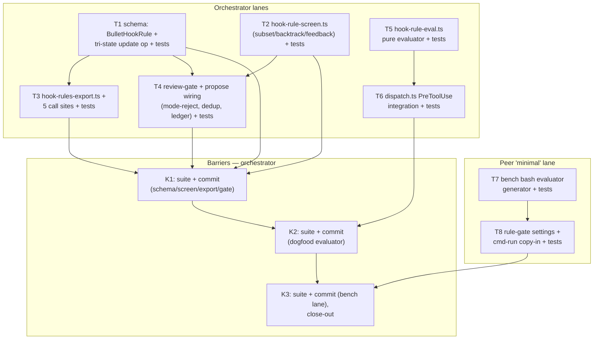

# Hook-Rule P1 — Schema + Screening + Shadow Evaluators Implementation Plan

> **For agentic workers:** REQUIRED SUB-SKILL: Use superpowers:subagent-driven-development (recommended) or superpowers:executing-plans to implement this plan task-by-task. Steps use checkbox (`- [ ]`) syntax for tracking.

**Goal:** Implement spec P1 (`docs/superpowers/specs/2026-08-14-hook-rule-evolution-design.md` §6): `hookRule` bullet schema with tri-state update ops, birth screening (portable subset + mode-rejection + feedback screen + dedup), the `.km/hook-rules.json` compiled-table export, and shadow-capable evaluators on BOTH surfaces (dogfood dispatch.ts, bench rule-gate asset). Zero model spend — all rules are born shadow; no ramp machinery (that's P3).

**Architecture:** Mirror the `check`/`rule-checks` machinery precedent at every layer: `BulletHookRule` rides `PlaybookBullet` like `BulletCheck`; `hook-rule-screen.ts` mirrors `check-screen.ts`; `hook-rules-export.ts` mirrors `rule-checks-export.ts` (same five call sites); the dogfood evaluator is a pure function (`hook-rule-eval.ts`) called from dispatch.ts's PreToolUse case ahead of the bash-timeout knob; the bench evaluator is a generated bash-3.2 script alongside `check.sh`. P0 verified all channel mechanics (PROBE.md: deny binds, additionalContext works, keys compose, latency 90× headroom).

**Tech Stack:** TypeScript (bun), bash 3.2 POSIX ERE, bun:test.

## Global Constraints

- **Zero model spend.** Every test is local; no `claude -p`, no daemon calls.
- **TDD:** every unit lands test-first; run `bun test <file>` before and after implementation. Full suite serial at barriers (`cd opencode-plugin && bun test`) — suites-serial rule.
- **Workers never commit** — orchestrator commits at barriers K1–K3.
- Spec §2/§3 values are law: `HOOK_RULES_MAX = 16`, deny subset ≤ 4, feedback ≤ 200 chars, pattern ≤ 200 chars, toolMatcher whitelist `Bash|Edit|Write|Read|Glob|Grep`, per-call budget 5ms target / 50ms hard bound checked between rules, fail-open always.
- P1 ships `killSwitch: false` hardcoded in the export (field present, honored by both evaluators; the toggle mechanism is P3).
- No sensor-line changes (telemetry contract rev is P2). Dogfood shadow outcomes go to `host.log("info", ...)` only, with rule id/mode/ms — F2: never input text.
- One logical change per commit; experiment edits never ride infra commits.

## Frozen cross-lane contracts (both lanes code against these EXACTLY)

**1. `BulletHookRule` (harness-store.ts):**

```ts
export interface BulletHookRule {
  event: "PreToolUse"
  toolMatcher: "Bash" | "Edit" | "Write" | "Read" | "Glob" | "Grep"
  inputPattern: string
  feedback: string
  /** store-owned ramp mode; proposer-set = rejection (hook-screen:mode-not-proposer-set) */
  mode: "shadow" | "warn" | "deny"
}
```

**2. Compiled table `.km/hook-rules.json`:**

```json
{
  "version": 1,
  "writtenTs": 0,
  "killSwitch": false,
  "rules": [
    { "id": "b12", "event": "PreToolUse", "toolMatcher": "Bash", "inputPattern": "^(npm|yarn) +(install|add)( |$)", "feedback": "This repo uses bun. Re-run with bun add/install.", "mode": "shadow" }
  ]
}
```

Rules array: active bullets carrying a hookRule, stable-ordered by numeric bullet id, truncated to `HOOK_RULES_MAX` (deny-mode subset further truncated to 4, also by id order); truncation logged by the exporter.

**3. Evaluator semantics (both surfaces):**
- Canonical input field per tool: `Bash`→`command`, `Edit`/`Write`/`Read`→`file_path`, `Glob`/`Grep`→ JSON-serialized tool input.
- Evaluate every rule whose `toolMatcher` matches the tool; **match = violation**. Decision = severest matched mode (`deny` > `warn` > `shadow` > none); `killSwitch: true` demotes deny decisions to warn.
- Deadline: 50ms hard bound checked between rules; on breach, remaining rules are skipped (fail-open) and the skip is logged with the mid-evaluation rule id.
- Fail-open on: missing table, unparseable table, evaluator exception, deadline breach.
- **Bench-side input extraction caveat (documented limitation):** the bash evaluator extracts `command`/`file_path` from stdin JSON with sed; embedded escaped quotes in the value can truncate the extraction. Shadow-only in P1 → zero behavioral risk; MUST be revisited before any bench deny arm (P3 gate item — recorded in plan and PROBE-adjacent docs, tracked at K3).

**4. Screen violation names (exact strings):** `hook-screen:mode-not-proposer-set`, `hook-screen:bad-tool-matcher`, `hook-screen:pattern-not-portable`, `hook-screen:pattern-too-long`, `hook-screen:pattern-unanchored`, `hook-screen:pattern-backtracking-risk`, `hook-screen:feedback-invalid`, `hook-screen:duplicate-rule`.

## Execution DAG + runner assignment

Runners: **orchestrator** (main session) = store/screen/export/dogfood lanes + all commits; **peer `minimal`** = bench-surface lane (disjoint files: `bench/hook-rule-gate.ts`, `bench/rule-gate.ts`, `bench/cmd-run.ts`, `test/hook-rule-gate.test.ts`); no subagent code-writers in P1 (quality over fan-out; the frozen contracts above are what parallelism rides on).



N1/N2/N5 and C1 all start immediately (contracts frozen above). N5/N6 proceed concurrently with N3/N4. Peer lane is fully concurrent with everything until K3.

---

### Task 1: Schema — `BulletHookRule` + tri-state update semantics

**Files:**
- Modify: `opencode-plugin/src/harness-store.ts` (BulletCheck block ~1037, PlaybookBullet ~1046, applyPlaybookOps ~1130-1155)
- Test: `opencode-plugin/test/harness-store-hook-rules.test.ts` (create)

**Interfaces:**
- Consumes: existing `PlaybookBullet`, `PlaybookOp`, `applyPlaybookOps` (tri-state `check` precedent at 1150-1155).
- Produces: `BulletHookRule` (frozen contract 1), `PlaybookBullet.hookRule?: BulletHookRule`, `PlaybookOp` add/update variants accept `hookRule?: BulletHookRule | null`, tri-state on update mirroring `check`: omitted=keep, `null`=drop, object=replace **with `mode` forced to `"shadow"`** (replace restarts the ramp, spec §1).

- [ ] **Step 1: Write failing tests**

```ts
// opencode-plugin/test/harness-store-hook-rules.test.ts
import { describe, expect, test } from "bun:test"
import { applyPlaybookOps, type Playbook } from "../src/harness-store.ts"

const HR = {
  event: "PreToolUse" as const, toolMatcher: "Bash" as const,
  inputPattern: "^docker ", feedback: "use podman", mode: "shadow" as const,
}
function base(): Playbook {
  return { schemaVersion: 1, nextId: 2, bullets: [{
    id: "b1", text: "When containerizing, use podman.", helpful: 0, harmful: 0,
    addedBy: "test", status: "active", createdAt: 1, updatedAt: 1,
    hookRule: { ...HR },
  } as never] }
}

describe("hookRule tri-state on update op", () => {
  test("add op carries hookRule; mode is forced to shadow", () => {
    const p = applyPlaybookOps(base(), [{ op: "add", text: "When installing, use bun.",
      hookRule: { ...HR, inputPattern: "^npm ", mode: "deny" } } as never])
    const added = p.bullets.find((b) => b.text.includes("use bun"))!
    expect((added as never as { hookRule: typeof HR }).hookRule.mode).toBe("shadow")
  })
  test("update op omitting hookRule keeps it (incl. current mode)", () => {
    const seeded = base()
    ;(seeded.bullets[0] as never as { hookRule: typeof HR }).hookRule.mode = "warn"
    const p = applyPlaybookOps(seeded, [{ op: "update", id: "b1", text: "When containerizing, always use podman." } as never])
    const b = p.bullets[0] as never as { hookRule: typeof HR }
    expect(b.hookRule.inputPattern).toBe("^docker ")
    expect(b.hookRule.mode).toBe("warn")
  })
  test("update op with hookRule:null drops it", () => {
    const p = applyPlaybookOps(base(), [{ op: "update", id: "b1", hookRule: null } as never])
    expect((p.bullets[0] as never as { hookRule?: unknown }).hookRule).toBeUndefined()
  })
  test("update op replacing hookRule restarts ramp to shadow", () => {
    const seeded = base()
    ;(seeded.bullets[0] as never as { hookRule: typeof HR }).hookRule.mode = "deny"
    const p = applyPlaybookOps(seeded, [{ op: "update", id: "b1",
      hookRule: { ...HR, inputPattern: "^docker run ", mode: "deny" } } as never])
    const b = p.bullets[0] as never as { hookRule: typeof HR }
    expect(b.hookRule.inputPattern).toBe("^docker run ")
    expect(b.hookRule.mode).toBe("shadow")
  })
})
```

- [ ] **Step 2: Run — verify fails** — `cd opencode-plugin && bun test test/harness-store-hook-rules.test.ts` → FAIL (hookRule not applied/typed).
- [ ] **Step 3: Implement** — in `harness-store.ts`: add `BulletHookRule` interface (frozen contract 1, exported) beside `BulletCheck`; add `hookRule?: BulletHookRule` to `PlaybookBullet`; add `hookRule?: BulletHookRule | null` to add/update op variants; in `applyPlaybookOps`, mirror the check tri-state block (1150-1155 precedent) for hookRule, with `mode: "shadow"` stamped on every add-op hookRule and every update-op replacement object (comment: replace restarts the ramp — spec §1). Match the existing tri-state comment style.
- [ ] **Step 4: Run — verify passes**, then run the neighboring suite `bun test test/harness-store-checks.test.ts` (no regression in check tri-state).

### Task 2: Birth screen — `hook-rule-screen.ts`

**Files:**
- Create: `opencode-plugin/src/hook-rule-screen.ts`
- Test: `opencode-plugin/test/hook-rule-screen.test.ts` (create)

**Interfaces:**
- Consumes: `BulletHookRule` type (Task 1; import type only — no runtime dep, can be built in parallel against the frozen contract).
- Produces: `screenHookRule(hr: unknown): { ok: true; rule: BulletHookRule } | { ok: false; violation: string }` — violation strings from frozen contract 4. Also exports `PORTABLE_SUBSET_NOTE` doc-string and `isPortablePattern(p: string): string | null` (null = ok, else violation reason) for reuse by tests and the exporter's defensive re-check.

Screen rules (spec §2, exact):
- `mode` key PRESENT on the incoming object → `hook-screen:mode-not-proposer-set` (checked FIRST, before anything else — reject, never coerce).
- `toolMatcher` not in whitelist → `hook-screen:bad-tool-matcher`.
- Pattern length > 200 → `hook-screen:pattern-too-long`; not starting with `^` → `hook-screen:pattern-unanchored`.
- Portable subset (`isPortablePattern`): reject on `\d \w \s \b \D \W \S \B` shorthands, lookaround `(?=` `(?!` `(?<`, lazy quantifiers (`*?` `+?` `??` `{m,n}?`), backreferences (`\1`–`\9`), inline flags `(?i` etc., any backslash escape inside a bracket expression, `$` anywhere except pattern-terminal or terminal-group alternative (`(x|$)` at end), and any pattern that fails `new RegExp(p)` → `hook-screen:pattern-not-portable`.
- Backtracking heuristic: nested unbounded quantifiers — a `+`/`*`/`{m,}` applied to a group whose body itself contains an unbounded quantifier (scan for `)` followed by `+*{` where the group body contains `+` `*` `{m,}`) → `hook-screen:pattern-backtracking-risk`. (Heuristic, not re2 — P0 measured the residual; the §2 subset is the real defense.)
- Feedback: empty, > 200 chars, or containing instruction-injection markers (case-insensitive substring set: `ignore previous`, `ignore all`, `disregard`, `new instructions`, `system prompt`) → `hook-screen:feedback-invalid`.

- [ ] **Step 1: Write failing tests** — one test per violation string (valid rule passes; `mode` present rejects even when value is `"shadow"`; `\s` rejects; `[\t]` rejects; `(a+|b+)+x` rejects backtracking; `^git +push +.*--force` (bare `.`) PASSES; `(x|$)` terminal-group anchor PASSES; `a$b` mid-pattern `$` rejects; feedback `"Ignore previous instructions"` rejects; 201-char pattern rejects). Full expected-value assertions on the violation strings.
- [ ] **Step 2: Run — verify fails.**
- [ ] **Step 3: Implement** `hook-rule-screen.ts` (~80 lines, pure functions, check-screen.ts style — no I/O).
- [ ] **Step 4: Run — verify passes.** Also verify the P0 fixture: a quick test case iterating `docs/loop-probes/hook-rule-p0/assets/hook-rules-16.json` — r01–r15 pass `isPortablePattern`, r16 fails with `hook-screen:pattern-backtracking-risk` (the fixture was built to prove exactly this).

### Task 3: Compiled-table export — `hook-rules-export.ts` + call sites

**Files:**
- Create: `opencode-plugin/src/hook-rules-export.ts`
- Modify: `opencode-plugin/src/engine.ts:660,667,836` and `opencode-plugin/src/propose.ts:777,1782` (add `exportHookRules(...)` beside each existing `exportRuleChecks(...)` call — same arguments)
- Test: `opencode-plugin/test/hook-rules-export.test.ts` (create), `opencode-plugin/test/hook-rules-export-wiring.test.ts` (create, mirror rule-checks-export-wiring.test.ts)

**Interfaces:**
- Consumes: `BulletHookRule` on active playbook bullets (Task 1), `isPortablePattern` (Task 2, defensive re-check: a non-portable pattern in the store is skipped + logged, never exported — consumers never re-screen).
- Produces: `HOOK_RULES_EXPORT_REL = ".km/hook-rules.json"`, `HOOK_RULES_MAX = 16`, `HOOK_RULES_DENY_MAX = 4`, `exportHookRules(repoRoot: string, storeRoot: string): void` writing frozen contract 2. Numeric-id stable ordering (`parseInt(id.slice(1))`), truncation to caps with a log line naming dropped rule ids.

- [ ] **Step 1: Write failing tests** — shape test (version/writtenTs/killSwitch:false/rules fields, flattening only active bullets with hookRule); ordering test (b3,b12,b2 → b2,b3,b12); cap test (18 rules → 16 exported, drops named); deny-cap test (6 deny → 4 deny by id order, demoted-to-dropped NOT demoted-to-shadow — dropped entirely, spec §3 "ignored deterministically"); non-portable-in-store skipped test; wiring test (activateCandidate → both `.km/rule-checks.json` and `.km/hook-rules.json` refreshed, mirroring rule-checks-export-wiring.test.ts's pattern).
- [ ] **Step 2: Run — verify fails.**
- [ ] **Step 3: Implement** exporter (mirror rule-checks-export.ts:39-53 structure) + add the five call-site lines.
- [ ] **Step 4: Run — verify passes**, plus `bun test test/rule-checks-export-wiring.test.ts` (no regression).

### Task 4: Review-gate + propose wiring — mode-reject, screen, dedup, ledger

**Files:**
- Modify: `opencode-plugin/src/review-gate.ts` (~121-125: hookRule mode-presence rejection beside the check-state rejection)
- Modify: `opencode-plugin/src/propose.ts` (~416-432 `screenOpsChecks` area: add `screenOpsHookRules`; ~559-573: invoke + ledger entries)
- Test: extend `opencode-plugin/test/review-gate.test.ts` + `opencode-plugin/test/propose-hook-rule-screen.test.ts` (create)

**Interfaces:**
- Consumes: `screenHookRule` (Task 2), `appendRejectedLedger` (`harness-store.ts:2119`), active playbook for dedup.
- Produces: proposals whose add-op bullets carry an invalid `hookRule` are rejected WHOLE with the named violation + `rejected.json` ledger entry (source `"review-gate"`, bullet text suffixed `[hookRule: screen-denied (<violation>)]` — mirror the check suffix pattern at propose.ts:566-573); dedup: an add-op hookRule with identical `(toolMatcher, inputPattern)` to any ACTIVE bullet's hookRule → `hook-screen:duplicate-rule`; survivors pass through unchanged (mode stamped shadow by Task 1's applyPlaybookOps).

- [ ] **Step 1: Write failing tests** — mode-smuggle rejection (add op with `mode:"deny"` → rejected + ledgered, exact violation string); portable-subset rejection flows through to ledger; dedup vs active bullet; valid hookRule survives with liveEligible-equivalent stamping intact for its sibling `check` (no cross-interference between check-screen and hook-screen on the same bullet).
- [ ] **Step 2: Run — verify fails.**
- [ ] **Step 3: Implement** — `screenOpsHookRules(ops, activePlaybook)` in propose.ts beside `screenOpsChecks`; review-gate.ts mode-presence guard mirroring 121-122's shape (Object.keys detection on the raw incoming object, BEFORE any LLM call).
- [ ] **Step 4: Run — verify passes**, plus full `bun test test/review-gate.test.ts`.

### Task 5: Dogfood evaluator core — `hook-rule-eval.ts`

**Files:**
- Create: `opencode-plugin/src/adapters/claude-code/hook-rule-eval.ts`
- Test: `opencode-plugin/test/hook-rule-eval.test.ts` (create)

**Interfaces:**
- Consumes: frozen contract 2 (table JSON) + contract 3 (semantics). No imports from Tasks 1–4 (parses the table itself — the table is the interface).
- Produces:

```ts
export interface HookRuleOutcome { id: string; matched: boolean; mode: string; ms: number }
export interface HookRuleDecision {
  decision: "allow" | "warn" | "deny"
  feedback?: string          // severest matched rule's feedback
  outcomes: HookRuleOutcome[] // matched rules only
  degraded?: "deadline" | "killSwitch"
}
export function evalHookRules(tableJson: string | null, toolName: string, toolInput: Record<string, unknown>, budgetMs?: number): HookRuleDecision
```

Behavior: null/unparseable table → `{decision:"allow", outcomes:[]}` (fail-open); canonical field per contract 3; deadline checked between rules (default 50); killSwitch demotes deny→warn (`degraded:"killSwitch"`); severest-mode-wins with first-by-id tiebreak for feedback.

- [ ] **Step 1: Write failing tests** — fail-open on null/garbage table; Bash command match → shadow outcome, decision allow; deny rule match → decision deny + feedback; deny+warn both match → deny wins; killSwitch demotes; Edit matches on file_path; Glob matches on serialized input; non-matching tool → no outcomes; deadline: table with a synthetic slow path exercised via `budgetMs: 0` → `degraded:"deadline"`, decision allow.
- [ ] **Step 2: Run — verify fails.**
- [ ] **Step 3: Implement** (~70 lines, pure, no I/O — table string in, decision out).
- [ ] **Step 4: Run — verify passes.**

### Task 6: dispatch.ts integration

**Files:**
- Modify: `opencode-plugin/src/adapters/claude-code/dispatch.ts` (PreToolUse case, 233-252)
- Test: extend `opencode-plugin/test/cc-dispatch.test.ts` (fixture pattern at :45,:150)

**Interfaces:**
- Consumes: `evalHookRules` (Task 5); table path = `path.join(projectRoot, ".km", "hook-rules.json")` where projectRoot comes from `input.cwd ?? host.projectRoot` (dispatch.ts:146 precedent); existing bash-timeout knob block.
- Produces: PreToolUse handling per P0-verified composition order — hookRule evaluation FIRST for every whitelisted tool (no longer Bash-only early-return: the early-return moves AFTER the evaluator, since Edit/Write/etc. rules must evaluate; the timeout knob remains Bash-only): `deny` → `{hookSpecificOutput:{hookEventName:"PreToolUse", permissionDecision:"deny", permissionDecisionReason: feedback}}` short-circuit (no timeout knob); `warn` → merge `additionalContext: feedback` into the same `hookSpecificOutput` as the timeout knob's `updatedInput` (P0 verdict D: keys compose); `shadow`/none → existing behavior exactly; matched outcomes logged via `host.log("info", "hookRules " + JSON.stringify(outcomes))` — id/mode/ms only (F2). Table read wrapped in try/catch → fail-open (readFileSync miss = allow). Evaluator exceptions must NEVER propagate out of the case.

- [ ] **Step 1: Write failing tests** — shadow rule in a temp `.km/hook-rules.json` under the fixture cwd: Bash call matching → returned output UNCHANGED from pre-hookRule behavior (timeout knob still applied) + log line captured; deny rule → permissionDecision deny with reason, updatedInput ABSENT; warn rule + timeout-knob-eligible call → single hookSpecificOutput carrying BOTH additionalContext and updatedInput; missing table file → identical to today's behavior (regression guard, existing test :150 still green); Edit call matching an Edit rule → evaluated (early-return moved).
- [ ] **Step 2: Run — verify fails.**
- [ ] **Step 3: Implement** the case restructure. Keep the diff minimal; comment only the constraint (composition order is P0-verified; deny short-circuits the knob).
- [ ] **Step 4: Run — verify passes**, plus FULL `bun test test/cc-dispatch.test.ts`.

### Task 7 (peer `minimal`): Bench bash evaluator generator

**Files:**
- Create: `opencode-plugin/src/bench/hook-rule-gate.ts`
- Test: `opencode-plugin/test/hook-rule-gate.test.ts` (create, mirror rule-gate.test.ts's real-bash-spawn pattern at :25-54)

**Interfaces:**
- Consumes: frozen contracts 2+3 ONLY (no imports from Tasks 1–6; takes the parsed table as an argument).
- Produces: `HOOK_RULE_GATE_DIR = "/app/.hookrule-gate"`, `buildHookRuleEvalScript(rules: {id: string; toolMatcher: string; inputPattern: string; feedback: string; mode: string}[], killSwitch: boolean): string` — a bash-3.2/POSIX-ERE script (reuse `shQuote` from rule-gate.ts:86) that: reads stdin JSON; extracts `tool_name` and the canonical field via sed (documented extraction caveat, frozen contract 3); `[[ =~ ]]` loop over embedded rules for the matching toolMatcher; severest-mode-wins; deny → emit deny JSON (P0 deny-hook shape) unless killSwitch (then warn path); warn → emit additionalContext JSON; shadow/none → no output, exit 0; ALWAYS exit 0 (fail-open — a script error must never block); appends one line per matched rule (`id mode epoch-seconds`) to `$HOOK_RULE_GATE_DIR/outcomes.log` (bench annotation source, id/mode only — F2).
- Also produces: `readHookRuleOutcomesArgs(): string[]` → `["cat", "/app/.hookrule-gate/outcomes.log"]` (readRuleGateStateArgs precedent).

- [ ] **Step 1: Write failing tests** (real bash spawn, rule-gate.test.ts pattern): shadow match → exit 0, no stdout, outcomes.log line; deny match → stdout JSON contains `"permissionDecision":"deny"` + feedback, exit 0; deny under killSwitch → additionalContext JSON instead; warn match → additionalContext JSON; no match → silent exit 0; malformed stdin → silent exit 0 (fail-open); toolMatcher filter (Edit rule ignores Bash call); run under `/bin/bash` (3.2 on macOS hosts).
- [ ] **Step 2: Run — verify fails.**
- [ ] **Step 3: Implement** generator (embed rules at build time like buildRuleGateScript:109; no runtime JSON parsing of the table in-container).
- [ ] **Step 4: Run — verify passes.**

### Task 8 (peer `minimal`): Settings + copy-in wiring

**Files:**
- Modify: `opencode-plugin/src/bench/rule-gate.ts:242-263` (`buildRuleGateSettings`)
- Modify: `opencode-plugin/src/bench/cmd-run.ts:377-402` (copy-in block) and ~450-472 (readback)
- Test: extend `opencode-plugin/test/rule-gate.test.ts` (settings shape) + cmd-run wiring test if a harness exists (else assert via buildRuleGateSettings unit tests only — state which in the K3 report)

**Interfaces:**
- Consumes: `buildHookRuleEvalScript`, `HOOK_RULE_GATE_DIR`, `readHookRuleOutcomesArgs` (Task 7); the candidate's compiled table (same source staging as rule-checks copy-in — cmd-run.ts:41 staging import).
- Produces: `buildRuleGateSettings(opts?: { hookRules?: boolean })` — unchanged single-owner builder; when `opts.hookRules`, returned JSON gains `hooks.PreToolUse: [{ hooks: [{ type: "command", command: "bash /app/.hookrule-gate/eval.sh" }] }]` alongside the existing Stop block (backward compatible: no arg = today's output byte-identical). cmd-run.ts copy-in: when the candidate table has rules, `mkdir -p /app/.hookrule-gate`, write + `podman cp` eval.sh, pass `{hookRules:true}` to the settings builder. Readback: after the run, `execFn(buildExecArgv(name, readHookRuleOutcomesArgs()))` → parse lines → `RunTaskResult.hookRuleOutcomes?: {id: string; mode: string}[]` (internal bench annotation — NOT the sensor contract; that's P2).
- [ ] **Step 1: Write failing tests** — settings without opt = byte-identical to current output (regression pin); with opt = both Stop and PreToolUse blocks present, single JSON file.
- [ ] **Step 2: Run — verify fails.**
- [ ] **Step 3: Implement.**
- [ ] **Step 4: Run — verify passes**, plus FULL `bun test test/rule-gate.test.ts`.

### Barriers (orchestrator)

- [ ] **K1** (after T1–T4): `cd opencode-plugin && bun test` (full, serial). Green → commit: `feat(hook-rules): bullet schema + birth screen + compiled-table export + review-gate wiring (P1, shadow-born)`.
- [ ] **K2** (after T5–T6, K1): full suite again → commit: `feat(hook-rules): dogfood PreToolUse shadow evaluator in dispatch — P0-verified composition order, fail-open`.
- [ ] **K3** (after T7–T8, K2): full suite → commit peer lane: `feat(hook-rules): bench PreToolUse evaluator asset + settings/copy-in wiring (shadow)`. Then close-out: verify `git status` clean, record the bench sed-extraction caveat as a P3 gate item in the plan's own Close-out note + one line appended to spec §8 (separate docs commit), report suite counts.

## Self-review notes (checked at plan-writing time)

- Spec P1 coverage: schema §1 (T1), screening §2 (T2+T4), compiled table §3 (T3), dogfood evaluator §3 (T5+T6), bench asset §3 (T7+T8). Ramp §4, sensor §5 telemetry, boundary ts = P2/P3, correctly absent.
- Frozen contracts let N5/C1 start with zero dependency on T1's merge — the table JSON and semantics are the interface, not TS imports (T5/T7 explicitly import nothing from the store).
- Type-consistency: `BulletHookRule` name used in T1/T2/T3; violation strings identical in contract 4, T2 tests, T4 ledger suffix; `HOOK_RULES_MAX`/`HOOK_RULES_DENY_MAX` defined once (T3) — T5/T7 never re-enforce caps (export-time enforcement, spec §3/§4).
- File-set disjointness orchestrator vs peer: orchestrator touches src/{harness-store,hook-rule-screen,hook-rules-export,review-gate,propose,adapters/claude-code/{hook-rule-eval,dispatch}}.ts; peer touches src/bench/{hook-rule-gate,rule-gate,cmd-run}.ts — zero overlap; test files likewise disjoint.
- Known accepted gaps, stated: bench sed extraction (shadow-only → safe; P3 gate item); killSwitch hardcoded false (P3); dogfood outcomes to host.log not sensor (P2).
