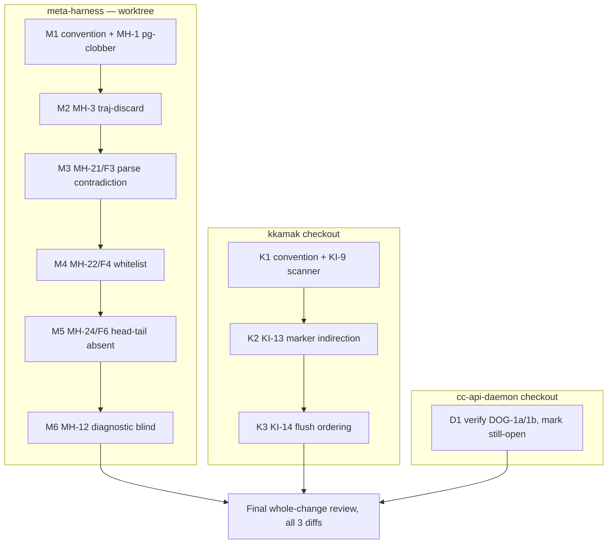

# Debt-In-Suite Markers Implementation Plan

> **For agentic workers:** REQUIRED SUB-SKILL: Use superpowers:subagent-driven-development (recommended) or superpowers:executing-plans to implement this plan task-by-task. Steps use checkbox (`- [ ]`) syntax for tracking.

**Goal:** Land calibrated `test.skip` markers for the 11 probe-verified expressible holes (verdict: `docs/loop-probes/debt-instrument-20260822/verdict.md`) so every green suite run visibly counts its known holes — debt lives in the suite, not in prose.

**Architecture:** One marker test per hole, in the owning repo's existing test tree. Every marker is CALIBRATED before it lands: written active first, run, must FAIL naming the hole (proves it pins something real), then flipped to `test.skip` (visible in skip counts, un-skipping IS the revisit). Marker name format is greppable: `KNOWN-HOLE(<census-id>): <hole>`. Three repos = three independent tracks; tracks run in PARALLEL (separate working trees), tasks within a track run SERIAL (one implementer per tree).

**Tech Stack:** bun:test (all three repos), TypeScript. No new deps, no new tooling (YAGNI: DOG-1a's grep-enforcement pattern exists if a repo later wants marker-count locks).

## Global Constraints

- **Calibration is mandatory per marker:** active-run→FAIL→flip-to-skip→green. A marker that passes when unskipped pins nothing and must not land (it would be the vacuous-check class this whole program exists to kill).
- Marker test title starts exactly `KNOWN-HOLE(<id>): ` with the census id (KI-9, MH-1, …); a comment above it cites the census row and states the unskip condition ("unskip when X; the test then pins the fix").
- Markers assert the DESIRED behavior (they go green when the hole is fixed) — never assert the broken behavior.
- No production code changes anywhere in this plan. Markers only, plus one convention line per repo.
- Suite green after every task (skips may grow, fails may not): meta-harness `cd opencode-plugin && bun test`; kkamak `bun test` at repo root; cc-api-daemon `bun test` at repo root. Run FOREGROUND with `| tail -4`.
- One commit per task. No pushes (user pushes).
- Convention line (verbatim, added once per repo to its CLAUDE.md): `Known-open holes carry a calibrated skip-marker test (KNOWN-HOLE(<id>) — see meta-harness docs/loop-probes/debt-instrument-20260822/): a partial fix or deferral lands WITH its marker; unskipping is the revisit.`

## DAG



Tracks M, K, D have no shared files and different working trees — dispatch their first tasks concurrently. Inside a track: serial (single implementer per tree; later tasks may touch the same test files).

Ordering rationale inside M: M1/M2 are fully-specified (machinery known); M3–M5 share the lane-A probe-record environment (implementer accumulates it once, tasks stay separate for review); M6 is least-specified and carries an explicit park path.

---

### Task M1: convention line + MH-1 marker (project-global transition clobbers .km tables)

**Files:**
- Modify: `CLAUDE.md` (meta-harness root — append the convention line under "Repository guidance")
- Test: `opencode-plugin/test/known-holes.test.ts` (create)

**Interfaces:**
- Consumes: `exportRuleChecks(repoRoot, storeRoot)` + `exportHookRules(repoRoot, storeRoot)` from `src/rule-checks-export.ts` / `src/hook-rules-export.ts`; playbook JSON shape from `src/harness-store.ts` (`{schemaVersion:1, nextId, bullets:[{id,text,helpful,harmful,addedBy,status,createdAt, check?:{cmd,timeoutMs,state,liveEligible}}]}`).
- Produces: the `known-holes.test.ts` file that M2 appends to.

- [ ] **Step 1: Write the marker ACTIVE (calibration form):**

```ts
import { test, expect } from "bun:test"
import * as fs from "node:fs"; import * as path from "node:path"; import * as os from "node:os"
import { exportRuleChecks } from "../src/rule-checks-export.ts"
import { exportHookRules } from "../src/hook-rules-export.ts"

// KNOWN-HOLE(MH-1) — census: docs/loop-probes/debt-instrument-20260822/census.md.
// Single-layer exporters are last-writer-wins: a transition on a layer with no
// checks/rules (project-global here) wipes the .km tables another layer
// (mh-build) just populated. Unskip when exports become union-across-layers or
// otherwise clobber-safe; this test then pins the fix.
test("KNOWN-HOLE(MH-1): project-global export preserves another layer's .km tables", () => {
  const repo = fs.mkdtempSync(path.join(os.tmpdir(), "mh-hole-mh1-"))
  const mkStore = (bullets: unknown[]) => {
    const root = fs.mkdtempSync(path.join(os.tmpdir(), "mh-hole-mh1-store-"))
    fs.mkdirSync(path.join(root, "active"), { recursive: true })
    fs.writeFileSync(path.join(root, "active", "playbook.json"),
      JSON.stringify({ schemaVersion: 1, nextId: 99, bullets }))
    return root
  }
  const mhBuild = mkStore([{ id: "b1", text: "When X, do Y.", helpful: 0, harmful: 0,
    addedBy: "v1", status: "active", createdAt: "2026-08-22T00:00:00Z",
    check: { cmd: "true", timeoutMs: 1000, state: "shadow", liveEligible: true } }])
  const pg = mkStore([]) // project-global: no checks, no rules — the wiping layer
  exportRuleChecks(repo, mhBuild)
  const before = JSON.parse(fs.readFileSync(path.join(repo, ".km", "rule-checks.json"), "utf8"))
  expect(before.rules).toHaveLength(1)
  // the transition event on the other layer:
  exportRuleChecks(repo, pg)
  exportHookRules(repo, pg)
  const after = JSON.parse(fs.readFileSync(path.join(repo, ".km", "rule-checks.json"), "utf8"))
  expect(after.rules).toHaveLength(1) // DESIRED: mh-build's check survives
})
```

- [ ] **Step 2: Run active, verify it FAILS** — `bun test test/known-holes.test.ts` → expect FAIL on the final assertion (`after.rules` is `[]` — the clobber, live). If it PASSES, STOP: either the hole is already fixed (report NEEDS_CONTEXT) or the test pins nothing.
- [ ] **Step 3: Flip `test(` → `test.skip(`** on that one test. Run file again → 0 fail, 1 skip.
- [ ] **Step 4: Append the convention line (verbatim from Global Constraints) to `CLAUDE.md`.**
- [ ] **Step 5: Full suite** `cd opencode-plugin && bun test 2>&1 | tail -4` → 0 fail.
- [ ] **Step 6: Commit** — `git add CLAUDE.md opencode-plugin/test/known-holes.test.ts && git commit -m "test(known-holes): MH-1 calibrated marker — pg-transition table clobber; debt-in-suite convention line"`

---

### Task M2: MH-3 marker (`--layers none` silently discards trajectories)

**Files:**
- Modify: `opencode-plugin/test/known-holes.test.ts` (append)

**Interfaces:**
- Consumes: `recordToStores(...)` at `src/bench/record.ts:398` — READ its full signature + the `layerStoreRoots(layers, agent, metaRoot)` helper (record.ts:57) first; the hole is the write loop at record.ts:432 iterating `layerStoreRoots("none", …)` = `[]`, so `writeTrajectory` never runs even with `saveAllTraj=true`.

- [ ] **Step 1: Write the marker ACTIVE.** Shape (adjust ONLY argument plumbing to the real signature after reading it — the assertion is fixed):

```ts
// KNOWN-HOLE(MH-3) — census row MH-3; measured 2026-08-20 (resume.md warning
// block): layers="none" makes layerStoreRoots return [], so the traj write
// inside the store loop never executes — --save-all-traj silently no-ops and
// mechanism evidence is unrecoverable. Unskip when record.ts persists
// trajectories independently of layer stores (or refuses the combination
// loudly); this test then pins the fix.
test("KNOWN-HOLE(MH-3): layers=none with saveAllTraj still persists the trajectory somewhere", () => {
  // construct: tmp metaRoot, minimal passing session record with 1 event,
  // call recordToStores(..., layers: "none", saveAllTraj: true, ...)
  // assert: at least one trajectory file exists under the tmp metaRoot tree
  // (glob **/traj/*.ndjson) OR the call threw a loud refusal — either is a fix;
  // silent zero-file success is the hole.
})
```

The implementer fills the construction from `recordToStores`'s real parameter list (it is long — copy a call shape from an existing test that calls it; grep `recordToStores(` under test/). The assertion block above is the contract: `expect(trajFilesFound > 0 || threwLoudly).toBe(true)`.

- [ ] **Step 2: Run active → FAIL** (files=0, no throw). PASS ⇒ STOP per M1 Step 2 rule.
- [ ] **Step 3: Flip to `test.skip`, file green.**
- [ ] **Step 4: Full suite green. Commit** — `git commit -m "test(known-holes): MH-3 calibrated marker — layers=none discards trajectories"`

---

### Task M3: MH-21/F3 marker (audit cell parse contradiction)

**Files:**
- Modify: `opencode-plugin/test/known-holes.test.ts` (append)

**Environment (read first, in order):** `docs/loop-probes/f3-cell-contract-20260820/` (the probe's recorded cells — O2 split-channels outcome; the 4 UNPARSED cells with units/derivations are the exact failing inputs) · the reval parser it feeds (grep `parseRevalBlock` / `REVAL_MARKER` under `opencode-plugin/src/` — shipped in the lane-a revalidator arc).

- [ ] **Step 1: Write the marker ACTIVE.** Take ONE verbatim unparsed-but-prompt-conformant cell from the F3 probe record (quote it in the test, cite the probe file path in the comment). Assert the DESIRED contract: the parser either parses it or the prompt schema forbids it — the hole is that the prompt's own toolless fix produces cells the parser rejects. Test: `parseRevalBlock(<recorded block with that cell>)` succeeds (returns parsed landings, no reject). Comment: `KNOWN-HOLE(MH-21) — F3 2026-08-20: prompt-conformant cells carry units/derivations; parser demands bare numerics. Unskip when prompt and parser agree on one cell grammar.`
- [ ] **Step 2: Run active → FAIL (parser rejects the recorded cell). PASS ⇒ STOP.**
- [ ] **Step 3: Flip to skip; file green. Step 4: suite green; commit** — `git commit -m "test(known-holes): MH-21 calibrated marker — F3 prompt/parser cell-grammar contradiction"`

---

### Task M4: MH-22/F4 marker (single-op whitelist rejects a correct audit)

**Files:**
- Modify: `opencode-plugin/test/known-holes.test.ts` (append)

**Environment:** `docs/loop-probes/f4-retraction-20260820/retraction.md` (the trap class + the correct-physics multi-op transform the whitelist cannot express) · `applyTransform`'s whitelist (grep `applyTransform` under `opencode-plugin/src/bench/` — reval-fit.ts family).

- [ ] **Step 1: Marker ACTIVE.** From the retraction record, reconstruct the correct transform for the trap class (the composition the models needed — the record documents it precisely; quote it). Assert DESIRED: `applyTransform` (or the gate path over it) accepts a correct declaration of that class. Comment: `KNOWN-HOLE(MH-22) — F4 2026-08-22 census: a CORRECT audit can never pass the gate on this trap class; whitelist is single-op. Unskip when the transform family covers it (spec-gated, NOT by adding an answer-key op — see f4-retraction for the op that was reverted).`
- [ ] **Step 2: Active → FAIL. Step 3: skip; green. Step 4: suite; commit** — `git commit -m "test(known-holes): MH-22 calibrated marker — F4 correct-audit-cannot-pass whitelist gap"`

---

### Task M5: MH-24/F6 marker (head/tail near-match anti-fabrication absent)

**Files:**
- Modify: `opencode-plugin/test/known-holes.test.ts` (append)

**Environment:** F6 finding (resume.md lane-A block + `docs/loop-probes/f3-cell-contract-20260820/`): fabricated landing inputs pass the range guard but are ABSENT from the sample's head/tail — 3 of 4 fabrications would have been caught. The revalidator's guard chain (grep the range/degeneracy guards near `parseRevalBlock`/reval-fit).

- [ ] **Step 1: Marker ACTIVE.** Use one recorded fabricated-input case (input value absent from sample head/tail, passes range guard). Assert DESIRED: the revalidation gate REJECTS a landing whose input appears nowhere in the sample's head/tail window. Comment: `KNOWN-HOLE(MH-24) — F6: spec §10 'implement or accept' resolved to implement; not built. Unskip when head/tail near-match lands; this is its acceptance test.`
- [ ] **Step 2: Active → FAIL (gate currently accepts the fabrication). Step 3: skip; green. Step 4: suite; commit** — `git commit -m "test(known-holes): MH-24 calibrated marker — F6 head/tail near-match unbuilt"`

---

### Task M6: MH-12 marker (residual-pattern diagnostic blind) — park-permitted

**Files:**
- Modify: `opencode-plugin/test/known-holes.test.ts` (append) — OR a park note (see Step 2).

**Environment:** `docs/loop-probes/dnc-second-fixture-20260820/addendum-01-final-review.md` + `addendum-02-two-masters.md` (the 0.63-vs-0.65 blindness: residual-pattern diagnostic cannot separate two bad list entries from a wrong transform).

- [ ] **Step 1: Attempt the marker ACTIVE:** reconstruct the two recorded inputs (bad-entries case 0.63, wrong-transform case 0.65) from the addenda; assert DESIRED: the diagnostic distinguishes them (different verdicts). FAIL expected today (verdicts indistinguishable).
- [ ] **Step 2: If the addenda do not record the inputs precisely enough to reconstruct without inventing numbers — STOP, do not fabricate (a marker with invented inputs pins nothing).** Report status DONE_WITH_CONCERNS: "MH-12 not expressible from the recorded evidence; needs the fixture-2 artifacts on yoo-dev" and append that line to the census verdict's expressible list as a correction (11→10). This park path is a legitimate probe-refinement outcome, not a failure.
- [ ] **Step 3 (marker path only): skip; green; suite; commit** — `git commit -m "test(known-holes): MH-12 calibrated marker — residual diagnostic blind to bad-entry vs wrong-transform"`

---

### Task K1: kkamak convention line + KI-9 marker (import scanner matches prose in comments)

**Repo/working tree: `/Users/yoo/z2/kkamak` (NOT the meta-harness worktree).**

**Files:**
- Modify: `~/z2/kkamak/CLAUDE.md` (convention line; create the file if absent — check first)
- Modify: `~/z2/kkamak/test/imports.test.ts` (append marker) — READ the file first: its scanner regex (~line 35 comment: "Matches static import/export ... from") is the subject.

**Environment:** known-issues #9 (`docs/known-issues.md:326-392`) — the measured false positive: prose `from "old and merely / slow"` spanning two doc-comment lines read as an import; two reword-to-pass events on record.

- [ ] **Step 1: Marker ACTIVE.** Fixture: write a temp .ts file whose only "import-like" text is inside a doc comment (reuse the recorded prose shape: a line containing `* ... from "old and merely` continued `* slow" ...`). Run the SAME scan the test file uses (extract its regex/helper — read how existing tests invoke it) and assert DESIRED: zero import matches. Comment: `KNOWN-HOLE(KI-9) — known-issues #9: scanner is not comment-aware; two reword-to-pass events on record (#9, dogfood 08-20). Unskip when comments are stripped before the regex or a real parser lands.`
- [ ] **Step 2: Active → FAIL (scanner matches the prose). PASS ⇒ STOP (hole may be fixed; check known-issues status).**
- [ ] **Step 3: Flip to `test.skip`; file green. Step 4: convention line into CLAUDE.md. Step 5: repo suite `bun test 2>&1 | tail -4` → 0 fail. Step 6: commit** — `git commit -m "test(known-holes): KI-9 calibrated marker — import scanner comment-blindness; debt-in-suite convention"`

---

### Task K2: KI-13 marker (oneshot marker count blind to indirection)

**Files:**
- Modify: the kkamak test file covering oneshot's marker mechanism — locate via `grep -rln "marker" ~/z2/kkamak/test/` cross-referenced with known-issues #13 (`docs/known-issues.md:590-661` — READ IT FULLY first; it names the Source-2 marker-count mechanism and the indirection shape that evades it).

- [ ] **Step 1: Marker ACTIVE.** Construct the exact indirection case #13 records (a write reaching the graded artifact through a command the marker counter does not attribute — the issue text specifies the shape; quote it in the comment). Assert DESIRED: marker count includes the indirect write. Comment: `KNOWN-HOLE(KI-13) — known-issues #13: marker blind to indirection; needs its own review before any change (this marker pins the behavior, decides nothing about the fix).`
- [ ] **Step 2: Active → FAIL. PASS ⇒ STOP + report (issue may have moved).**
- [ ] **Step 3: skip; green. Step 4: suite; commit** — `git commit -m "test(known-holes): KI-13 calibrated marker — oneshot marker indirection blindness"`

---

### Task K3: KI-14 marker (multi-extension sensor-flush ordering)

**Files:**
- Modify: kkamak extensions test file (locate: `grep -rln "EXTENSIONS\|extensions" ~/z2/kkamak/test/`) — READ `src/extensions/registry.ts` + known-issues #14 (`docs/known-issues.md:663-692`) first; #14 states the defect materializes "the moment a second extension is added to EXTENSIONS".

- [ ] **Step 1: Marker ACTIVE.** In-test: construct the extension context with TWO fake extensions (mirror how the existing extension tests build one — hold-and-flush sensor decoration is the seam) and assert DESIRED: flush order/composition is deterministic per whatever contract #14 says is missing (quote #14's own sentence for the asserted property). If the registry API cannot register a second extension from test code without production changes — STOP, report DONE_WITH_CONCERNS with the API limitation; do NOT modify production code (Global Constraint). Park like M6.
- [ ] **Step 2: Active → FAIL. Step 3: skip; green. Step 4: suite; commit** — `git commit -m "test(known-holes): KI-14 calibrated marker — multi-extension flush ordering undefined"`

---

### Task D1: cc-api-daemon — verify DOG-1a/1b, mark only what is still open

**Repo/working tree: `/Users/yoo/z2/cc-api-daemon`.**

**Files:**
- Possibly modify: a new `~/z2/cc-api-daemon/test/known-holes.test.ts` + `CLAUDE.md` convention line — ONLY if verification finds either hole still open.

- [ ] **Step 1: Verify DOG-1a (lingering disabled tests):** `grep -rn "\.skip\|skipIf" test/` — classify each hit: env-conditional (`skipIf(GATE_FAST)`, `skipIf(!HAS_CREDENTIALS)` = deliberate, contract-documented in warm-session.test.ts header) vs unconditional `.skip` (= the DOG-1a class). Zero unconditional ⇒ DOG-1a is CLOSED in practice; record that.
- [ ] **Step 2: Verify DOG-1b (duplicate implementations of the same three names):** find the three names in the dogfood-log account (kkamak `docs/dogfood-log.md:513-522` names them) and grep the current source for double definitions. Resolved ⇒ record; still dual ⇒ marker: a test asserting single definition per name (grep-shaped assertion in-test).
- [ ] **Step 3: If BOTH closed:** no test file; commit ONLY the CLAUDE.md convention line + a one-line note in the commit body that DOG-1a/1b were verified closed (census correction: expressible 11→9 minus parks). If either open: marker per the calibration protocol (active→FAIL→skip), then convention line, suite, commit — `git commit -m "test(known-holes): DOG-1a/1b verification + markers for still-open holes; debt-in-suite convention"`

---

### Final: whole-change review

One reviewer, three diffs (meta-harness branch diff, kkamak diff, cc-api-daemon diff) + the census verdict. Checks: every landed marker is calibration-proven in its task report (active-FAIL evidence quoted) · titles/comments match the `KNOWN-HOLE(<id>)` convention · no production code changed anywhere · park decisions (M6/K3/D1 paths) recorded with evidence, and the verdict's expressible-count corrected if parks occurred.

## Self-Review

1. **Spec coverage:** all 11 verdict items have tasks — MH-1(M1), MH-3(M2), MH-21(M3), MH-22(M4), MH-24(M5), MH-12(M6, park-permitted), KI-9(K1), KI-13(K2), KI-14(K3, park-permitted), DOG-1a+1b(D1, verify-first). Convention line: all three repos (M1/K1/D1). Gap: none.
2. **Placeholder scan:** M2/M3/M4/M5/M6/K2/K3 carry read-first environments with exact file paths and fixed assertion contracts rather than full code — the recorded probe inputs live in those files and must be QUOTED, not invented; each task states the STOP rule against fabrication. This is the anti-fabrication law applied to the plan itself, not a placeholder.
3. **Type consistency:** single shared test file per repo (`known-holes.test.ts` in meta-harness; kkamak markers ride existing subject files); no cross-task type surface beyond bun:test.

Known risks, stated: calibration may reveal an already-fixed hole (STOP rules convert that to a census correction, which is a probe win, not a failure) · M6/K3 may be inexpressible without artifacts/API this host lacks (park paths defined, verdict count corrected honestly) · kkamak/cc-api-daemon commits land on their mains directly (solo-dev convention, small test-only diffs).
