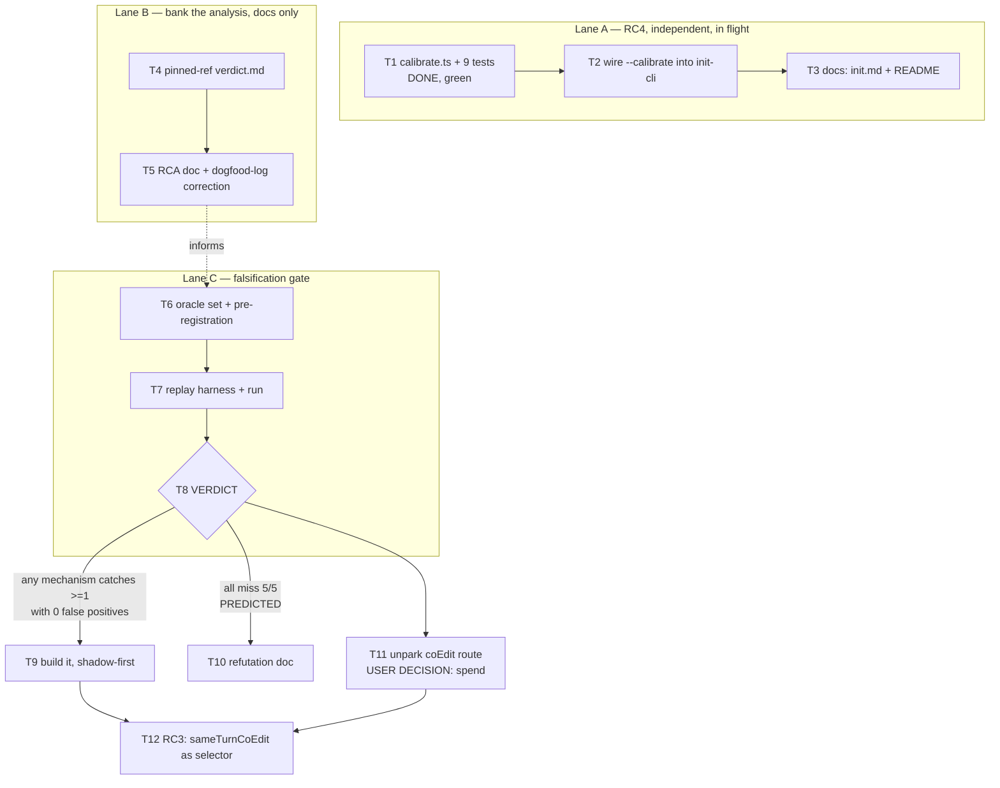

# Loosening-Gap Root Cause + Fix Implementation Plan

> **For agentic workers:** REQUIRED SUB-SKILL: Use superpowers:subagent-driven-development (recommended) or superpowers:executing-plans to implement this plan task-by-task. Steps use checkbox (`- [ ]`) syntax for tracking.

**Goal:** Close the four root causes behind "the gate caught 0 real defects, review caught 5" — and refuse to build any mechanism that has not first been shown to catch a measured escape.

**Architecture:** Three independent lanes. Lane A ships the one root cause that is already fixable (fail-open vacuity, via init-time calibration). Lane B banks the analysis that currently exists only as prose in an 8000-line handoff file. Lane C is a **falsification gate**: a replay probe against a 5-case oracle set drawn from this repo's own escaped defects, run *before* any mechanism is built. Lane C's verdict decides whether Tasks 9–12 exist at all.

**Tech Stack:** Bun 1.3 + TypeScript, `bun test`, kkamak 0.8.0 extension seam, git plumbing (`git worktree`, `git apply -R`).

---

## THE FINDING THAT SHAPES THIS PLAN

The earlier root-cause list said the escapes were **correlated generator-evaluator error** — agent writes impl and tests together, test encodes the same misunderstanding. Checked against the five actual commits, that is **the wrong mechanism**:

| # | defect | fix commit | shape |
|---|---|---|---|
| 1 | accept/exhausted resets never checked `persist()`'s return | `bcc23ee` | **missing guard** |
| 2 | `DEFAULT_TEST_PATH_PATTERN` false-negative on bare `test.ts` | `bcc23ee` | **missing branch** |
| 3 | README config table missing 3 fields | `bcc23ee` | docs — not a code defect |
| 4 | `FileStateStore.save()` lost-update race | `1589ae1`, `93b7986` | **missing CAS, then missing lock** |
| 5 | reverse of the guarded race left unguarded; lock reclaimed on age without liveness | `c2a48e3` | **missing guard** |

**Zero of five is a loosened assertion.** Not one instance in this corpus of an agent weakening a test to get through the gate. Every one is *absent code with a correspondingly absent test*. `c2a48e3`'s own message says it: *"The reverse of the already-guarded race was unguarded."*

Evidence basis: fix-commit messages and diffstats for all five, not a line-by-line read of every diff. Task 7 replays them mechanically, which is what settles it.

The consequence is structural, and it kills a whole family of candidate fixes:

> **An absent branch has no line to mutate, no hunk to revert, and no line to cover.** Every deterministic diff-derived mechanism — mutation testing, hunk-revert discrimination, changed-line coverage, pinned-ref — inspects code that exists. None of them can see code that was never written.

This is the same wall pinned-ref hit, one level deeper. Pinned-ref was refuted because 100% of escapes were in files that did not exist at the pin. The generalization: 100% of escapes were in *code paths that did not exist at all*.

**Corrected root-cause list:**

| RC | statement | status |
|---|---|---|
| RC1 | **Correlated omission** (not correlated error): the agent and its tests share a blind spot about what could go wrong, not a wrong belief about what the code does. 5/5 measured. | open; only Lane C can propose a fix |
| RC2 | Downstream-of-decision: the suite is authored by the agent it audits; no prior from outside the artifact. | open; structural |
| RC3 | `implOnly`/`sameTurnCoEdit` are computed and wired to nothing. | open; Task 12 |
| RC4 | Fail-open collapses "check ran nothing" and "check passed". | Lane A, in flight |

**Measured catch rate, our corpus: independent fresh-context review 5/5. Gate 0/5.** That is the only mechanism with evidence behind it, and it is currently parked on a rationale this finding invalidates — the parking note says the peer-reviewed fix is "a deterministic non-LLM check, which the runner already is." A deterministic check cannot see absent code. Task 11 unparks it; it needs a user decision, not a rebuttal.

---

## Global Constraints

- **kkamak is public. The generality rule applies**: no answer keys, no per-domain registries, no facts added in response to a case that failed. Mechanism growth requires validation against an oracle set AND a bad set.
- **Kernel byte-untouched** for extension work: config-gated, off by default, 0.7.0-parity pinned. `src/extensions/gauge/` is the template.
- **`Extension.afterDecision` MUST NOT change the emitted decision** (`src/extensions/registry.ts:36-40`). Shadow-first is not a preference here, it is the seam's contract.
- **`resetWithRetry` wipes `touchedPaths` before `afterDecision` runs** (`src/kernel/gate.ts:359`). An extension cannot read the cycle's paths from state. Trigger from `SensorLine.sameTurnCoEdit` via the `wrapHost` sensor decoration; source file lists from git.
- **TDD.** One change per commit. Explicit go before merge/push of code; docs pushes need no go.
- **Suite baseline: 712 pass / 3 skip / 0 fail** (kkamak, `bun test`, 36 files, ~31s). Never unskip a `KNOWN-HOLE` without reading its unskip comment.
- Worktree `~/z2/kkamak-refutation-lane` must stay a **sibling** of `meta-harness` — `test/sensor-contract.test.ts:309` resolves the cross-repo vector via `../../`.
- **Leave no untracked file in `meta-harness` at end of turn.** Verified 2026-08-22: an untracked non-doc path enters `dirtyTreeId()`'s tree and hits `km-crank/src/gate-check-core.ts:142`'s conservative fallback, unioning all five suites into every subsequent Stop. Commit or delete before finishing.

---

## Execution DAG



**Parallelism:** Lanes A, B, C have no shared files and no ordering between them — run all three concurrently. Lane A is ~40 minutes of work already half-done; Lane B is pure docs; Lane C is the expensive one and the only one that can invalidate downstream work. **Start Lane C first** if serializing, because T8 decides whether T9/T12 are worth staffing.

**Files touched per lane — no overlap:**

| lane | writes |
|---|---|
| A | `kkamak/src/cli/calibrate.ts`, `kkamak/src/cli/init-cli.ts`, `kkamak/test/calibrate.test.ts`, `kkamak/test/init-cli.test.ts`, `kkamak/commands/init.md`, `kkamak/README.md` |
| B | `meta-harness/docs/loop-probes/pinned-ref-gauntlet-20260822/verdict.md`, `meta-harness/docs/loop-probes/omission-rca-20260822/`, `kkamak/docs/dogfood-log.md` |
| C | `meta-harness/docs/loop-probes/omission-rca-20260822/*` |

---

## File Structure

**New, Lane A** (`~/z2/kkamak-refutation-lane`):
- `src/cli/calibrate.ts` — canary mechanism. Pure of CLI concerns; takes an injected `run`. **Already written, 9/9 green.**
- `test/calibrate.test.ts` — mechanism cases. **Already written.**

**Modified, Lane A:**
- `src/cli/init-cli.ts` — add `--calibrate`, report, exit code.
- `test/init-cli.test.ts` — 4 CLI-level cases. **Already written, 3 currently RED.**
- `commands/init.md` — the walkthrough must offer what the CLI offers.
- `README.md` — one row in the flags table.

**New, Lanes B/C** (`~/z2/meta-harness`):
- `docs/loop-probes/pinned-ref-gauntlet-20260822/verdict.md` — the missing verdict; every sibling probe dir has one.
- `docs/loop-probes/omission-rca-20260822/pre-registration.md` — oracle set, candidate mechanisms, decision rule, all frozen before T7 runs.
- `docs/loop-probes/omission-rca-20260822/replay.ts` — the harness.
- `docs/loop-probes/omission-rca-20260822/verdict.md` — written after T7, whatever it says.

---

## Task 1: Canary calibration mechanism — **COMPLETE**

Recorded for the DAG. `src/cli/calibrate.ts` + `test/calibrate.test.ts` exist and pass 9/9. Exports:

```ts
export type CalibrationReason =
  | "check-fails-on-canary" | "check-passes-on-canary" | "already-red"
  | "check-timed-out" | "no-test-file-found" | "canary-path-occupied"

export interface Calibration { calibrated: boolean; reason: CalibrationReason; canaryPath?: string }

export async function calibrateGate(opts: {
  cwd: string; check: string; timeoutMs: number
  run: (command: string, timeoutMs: number) => Promise<{ code: number; output: string }>
  testPathPattern?: string; token?: string
}): Promise<Calibration>
```

Design facts later tasks depend on: two spawns (clean run first, so an already-red check is `already-red` not a fake pass); canary name derived from a sibling test file so no per-language table exists; removed on every observable exit path including SIGINT.

---

## Task 2: Wire `--calibrate` into the init CLI

**Files:**
- Modify: `src/cli/init-cli.ts`
- Test: `test/init-cli.test.ts` (cases already written, currently RED)

**Interfaces:**
- Consumes: `calibrateGate`, `Calibration` from `./calibrate.ts`; `SpawnCheckRunner` from `../runtime/check-runner.ts`; `DEFAULT_CHECK_TIMEOUT_MS` from `../kernel/config.ts`
- Produces: `ParsedArgs.calibrate: boolean`; exit code 2 for "requested calibration, did not get it"

- [ ] **Step 1: Confirm the tests are red for the right reason**

Run: `cd ~/z2/kkamak-refutation-lane && bun test test/init-cli.test.ts`
Expected: 3 fail — `--calibrate on a check that can fail` (no "calibrated" in output), `--calibrate on a check that cannot fail` (exit 0, expected nonzero), `SIGINT during calibration removes the canary` (`sawCanary` false, no canary ever written).

- [ ] **Step 2: Add the flag to `parseArgs`**

In the `ParsedArgs` interface add `calibrate: boolean`. In `parseArgs`, alongside the existing `--force` branch:

```ts
} else if (a === "--calibrate") {
  calibrate = true
}
```

Declare `let calibrate = false` with the other locals and add `calibrate` to the returned object.

- [ ] **Step 3: Make `main` async and report the verdict**

Replace `function main(): void` with `async function main(): Promise<void>`, and the tail of the function (from the `if (args.dryRun)` block onward) with:

```ts
  if (args.dryRun) {
    console.log("Would write gate.json (dry run — nothing written):")
    console.log(json)
    if (args.calibrate) {
      console.log("Calibration skipped: it writes a temporary file into the repo, which a dry run must not do.")
    }
    return
  }

  fs.writeFileSync(gatePath, json)
  if (!args.noGitignore) ensureGitignoreHasKm(cwd)
  console.log(`gate.json written at ${gatePath}:`)
  console.log(json)

  if (!args.calibrate) {
    console.log("Run again with --calibrate to prove this check can actually go red.")
    return
  }

  let verdict: Calibration
  try {
    verdict = await calibrateGate({
      cwd,
      check,
      timeoutMs: DEFAULT_CHECK_TIMEOUT_MS,
      run: (command, timeoutMs) => new SpawnCheckRunner(cwd).run(command, timeoutMs),
    })
  } catch (err) {
    console.error(`kkamak: calibration could not run the check: ${String(err)}`)
    process.exit(2)
  }

  console.log(report(verdict, check))
  if (!verdict.calibrated) process.exit(2)
}

/** One line the adopter can act on. Never claims more than was measured. */
function report(v: Calibration, check: string): string {
  const where = v.canaryPath ?? "(no canary)"
  switch (v.reason) {
    case "check-fails-on-canary":
      return `kkamak: calibration: CALIBRATED — \`${check}\` went red with a deliberately broken ${where} present.`
    case "check-passes-on-canary":
      return `kkamak: calibration: NOT CALIBRATED (check-passes-on-canary) — \`${check}\` passed with a deliberately broken ${where} in the repo. It is running nothing, or it does not cover that path.`
    case "already-red":
      return `kkamak: calibration: NOT CALIBRATED (already-red) — \`${check}\` was failing before calibration started, so a red result could not be attributed to the canary. Fix the check, then re-run.`
    case "check-timed-out":
      return `kkamak: calibration: NOT CALIBRATED (check-timed-out) — \`${check}\` hit the ${DEFAULT_CHECK_TIMEOUT_MS}ms cap. No verdict.`
    case "no-test-file-found":
      return "kkamak: calibration: NOT CALIBRATED (no-test-file-found) — no file matched the test-path pattern, so nothing could be broken. No verdict."
    case "canary-path-occupied":
      return `kkamak: calibration: NOT CALIBRATED (canary-path-occupied) — ${where} already exists and will not be overwritten. Re-run to draw a different name.`
  }
}
```

Change the entry point to `if (import.meta.main) void main()`.

- [ ] **Step 4: Run the tests**

Run: `bun test test/init-cli.test.ts`
Expected: 19 pass, 0 fail.

- [ ] **Step 5: Run the full suite and typecheck**

Run: `bun test && bun run typecheck`
Expected: 721 pass / 3 skip / 0 fail (712 baseline + 9 calibrate cases), typecheck clean. **If the count is not 721, stop and reconcile before committing** — a drifting baseline is how a regression hides.

- [ ] **Step 6: Commit**

```bash
git add src/cli/calibrate.ts test/calibrate.test.ts src/cli/init-cli.ts test/init-cli.test.ts
git commit -m "feat(init): --calibrate proves the configured check can go red

A canary test file derived from a sibling the repo already has, written
into the adopter's repo, removed on every observable exit path. Clean run
first, so an already-red check is reported as such rather than counted as
a pass. Closes the fail-open ambiguity at adoption time: a check that runs
nothing has been indistinguishable from a check that passes."
```

---

## Task 3: Document `--calibrate`

**Files:**
- Modify: `commands/init.md` (new step after Step 3), `README.md` (flags table)

**Interfaces:** Consumes Task 2's flag and exit codes. Produces nothing later tasks read.

- [ ] **Step 1: Add the offer to the walkthrough**

In `commands/init.md`, after Step 3's confirmation line, insert:

```markdown
## Step 3.5: Offer to calibrate

Ask: "Prove the check can actually fail? This writes one deliberately broken
test file, runs your check twice, and deletes it. (y/n)"

On yes, run:
`bun "${CLAUDE_PLUGIN_ROOT:-.}/src/cli/init-cli.ts" --check '<cmd>' --force --calibrate`

Report the verdict line verbatim. A `NOT CALIBRATED` result is not a failure of
the setup — gate.json is written either way — it is the answer to a question
that otherwise stays open forever.
```

- [ ] **Step 2: Fix the Notes line that this supersedes**

`commands/init.md:60` currently ends: *"tell the user to confirm on first use by letting a failing check run."* Replace that clause with: *"offer `--calibrate` (Step 3.5), which confirms it without waiting for a real failure."*

- [ ] **Step 3: Add the README row**

In the CLI flags table add: `` `--calibrate` `` — "After writing gate.json, prove the check can go red. Exit 2 if it cannot."

- [ ] **Step 4: Commit**

```bash
git add commands/init.md README.md
git commit -m "docs(init): --calibrate walkthrough step and flag reference"
```

---

## Task 4: Write the missing pinned-ref verdict

**Files:**
- Create: `~/z2/meta-harness/docs/loop-probes/pinned-ref-gauntlet-20260822/verdict.md`

That directory holds only `pre-registration.md`. `debt-instrument-20260822`, `derived-thresholds-20260821`, `f3-cell-contract-20260820`, `glyph-perception-20260820`, `delivery-channel-20260820` and every other sibling carry a `verdict.md`. The probe that produced the lane's largest negative result is the one whose verdict was never written — it was banked into `docs/resume.md:143` instead, reachable only by someone who already knows it happened.

- [ ] **Step 1: Read the pre-registration and the banked block**

Read `docs/loop-probes/pinned-ref-gauntlet-20260822/pre-registration.md` and `docs/resume.md:143-220`. The verdict must answer the pre-registration's own decision rule, not a rule invented afterwards.

- [ ] **Step 2: Write the verdict**

Required content: the four anchored findings with their file:line citations; the decisive one stated plainly (100% of measured escapes were in files that did not exist at the pin, so a merge-base test tree cannot reach turn-born tests); the KEEP/DROP/IMPROVE/ADD ladder disposition; and an explicit "what would have changed this verdict" paragraph.

- [ ] **Step 3: Commit and push** (docs — no go needed)

```bash
git add docs/loop-probes/pinned-ref-gauntlet-20260822/verdict.md
git commit -m "docs(probe): pinned-ref gauntlet verdict — refuted as spec'd

Written late. The refutation lived in a resume block; every sibling probe
carries its verdict next to its pre-registration and this one did not."
git log @{u}..HEAD   # confirm what the push will take BEFORE pushing
git push
```

---

## Task 5: RCA doc + dogfood-log correction

**Files:**
- Create: `~/z2/meta-harness/docs/loop-probes/omission-rca-20260822/rca.md`
- Modify: `~/z2/kkamak/docs/dogfood-log.md`

**Interfaces:** Produces the oracle-set table T6 consumes verbatim.

- [ ] **Step 1: Write the RCA**

The causal chain, stated once, in one place: agent authors impl + tests in one turn → both share a blind spot about failure modes → the branch that would fail is never written, so the test that would catch it is never written → suite green → gate accepts → independent review finds it later. Include the five-case table from this plan's opening with its commit SHAs, the RC1–RC4 list, and the statement that no deterministic diff-derived mechanism can see an absent branch.

- [ ] **Step 2: Correct the dogfood log's own framing**

`dogfood-log.md` describes these as the gate failing to catch defects, which is right, and leaves the reader to infer test-loosening, which the commits do not support. Append a short subsection under the nine-cycle entry recording the reclassification: **five escapes, five absent branches, zero loosened assertions.** Do not edit the original text — this repo leaves wrong claims standing with corrections appended (`dogfood-log.md`'s own "CORRECTION, next day" is the precedent).

- [ ] **Step 3: Commit both repos separately** (docs — no go needed)

---

## Task 6: Oracle set + pre-registration

**Files:**
- Create: `~/z2/meta-harness/docs/loop-probes/omission-rca-20260822/pre-registration.md`

**Interfaces:** Produces the frozen case list and decision rule T7 executes and T8 reads.

- [ ] **Step 1: Freeze the oracle set**

Five cases, each `(accepted_state_commit, fix_commit, defect)`. The accepted state is the commit the gate accepted green; the fix is where review's finding landed.

| id | accepted state | fix | defect |
|---|---|---|---|
| O1 | `5dc5f93` | `bcc23ee` | accept/exhausted resets ignore `persist()` return |
| O2 | `5dc5f93` | `bcc23ee` | classifier false-negative on bare `test.ts` |
| O3 | pre-`1589ae1` | `1589ae1` | `FileStateStore.save()` lost update |
| O4 | `1589ae1` | `93b7986` | read-to-rename window left open |
| O5 | `93b7986` | `c2a48e3` | reverse race unguarded; lock reclaimed without liveness check |

- [ ] **Step 2: Freeze the bad set (false-positive control)**

Five clean-accept cycles from the same window with no known escaped defect. A mechanism that flags these is not a detector, it is an alarm. Required: **0 false positives on 5**, stated before running.

- [ ] **Step 3: Freeze the candidate mechanisms**

- **M1 hunk-revert discrimination** — revert the turn's non-test hunks in a scratch worktree, keep test edits, re-run the check. Green = tests do not distinguish the change from its absence.
- **M2 changed-line coverage** — `bun test --coverage`; flag changed impl lines with no coverage.
- **M3 pinned-ref** — negative control. Already refuted; must miss 5/5 or the replay harness itself is wrong.

- [ ] **Step 4: Freeze the decision rule, before running anything**

> A mechanism advances to build iff it catches **≥1 of O1–O5** with **0 of 5 false positives** on the bad set. All-miss on all mechanisms → no build; write the refutation (T10). M3 catching anything invalidates the harness rather than vindicating pinned-ref.

- [ ] **Step 5: Record the prediction, before running**

State plainly: **M1 and M2 are predicted to miss 5/5**, because every case is an absent branch and neither mechanism can inspect code that does not exist. Recording the prediction is what makes the run informative either way — a confirmed prediction is a real result, and a violated one is a bigger one.

- [ ] **Step 6: Commit and push**

---

## Task 7: Replay harness

**Files:**
- Create: `~/z2/meta-harness/docs/loop-probes/omission-rca-20260822/replay.ts`

**Interfaces:** Consumes T6's frozen case list. Produces `results.json`: `{ id, mechanism, verdict: "caught"|"missed"|"error", evidence }[]`.

- [ ] **Step 1: Write the failing test for the harness's own core**

The harness has one piece worth testing independently — the reverse-patch construction. Create `replay.test.ts`:

```ts
import { test, expect } from "bun:test"
import { implHunksOf } from "./replay.ts"

test("splits a diff into impl and test hunks by the repo's own classifier", () => {
  const diff = [
    "diff --git a/src/kernel/gate.ts b/src/kernel/gate.ts",
    "@@ -1 +1 @@", "-old", "+new",
    "diff --git a/test/gate.test.ts b/test/gate.test.ts",
    "@@ -1 +1 @@", "-oldtest", "+newtest",
  ].join("\n")
  const { impl, tests } = implHunksOf(diff)
  expect(impl).toContain("src/kernel/gate.ts")
  expect(impl).not.toContain("test/gate.test.ts")
  expect(tests).toContain("test/gate.test.ts")
})
```

- [ ] **Step 2: Run it, watch it fail**

Run: `bun test docs/loop-probes/omission-rca-20260822/replay.test.ts`
Expected: FAIL — `Cannot find module './replay.ts'`.

- [ ] **Step 3: Implement `implHunksOf` and the driver**

`implHunksOf(diff)` splits on `diff --git ` boundaries and routes each file section by `isTestPath` (import from kkamak's `src/kernel/classify.ts` — reuse, do not reimplement; a second classifier would drift from the one the gate uses).

Driver, per oracle case: `git worktree add --detach <tmp> <accepted_state>`; symlink `node_modules` from the main checkout; **run the check once and require green** — the same clean-run-first discipline `calibrate.ts` uses, and for the same reason: a worktree that cannot run the suite produces red for a reason that has nothing to do with the mechanism, and red reads as "caught"; apply the mechanism; run again; record. `git worktree remove --force` in a `finally`.

- [ ] **Step 4: Run the harness test**

Expected: PASS.

- [ ] **Step 5: Run the replay**

Run: `bun docs/loop-probes/omission-rca-20260822/replay.ts > results.json`
This spawns ~30 suite runs across 5 worktrees. Budget ~20 minutes. Run it in the background with the check condition: `results.json` exists and holds 15 records (3 mechanisms × 5 cases).

- [ ] **Step 6: Commit harness + results together**

---

## Task 8: Verdict — **DECISION GATE**

**Files:**
- Create: `~/z2/meta-harness/docs/loop-probes/omission-rca-20260822/verdict.md`

- [ ] **Step 1: Apply T6's decision rule to `results.json`. Do not adjust the rule.**
- [ ] **Step 2: Write the verdict, including the prediction's outcome.**
- [ ] **Step 3: Route.** Any mechanism passing → T9. All missing → T10, and **T9 and T12's M1/M2 branches are cancelled, not deferred.**
- [ ] **Step 4: Commit, push, and update `docs/resume.md`'s top block with the one-line outcome.**

---

## Task 9: Build the surviving mechanism, shadow-first — **CONDITIONAL ON T8**

Do not start this task until T8 names a mechanism. Shape, fixed in advance so the conditional does not become a blank cheque:

- New extension under `src/extensions/<name>/`, registered lazily in `EXTENSIONS` (`src/extensions/registry.ts:75`) with a **static string literal** specifier — `test/imports.test.ts` guards against computed specifiers.
- Triggered by `SensorLine.sameTurnCoEdit === true`, observed through the `wrapHost` sensor decoration. **Not** from `GateState.touchedPaths`: the accept path resets state before `afterDecision` runs.
- `afterDecision` must not change the decision. The probe's cost exceeds the Stop hook's kill ceiling, so it spawns detached and writes to `.km/`, annotating no line in the same cycle.
- Off by default. Parity test alongside `test/extensions-parity.test.ts`.

---

## Task 10: Refutation doc — **CONDITIONAL ON T8 (predicted path)**

If all mechanisms miss 5/5, write `refutation.md` next to the verdict: what was tried, why absent branches defeat diff-derived detection, and the explicit recommendation that no further deterministic mechanism be proposed for this defect class without new evidence. Update the resume top block so the next session does not re-derive it. **This is a successful outcome of the plan, not a failure of it** — it is ~500 lines not written, which is exactly what the pinned-ref probe bought and this plan exists to buy again.

---

## Task 11: Unpark the fresh-context coEdit route — **USER DECISION REQUIRED**

Not an implementation task. Present the decision with the corrected rationale:

- Measured catch rate in our own corpus: **5/5**. Every escaped defect was found by independent fresh-context review.
- The parking rationale — "the peer-reviewed half says the working fix is a deterministic non-LLM check, which the runner already is" — does not survive this plan's finding. A deterministic check cannot see an absent branch. The citation-quality objection to the preprint stands; it is now an objection to a claim nobody needs.
- The real cost is identity: kkamak becomes zero-spend → optional-spend. Off by default, loud docs, and the decision is the user's.

Do not build without an explicit go.

---

## Task 12: RC3 — make `sameTurnCoEdit` load-bearing — **CONDITIONAL ON T9 OR T11**

The telemetry stays decision-inert; it becomes a **selector**, never a decider. The path-regex heuristic picks which cycles pay for the expensive probe; it never blocks a turn, so a misclassification costs a skipped probe or a wasted one — never a wedged session. That preserves `classify.ts`'s stated invariant (`src/kernel/classify.ts:8-11`) while ending the state where the one signal that sees the failure shape is wired to nothing.

---

## Self-Review

**Spec coverage:** RC1 → T6/T7/T8 then T9 or T11. RC2 → addressed only insofar as T11 supplies a prior from outside the artifact; stated as open in T5's RCA. RC3 → T12. RC4 → T1/T2/T3. The missing verdict → T4. The missing RCA → T5.

**Placeholder scan:** No TBDs. T9's shape is fixed in advance even though its mechanism is not — the conditional is on *which* mechanism, not on whether the constraints apply. T10 and T11 have full content.

**Type consistency:** `Calibration`/`CalibrationReason`/`calibrateGate` match `src/cli/calibrate.ts` as written. `implHunksOf(diff) → { impl, tests }` is used identically in T7 steps 1 and 3. `isTestPath(path, pattern)` matches `src/kernel/classify.ts:42`.

**Known weakness, recorded rather than hidden:** the oracle set is n=5, one repo, one operator, one model. A mechanism that catches 1/5 here is not thereby a good detector — it is a mechanism worth a larger trial. The decision rule advances to *build shadow-first*, not to *enforce*.
