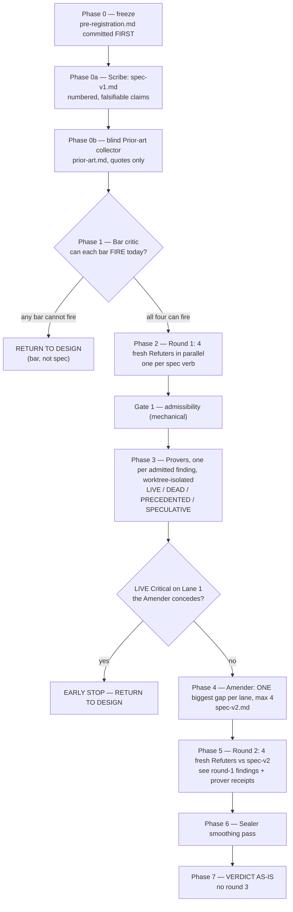

# Pinned-ref spec gauntlet — refute the spec BEFORE the ~500 lines exist

**Status:** RUNBOOK, bars frozen below. Nothing has run yet.
**Subject under review:** the `pinned-ref` check extension for kkamak
(`docs/resume.md:71-76`, four prose bullets — there is no spec file).
**Method credit:** the 2026-08-01 Gauntlet adoption loop
(`docs/superpowers/plans/2026-08-01-gauntlet-adoption-loop.md`,
ledger `docs/2026-08-01-gauntlet-adoption-ledger.md`), adapted from
artifact-critique to **spec**-critique.
**Why spec and not artifact:** the 08-01 program's own retrospective names the
gap this run closes — *"Gauntlet critiques artifacts; nothing critiqued the
bars."* A spec is upstream of the artifact in exactly the way a bar is. Loop D
spent a full build discovering its bar was unrunnable. This run spends ~0 build
to discover whether ~500 lines are worth writing.

---

## 0. What is actually being reviewed (read this first)

The whole spec, verbatim, is `docs/resume.md:71-76`:

> ` - pinned-ref check extension (~500 lines: ~200 code / ~250 tests): run`
> `   merge-base's TEST TREE against current impl — ownership split by time;`
> `   closes the loosening gap for pre-existing behavior; slots into 0.8.0`
> `   extension seam exactly like gauge (config-gated, kernel untouched,`
> `   shadow-first = one additive check run while calibrating); reuse`
> `   kernel/classify.ts test-path classifier for tree selection.`

Its claim to importance, `docs/resume.md:89-90`:

> `Minimum refutation cut = README + pinned-ref (~650 lines) — kills the`
> `critique's central sentence; residual = maturity only.`

So the mechanism exists to close ONE conceded gap: **test-loosening**. The
kkamak critique arc concluded the gate is *"floor + telemetry, NOT
defect-catcher"* and the structural test-loosening gap was **CONCEDED, open by
measured choice** (`docs/resume.md:19-20`). pinned-ref is the proposed answer.

**Therefore the review's centre of gravity is not code quality. It is whether
the pin is an outside prior.** CLAUDE.md's downstream-of-decision law:

> a statistic computed from the thing it audits cannot contradict it; a check
> that cannot fail cannot inform. The escape is always a prior from OUTSIDE the
> artifact under audit.

An agent that loosens tests controls the working tree. If it also controls the
merge-base, pinned-ref is an audit whose scope is set by the audited party —
the answer-key failure wearing a git hat. Lane 1 exists to settle that and
nothing else.

### Prerequisites that gate the RUN, not the review

- **Phase −1, coordination ping (blocking for BUILD, not for this review).**
  `docs/resume.md:26-29` — pinned-ref belongs to the cc-gate→kkamak backport
  milestone on **yoo-dev**'s board, and that resume block does not exist in
  this checkout. Run the gauntlet now; the verdict authorises a build only
  after the ping resolves. A `BUILD` verdict with an unresolved ping is a
  `HOLD`.
- **Shared-object-store hazard.** `/Users/yoo/z2/kkamak` (main) and
  `/Users/yoo/z2/kkamak-refutation-lane` (branch `refutation-lane`, currently
  byte-identical to main) share one object store. **No agent in this program
  writes to either.** Provers create throwaway worktrees under the scratchpad
  and remove them.
- **kkamak is a public repo.** The generality rule applies: a finding whose
  remedy is "encode this repo's specifics" is inadmissible (see §5, Gate 1).

---

## 1. Roles

| Seat | Model | Context | Isolation | May write? |
|---|---|---|---|---|
| **Orchestrator** | opus (driving session) | everything | — | owns all committed artifacts |
| **Scribe** | sonnet | the 4 source bullets + named repo files | read-only | writes `spec-v1.md` only |
| **Prior-art collector** | sonnet | **blind** — corpus paths only, never the bars, never the spec's claims | read-only | writes `prior-art.md` only |
| **Bar critic** | opus | pre-registration + repos | read-only | nothing (returns a report) |
| **Refuter ×4** | opus | `spec-v1.md` + `prior-art.md` + repos. **Never the decision rule, never each other, never the orchestrator's reasoning** | read-only | nothing (returns findings) |
| **Prover ×N** | sonnet | ONE finding + repos | **own git worktree** | throwaway probes only |
| **Amender** | sonnet | spec + surviving findings + prover receipts. **Never the refuters' rhetoric beyond the finding rows** | read-only | writes `spec-v2.md` only |
| **Sealer** | opus | all artifacts | read-only | nothing (returns report) |
| **User** | — | reads the verdict | — | the brake |

Model split is policy, not taste (`project-model-role-policy`): sonnet is the
subject under evolution, opus holds the judgment seats. Two consequences worth
stating because they bias the outcome:

- The **amender is deliberately cheaper than the refuters.** A weak amendment
  lets findings survive, which biases toward RETURN-TO-DESIGN. That is the
  intended direction — the 08-01 program's stated design goal was to *"make
  DROP the cheapest action."*
- **Refuters do not see the decision rule.** This deviates from 08-01, where
  the critic saw the bar and tallied against it. Reason: there the bar was an
  *execution instruction* (run this replay); here the bars are *thresholds*, and
  a critic who knows the threshold shapes findings to clear it. The bar decides;
  the refuter only supplies evidence. The orchestrator tallies.

---

## 2. Phase structure



Artifacts, all under `docs/loop-probes/pinned-ref-spec-gauntlet-20260822/`:

| Phase | Artifact | Rule |
|---|---|---|
| 0 | `pre-registration.md` | committed **before** any agent launches |
| 0a | `spec-v1.md` | committed before round 1; frozen for round 1 |
| 0b | `prior-art.md` | raw, **verbatim, unedited** |
| 2/5 | `findings.md` | append-only; one row per finding, both rounds |
| 3 | `repro/<finding-id>.md` | prover receipt: exact command + exact output |
| 4 | `spec-v2.md` | diff against v1 must be traceable to named finding ids |
| 7 | `verdict.md` | decision rule re-applied clause-by-clause |

Then one row in `docs/2026-08-22-pinned-ref-gauntlet-ledger.md` and a pointer
line in `docs/INDEX.md`.

**Commit discipline (copied from the 08-01 program, whose Loop-D artifacts
nearly died with a worktree):** every prover receipt is committed to the probe
dir before its worktree is removed. Nothing of evidentiary value lives in a
worktree at end of phase.

---

## 3. The four lanes are derived from the spec's own verbs

CLAUDE.md's corollary: *"a fixed defence list grown one entry per attack found
is [the downstream-of-decision law] at the meta level — derive defences from the
artifact's structure, never enumerate them by incident."* So the attack surface
is not a checklist of "common spec bugs". It is the spec's four verbs:

| Lane | Verb | The question | Kills the spec if |
|---|---|---|---|
| **L1** | **pins** a git ref | is the pin an outside prior? | the audited agent controls the pin, or the pin degenerates |
| **L2** | **materializes** the tree | does the environment reconstruct faithfully and affordably? | materialization is infeasible, unfaithful, or unbounded at the Stop hook |
| **L3** | **runs** old tests against current impl | does it fit the seam without breaking what is there? | it violates the extension contract or regresses gauge |
| **L4** | **reports** as telemetry | can the output ever say something new? | the field cannot vary, cannot travel, or leaks |

Each lane gets exactly one refuter per round. Lanes never see each other's
output within a round — parallel and blind, so agreement between two lanes is
evidence rather than an echo.

---

## 4. FROZEN BARS

Written before any agent launches. Amendments after this point are
**pre-data amendments recorded in this file with a timestamp**, never silent
edits. Conservatism tiebreak, from the debt-instrument probe: **anything
ambiguous is counted AGAINST the spec.**

### B1 — trust-root bar (Lane 1)

> **BLOCKS BUILD** iff a prover demonstrates LIVE, on this repo's real history,
> **either**
> (a) the pin degenerates in the dominant workflow — `merge-base(HEAD, <base>)`
> resolves to a tree whose test files are identical to the working tree's, so
> the check is unfailable by construction; **or**
> (b) an agent can move what the pin resolves to, within one session, without
> that movement appearing in the emitted telemetry.
> Ties/ambiguity count as firing.

### B2 — seam bar (Lane 3)

> **BLOCKS BUILD** iff registering a second extension changes any observable of
> the gauge path — measured by instantiating KNOWN-HOLE(KI-14)'s real
> two-extension shape and observing gauge's held lines misroute or drop.
> Off-by-default parity (`test/extensions-parity.test.ts`) must stay green with
> the new entry present-but-disabled.

### B3 — signal bar (Lane 4)

> **BLOCKS BUILD** iff, replayed over the recorded sensor corpus, the proposed
> telemetry field would have been **constant** across every recorded cycle. A
> field that cannot vary cannot inform.
> Precedent this bar is calibrated against (`docs/resume.md:99-104`):
> `ruleChecks 120/120 pass = zero promotion evidence`, `hookRules 0 carriers`,
> `coEdit 30/32 clean → boolean DECIDED permanently shadow`. That audit is the
> proof this bar fires on real data.

### B4 — operation bar (Lane 2)

> **BLOCKS BUILD** iff **any** of
> (a) the spec contains no mechanism that bounds the pinned run's cost
> **independently of total suite size** — a cost that scales with the whole
> suite is unbounded by construction, whatever today's number happens to be;
> **or**
> (b) measured median added wall-clock at one Stop exceeds **30s** — half of one
> measured run of kkamak's own suite (see pre-check below) — and the spec names
> no mitigation. The mitigation this project has already written down is the
> tiered-check pattern, *"fast subset at Stop / full in CI"*
> (`docs/resume.md:86-87`); **or**
> (c) the mechanism's durable artifact cannot travel between hosts under the
> repo's git-only rule, and the spec does not say so in a written limitation.
>
> *Threshold anchoring, stated because an unanchored number is a bar critic's
> first target:* 30s is not chosen for roundness — it is half the measured cost
> of one full run of the suite this mechanism would duplicate. The governing
> rule it serves is `src/kernel/gate.ts:6-8`, *"a gate that wedges a session is
> worse than no gate at all"*, and the project's own sensitivity precedent is
> that an extension adding **~11ms** per hook invocation was considered worth
> fixing (`src/extensions/registry.ts:60-74`).

### Program decision rule (frozen)

Applied by the orchestrator to the **round-2** finding set only.

1. **RETURN-TO-DESIGN** iff ≥1 **LIVE Critical** finding survives on **L1**.
   Rationale: L1 is the mechanism's entire justification. A pinned-ref whose pin
   is inside the claimant's control does not close the loosening gap; it
   *reports* on it, which the gate already does.
2. **DROP** iff **B1 fires LIVE and B3 fires LIVE.** Neither trustworthy nor
   informative — the ~500 lines buy a number nobody can act on.
3. **AMEND-THEN-BUILD** iff every surviving LIVE finding is Major or minor
   **and** each carries a written disposition (AMEND / SCOPE-CUT /
   KNOWN-HOLE), **and** the resulting `spec-v2.md` states its own limitations
   section in the shape of `docs/2026-07-31-phase2-fixture-registration.md`'s
   *"Known limitations"*.
4. **BUILD AS SPEC'D** iff zero LIVE Critical or Major findings survive round 2.
5. Any BUILD-class verdict is a **HOLD** until Phase −1's coordination ping
   resolves.
6. **Size amendment rule.** If the accepted amendments push the estimate past
   **~750 lines** (spec says ~500), the verdict downgrades one step
   (BUILD → AMEND-THEN-BUILD → RETURN-TO-DESIGN). The minimum-refutation-cut
   argument at `resume.md:89` is a *size* argument; a mechanism that doubles has
   lost the argument that justified it.

### Bar-feasibility pre-check (mandatory — this is the 08-01 program's own standing rule)

> *"before any builder launches, a critic (or the orchestrator with data in
> hand) must show the bar's EMPLOY condition CAN fire on existing evidence; a
> bar that cannot fire is returned to design, not built against."*

Each bar has a runnable demonstration. **A bar that cannot be demonstrated is
returned to design before Phase 2 opens.**

```bash
# B1(a) — does the pin degenerate? Direct-to-main commits leave merge-base == HEAD.
cd /Users/yoo/z2/kkamak
git rev-parse HEAD
git merge-base HEAD main                     # equal to HEAD => pinned tree == current tree
git log --first-parent --format='%H %P' -50 | awk 'NF==2' | wc -l   # single-parent commits on main
# Prior: memory `feedback-solo-dev-workflow` — "no PRs; feature branches merge
# directly to main". If most recent work is linear on main, (a) fires.

# B2 — the marker already exists and is calibrated (proven RED before it was skipped).
sed -n '129,170p' /Users/yoo/z2/kkamak/test/extensions-registry.test.ts
# KNOWN-HOLE(KI-14) at :150. Unskipping it in a throwaway worktree is the
# demonstration that B2 can fire.

# B3 — does a derived boolean actually vary on the real corpus?
jq -r '[.implOnly, .sameTurnCoEdit] | @tsv' \
  /Users/yoo/z2/kkamak/.km/gate-outcomes.ndjson 2>/dev/null | sort | uniq -c
# Precedent already measured: coEdit 30/32 clean. B3 fires on real data.

# B4(b) — the actual cost of materialize + install + run, on kkamak itself.
d=$(mktemp -d) && git -C /Users/yoo/z2/kkamak archive HEAD | tar -x -C "$d" \
  && cd "$d" && time bun install && time bun test ; rm -rf "$d"
```

### Pre-check RESULT — run 2026-08-22, `yoo-mac`, kkamak @ `dccef31`

All four bars are demonstrated to fire. Recorded here so the bar critic (7.2)
audits real numbers rather than re-deriving them, and so the program cannot
later be accused of having anchored its thresholds after seeing results.

| Bar | Status | Measured |
|---|---|---|
| **B1(a)** | **CAN-FIRE — and fires hard** | `HEAD` = `dccef31…`, `merge-base(HEAD, main)` = `dccef31…` — **identical**. 47 of the last 50 first-parent commits on `main` are single-parent. On this repo, today, the pinned tree *is* the current tree. |
| **B2** | **CAN-FIRE by construction** | `KNOWN-HOLE(KI-14)` at `test/extensions-registry.test.ts:150` is a *calibrated* marker — proven RED before it was skipped. Unskipping it instantiates the two-extension shape. |
| **B3** | **CAN-FIRE — and fires hard** | meta-harness corpus, 583 lines: `implOnly`/`sameTurnCoEdit` **absent on 396 (68%)**; `sameTurnCoEdit` true on 32 of the 187 that carry it. kkamak's own corpus, 17 lines: **17/17 absent — zero carriers, 100% constant.** |
| **B4** | **CAN-FIRE — measured at the boundary** | Materialize via `git archive \| tar -x`: **0.058s**, 36 test files. `bun install`: unnecessary (zero runtime deps). `bun test`: **50.5s**, 715 tests. Added cost at one Stop ≈ **50s**, against a 30s bar. |

Three observations the orchestrator must carry into the review, stated as
measurements and **not** as findings — the refuters must reach these
independently or not at all, and a refuter who is handed them is no longer a
fresh context:

- B1's demonstration is the strongest single result here. It does not by itself
  prove the spec is broken — `merge-base(HEAD, main)` collapsing to `HEAD` is
  expected when `HEAD` *is* `main`, and a session on a feature branch would
  differ. What it establishes is that the degenerate case is the **recorded
  default workflow of this repo**, not an edge case, so L1's refuter has real
  ground to stand on and B1 is not a bar that will pass everything.
- B3's kkamak column (17/17 absent) is a warning about the *corpus*, not only
  the field: kkamak has recorded very few gate cycles. A "field would have been
  constant" result on n=17 is weak evidence. The L4 refuter should use the
  583-line meta-harness corpus as its denominator and say so.
- B4's 50.5s is a **warm-cache, fast-host, current-tree** measurement. The real
  case is an *older* test tree, possibly needing an install. 50.5s is the floor.

---

## 5. How a finding survives or dies

### A finding is born with four mandatory fields

```
id:        R<round>-L<lane>-<n>            e.g. R1-L1-2
claim:     one sentence — what the spec gets WRONG
spec-ref:  the numbered claim in spec-v1.md it contradicts   (S3, S7, ...)
prior:     the source OUTSIDE the spec that decides it —
           <abs-path>:<line>, a documented git behaviour, or a measured number
falsifier: the concrete observation that would make this claim FALSE
severity:  Critical | Major | minor
```

`prior` and `falsifier` are the load-bearing fields. A finding whose only
evidence is the spec's own text is dead on arrival — that is the
downstream-of-decision law applied to the critique itself.

### Gate 1 — ADMISSIBILITY (orchestrator, mechanical, no judgement)

A finding is **INADMISSIBLE** and dies unrecorded-as-defect if any holds:

- `prior` is absent, or is a line from `spec-v1.md`.
- `falsifier` is absent, or is not an observation ("if the author disagrees" is
  not a falsifier).
- `spec-ref` names no numbered claim.
- The remedy amounts to encoding this repo's specifics — a per-repo table, a
  hardcoded path list, a name allowlist grown one entry per case. **kkamak is
  public; the generality rule is not negotiable.** (CLAUDE.md: *"a per-domain
  registry where each new task type gets its own entry — memorizing tests one at
  a time and calling the collection generality"*.)
- It is a style, naming, or prose-quality objection.

Inadmissible findings are still written to `findings.md` with
`disposition: INADMISSIBLE(<reason>)` — so a refuter cannot be accused of
having been ignored, and so a repeat objection is visibly a repeat.

### Gate 2 — REPRO (a prover subagent per admitted finding, worktree-isolated)

The prover's mandate is CLAUDE.md's sanctioned method: **to test whether a check
can fail, build the input that should break it.** Four possible verdicts:

| Verdict | Means | Required receipt | Finding |
|---|---|---|---|
| **LIVE** | demonstrated firing today against real repo state | exact command + exact output | **SURVIVES** |
| **DEAD** | the breaking input was built and the thing held | the attempt, quoted, plus why it held | **DIES** — recorded as refuted |
| **PRECEDENTED** | the failure mode is already recorded/solved in prior art | the prior-art quote + file:line | **SURVIVES as SPEC-DEBT** — the spec must cite the prior art; not a defect |
| **SPECULATIVE** | no repro constructible today, no prior-art instance | why not | **DIES to the deferral register** with a reopen trigger |

Two notes that make this workable for a *spec* review, where most of the code
does not exist:

- **The nearest existing analogue is the test bed.** The spec's hard parts have
  already been built once, in the private research build. A prover facing "the
  spec's future code might do X" builds the repro against
  `cc-gate-plugin/src/gauge/state-resolve.ts:60-90` (the
  `git archive | tar -x` materialize recipe, with `git worktree` explicitly
  rejected), `cc-gate-plugin/src/fixture-ref.ts` (non-mutating snapshot, bail
  taxonomy, the >64KB-stderr git deadlock), and
  `cc-gate-plugin/src/review-sensor/git-diff.ts:41-100` (the merge-base
  resolution ladder). If the failure mode already fired there once, it is LIVE.
- **PRECEDENTED is not a loss for the finding.** It converts a defect claim into
  a spec requirement: *the spec must reuse or cite the prior art rather than
  re-derive it.* Given ~500 lines are being budgeted for a mechanism that
  already exists once, this class is expected to be large and is the single
  cheapest thing this program can produce.

- **SPECULATIVE deaths go to `docs/explicitly-not-now.md`**, each with a reopen
  trigger, per that file's own contract: *"a deferral is a recorded decision with
  an expiry condition, not a forgotten TODO."* This is how a killed finding is
  prevented from silently returning as a fresh objection in round 2.

### Gate 3 — the BAR (orchestrator, frozen §4)

Only LIVE and SPEC-DEBT findings reach the decision rule. The refuters do not
decide; the provers do not decide; the bar decides.

### Dispositions for surviving findings

- **AMEND** — the spec changes. Round 1 only, one per lane, max four.
- **SCOPE-CUT** — the spec declares the case out of scope in a written
  limitation. Template: `docs/2026-07-31-phase2-fixture-registration.md`'s
  *"Known limitations"* section, which does exactly this for the same mechanism
  (*"The tamper guard is narrow by design"*).
- **KNOWN-HOLE** — deferred to build time as a calibrated skip-marker,
  `test.skip("KNOWN-HOLE(KI-<n>): <the sentence that would be TRUE if the hole
  were closed>")`, next free id **KI-15**. Per CLAUDE.md: *a partial fix or
  deferral lands WITH its marker; unskipping is the revisit.* The marker must be
  **calibrated** — proven to fail before it is skipped.
- **BLOCK** — build cannot start. Only Critical.

---

## 6. Stop rule

- **Hard bound: 2 refutation rounds.** Round 2's tally against the frozen bar is
  the verdict, **as-is**. No round 3. No bar relaxation. No merging on
  "directionally favorable". Parity with `gate.json`'s `rounds: 2`, and with the
  08-01 bound: *"≤2 gap-feedback rounds per loop, then verdict as-is (no round
  inflation)."*
- **Exactly one amendment wave**, between the rounds. One biggest gap per lane,
  maximum four amendments total. A refuter that returns eight findings still
  yields at most one amendment on its lane.
- **Early stop (cheapest exit, deliberately):** if round 1 yields a LIVE
  Critical on **L1** and the amender returns `CONCEDE` — it cannot write an
  amendment that survives its own stated falsifier — the program stops
  immediately at RETURN-TO-DESIGN. Round 2 is not run. This is the whole point
  of reviewing a spec instead of a build.
- **Directional positives are quarantined, not counted.** The 08-01 ledger's
  most transplantable line: *"Directional positives recorded, NOT verdict
  evidence."* Anything encouraging that is not a bar clause goes in a labelled
  block in `verdict.md` and touches nothing.
- **Spend cap:** ~14 opus calls (1 bar critic + 8 refuters + 1 sealer + slack),
  ~12 sonnet subagents (1 scribe + 1 collector + provers + 1 amender). Exceeding
  it needs a new sized go, per the 08-01 bound.
- **Branch/artifact retention:** a RETURN-TO-DESIGN or DROP verdict keeps every
  artifact committed, unmerged, for audit and reopen — never deleted
  (`resume.md:3578` precedent: *"RETAINED BY DESIGN, do not 'finish'"*).

---

## 7. Exact prompts

Every prompt below is copy-pasteable. Absolute paths throughout — agent threads
reset cwd between bash calls.

### 7.0 — Scribe (sonnet, Phase 0a). ONE call.

```
Write the pinned-ref extension spec as numbered, individually falsifiable claims.
You are NOT designing it and NOT improving it. You are making an existing
four-bullet prose sketch explicit enough to be attacked.

SOURCE (this is the entire spec that exists today), /Users/yoo/z2/meta-harness/docs/resume.md lines 71-76:
"pinned-ref check extension (~500 lines: ~200 code / ~250 tests): run
merge-base's TEST TREE against current impl — ownership split by time; closes
the loosening gap for pre-existing behavior; slots into 0.8.0 extension seam
exactly like gauge (config-gated, kernel untouched, shadow-first = one additive
check run while calibrating); reuse kernel/classify.ts test-path classifier for
tree selection."

Constraints it inherits (resume.md:34-45): kernel byte-untouched; config-gated;
off-default; 0.7.0-parity pinned; gauge port is the template; kkamak is a PUBLIC
repo so the generality rule applies (no answer keys, no per-repo tables); TDD;
SDD for this size.

READ, to ground each claim in the real seam:
- /Users/yoo/z2/kkamak/src/extensions/registry.ts        (Extension interface, EXTENSIONS map, the reduce)
- /Users/yoo/z2/kkamak/src/extensions/config.ts          (parseEnabledExtensions)
- /Users/yoo/z2/kkamak/src/extensions/gauge/index.ts     (the hold-and-flush template)
- /Users/yoo/z2/kkamak/src/kernel/ports.ts               (SensorLine, GateConfig, GateHost)
- /Users/yoo/z2/kkamak/src/kernel/classify.ts            (isTestPath — read its header comment carefully)
- /Users/yoo/z2/kkamak/src/kernel/sensor.ts              (SENSOR_FIELDS / OPTIONAL_SENSOR_FIELDS)
- /Users/yoo/z2/kkamak/src/runtime/check-runner.ts       (SpawnCheckRunner and its fixed cwd)
- /Users/yoo/z2/kkamak/hooks/hooks.json                  (hook timeouts)
- /Users/yoo/z2/kkamak/gate.json
- /Users/yoo/z2/kkamak/docs/gauge.md

OUTPUT — write exactly one file:
/Users/yoo/z2/meta-harness/docs/loop-probes/pinned-ref-spec-gauntlet-20260822/spec-v1.md

Format. Numbered claims S1..Sn, grouped under the spec's four verbs:
  ## PINS      — what ref, resolved how, at what moment, from what input
  ## MATERIALIZES — how the old tree becomes runnable, where, with what deps
  ## RUNS      — what command, in what cwd, under what timeout, how failures are read
  ## REPORTS   — what value reaches what sink, in what shape

Each claim is ONE sentence, present tense, stating a behaviour that could be
observed to be false. "S4. The base ref is resolved as merge-base(HEAD,
config.baseRef) at the moment the Stop event is received." Not "S4. The base ref
is chosen sensibly."

Where the source prose does not determine an answer, DO NOT INVENT ONE. Write:
  S<n>. UNDETERMINED: <the exact question the prose leaves open>.
and list every UNDETERMINED claim again under a final "## Open" section. There
are several — "merge-base of HEAD against WHAT?" is the obvious one. Naming them
is the most valuable thing you will do here; a guess laundered into a claim
corrupts the entire review downstream.

End with "## Size budget" restating the spec's own ~500 lines / ~200 code /
~250 tests.

Do not write any other file. Do not edit anything in /Users/yoo/z2/kkamak.
```

### 7.1 — Prior-art collector (sonnet, Phase 0b). ONE call. BLIND.

Launch this **without** having shown the agent `spec-v1.md`, this runbook, or
the bars. Its independence is the point (debt-probe convention: *"a fresh-context
agent that has NOT seen this session's root-cause analysis or this file's
decision rule — it enumerates and quotes, no judgments"*).

```
Collect, do not judge. Enumerate every existing implementation, in these repos,
of any part of this mechanism:

  "take a git ref, reconstruct the repository's test files as they existed at
  that ref into a runnable location, run a test command there, and record the
  result."

CORPUS (search all of it; absolute paths):
- /Users/yoo/z2/meta-harness/cc-gate-plugin/src/
- /Users/yoo/z2/meta-harness/km-crank/src/
- /Users/yoo/z2/meta-harness/opencode-plugin/src/
- /Users/yoo/z2/meta-harness/scripts/
- /Users/yoo/z2/kkamak/src/
- /Users/yoo/z2/meta-harness/docs/  (design notes describing any of the above)

For EACH item, record — raw, verbatim, no assessment:
  name · absolute file path · line range · what it does, in the code's own words
  (quote the header comment) · every failure mode, bail condition, timeout, or
  limitation the code or its comments NAME · any alternative the author
  explicitly REJECTED and the reason quoted verbatim · whether the artifact it
  produces is host-local or travels via git, quoted.

Cast wide before narrowing: grep for git archive, write-tree, merge-base,
GIT_INDEX_FILE, worktree, mkdtemp, tar, pristine, snapshot, fixture, ref.

OUTPUT — write exactly one file:
/Users/yoo/z2/meta-harness/docs/loop-probes/pinned-ref-spec-gauntlet-20260822/prior-art.md
A table plus one quoted block per item.

Write NO opinions, NO recommendations, NO "this suggests". If you find yourself
writing "should", delete the sentence. Quote or omit.
```

### 7.2 — Bar critic (opus, Phase 1). ONE call. Read-only.

```
Attack four decision bars. Your job is NOT to judge the mechanism they will
judge — it is to determine whether each bar CAN FIRE on evidence available
today. A bar that cannot fire is worthless: it will pass everything, and a full
program will be spent discovering that.

This is a standing rule with a scar behind it. From
/Users/yoo/z2/meta-harness/docs/2026-08-01-gauntlet-adoption-ledger.md:184-190 —
"Loop D's bar was unrunnable from the start ... a full build+eval was spent
discovering it. Gauntlet critiques artifacts; nothing critiqued the bars."

READ:
- /Users/yoo/z2/meta-harness/docs/superpowers/plans/2026-08-22-pinned-ref-spec-gauntlet.md
  sections 4 (FROZEN BARS) and 3 (the four lanes)
- /Users/yoo/z2/meta-harness/CLAUDE.md — the downstream-of-decision law

FOR EACH of B1, B2, B3, B4 you must, in this order:
1. RUN the demonstration command listed under "Bar-feasibility pre-check" in
   section 4. Paste the exact command and its exact output.
   That section also records a "Pre-check RESULT" table from an earlier run.
   Run the commands yourself FIRST and write down what you get, THEN compare.
   Report any discrepancy loudly — a recorded number that does not reproduce is
   a more important finding than anything else you could return today. Do not
   let the recorded table stand in for your own measurement.
2. State whether the bar's blocking condition CAN fire today: CAN-FIRE /
   CANNOT-FIRE / UNMEASURABLE. Justify from the output you pasted, not from
   reasoning about the output you expect.
3. Independently attack the bar itself with three questions:
   - Is it computed from the thing it audits? (If the bar's input is the spec's
     own claim, it cannot contradict it — say so plainly.)
   - Is it satisfiable by construction — can any competent spec clear it without
     changing anything real? The 08-01 program's null_precedent check failed
     exactly this way: "satisfiable by construction ('write a distinguishing
     sentence')".
   - Is its threshold arbitrary? Name what the number is anchored to, or say it
     is unanchored.
4. If CANNOT-FIRE or UNMEASURABLE: propose a replacement bar that CAN fire,
   and give the command that demonstrates it.

Also answer one question about the SET of bars: do the four together leave a
verb of the spec (pins / materializes / runs / reports) with no bar over it?
Name the gap if so.

You are read-only. Write nothing. Return your report as your final message,
structured B1..B4 then "## Set-level gap".
```

### 7.3 — Refuters (opus, Phase 2 and Phase 5). FOUR PER ROUND, LAUNCHED IN ONE MESSAGE, FRESH EACH ROUND.

Shared preamble — paste identically into all four, then append exactly one lane
block from 7.3.1–7.3.4.

```
Refute a specification before it is implemented. You are one of four
independent refuters, each assigned one attack surface. You will not see the
others' output and must not speculate about it. You are read-only: run commands,
read files, write nothing.

THE SPEC UNDER ATTACK:
/Users/yoo/z2/meta-harness/docs/loop-probes/pinned-ref-spec-gauntlet-20260822/spec-v1.md
Its claims are numbered S1..Sn. Every finding you produce must name one.

PRIOR ART (an independent agent collected this blind; treat it as evidence, not
as argument):
/Users/yoo/z2/meta-harness/docs/loop-probes/pinned-ref-spec-gauntlet-20260822/prior-art.md

WHY THE SPEC EXISTS — you need this to attack its purpose rather than its prose.
kkamak is a completion gate: Claude Code cannot claim a turn is done until a
configured check passes. An external critique concluded the gate is "floor +
telemetry, NOT defect-catcher", and one structural gap was CONCEDED:
test-loosening. An agent that cannot make the tests pass can instead make the
tests weaker. pinned-ref is the proposed answer: run the OLD tests, the ones
that existed before this session, against the NEW implementation. The claim on
record is that this "kills the critique's central sentence."

THE LAW YOU ARE ENFORCING (/Users/yoo/z2/meta-harness/CLAUDE.md):
"a statistic computed from the thing it audits cannot contradict it; a check
that cannot fail cannot inform. The escape is always a prior from OUTSIDE the
artifact under audit ... Before trusting any check, ask what would have to be
true for it to fail, and whether anything outside the audited claim supplies
that."

REPOS (read-only; do NOT write to either, they share one git object store):
- /Users/yoo/z2/kkamak                     (the target, v0.8.0, Bun+TypeScript)
- /Users/yoo/z2/kkamak-refutation-lane     (worktree of the same repo — do not touch)
- /Users/yoo/z2/meta-harness               (prior art lives in cc-gate-plugin/ and km-crank/)

FINDING FORMAT — return a numbered list, each finding exactly these fields:

  id:        R<round>-L<lane>-<n>
  claim:     ONE sentence. What the spec gets wrong.
  spec-ref:  S<n> — the numbered claim you contradict
  prior:     the source OUTSIDE the spec that decides this. An absolute
             file:line, a documented git behaviour you demonstrated, or a number
             you measured. If your only evidence is the spec's own text, DO NOT
             SUBMIT THE FINDING — it is inadmissible by the law above.
  falsifier: the concrete observation that would make your claim FALSE. Write it
             as something someone could go and see.
  severity:  Critical (the mechanism does not do what it claims) |
             Major (it does, but a named realistic case defeats it) |
             minor (correct, incomplete)
  repro-sketch: the command or test a prover should run to make this fire.

HARD RULES:
- A finding with no `prior` outside the spec is inadmissible and will be
  discarded. So will a finding with no `falsifier`.
- kkamak is a PUBLIC repo under a strict generality rule. Any remedy that
  amounts to a per-repo table, a hardcoded path list, or a name allowlist grown
  one entry per case is inadmissible — it is an answer key. Say "this needs a
  general mechanism" and stop; do not propose the registry.
- Do NOT propose designs. Refute. If a fix is one obvious word, you may append
  `possible-fix:` in a single line, but the finding must stand without it.
- Quality over volume. Three findings that fire beat twelve that argue. A
  finding you cannot state a falsifier for is a feeling.
- Say so explicitly if the spec survives your lane. "L<n>: no admissible
  finding" is a real and useful result, and it is the honest answer if it is
  the answer.

Return findings as your final message. Write no files.
```

#### 7.3.1 — Lane 1 block: **PINS** (the trust root)

```
YOUR LANE — L1, PINS. The trust root, and the only lane that can kill this spec
outright.

The single question: IS THE PIN A PRIOR FROM OUTSIDE THE AUDITED ARTIFACT?
The audited party is an agent with write access to the repository. It authors
the code, authors the tests, runs git, and edits gate.json. Determine what it
does NOT control about the pin — and whether that residue is enough.

Establish, by running git in /Users/yoo/z2/kkamak and reading the spec's PINS claims:
- What exactly does the base resolve to, at what moment, from what input? If the
  spec leaves it UNDETERMINED, enumerate the candidate answers and attack the
  most favourable one — do not attack a strawman.
- What happens when the session works directly on the default branch, with no
  feature branch? Compute it, do not reason about it:
    git -C /Users/yoo/z2/kkamak rev-parse HEAD
    git -C /Users/yoo/z2/kkamak merge-base HEAD main
    git -C /Users/yoo/z2/kkamak log --first-parent --format='%H %P' -50 | awk 'NF==2' | wc -l
  This project's recorded workflow is solo-dev, no PRs, feature branches merged
  directly to main. Does the pin degenerate under it, and how often, measured?
- Enumerate every way the resolved tree can be MOVED by the audited party inside
  one session: commit, amend, rebase, reset, branch move, a config edit, an
  edit to whatever selects which files count as tests. For each: does the
  emitted telemetry record that it moved? A pin that silently follows the agent
  is not a pin.
- The spec reuses /Users/yoo/z2/kkamak/src/kernel/classify.ts to decide which
  files are tests, and that pattern is user-configurable via gate.json's
  testPathPattern. Read classify.ts:1-12 and ports.ts:67-75 in full. Who controls
  the audit's scope?
- Scope honesty: CLAUDE.md records that the over-determination mechanism
  "rejects ERROR (internal inconsistency), never DECEPTION (consistent
  fabrication)". Which does pinned-ref reject? Does the spec claim more than it
  can deliver?
- Time-ownership: the spec's phrase is "ownership split by time". A test written
  in this session and immediately loosened in this session is on which side of
  the split? Is the mechanism blind to exactly the case that motivated it?
```

#### 7.3.2 — Lane 2 block: **MATERIALIZES** (the environment)

```
YOUR LANE — L2, MATERIALIZES. Turning a git ref into something that can actually
run, on real repos, on both of this project's hosts.

Ground yourself in the prior art FIRST — this has been built once already, and
the alternatives its author rejected are recorded:
- /Users/yoo/z2/meta-harness/cc-gate-plugin/src/gauge/state-resolve.ts:60-90
  (git archive | tar -x into mkdtemp as ONE raw bash pipe; git init + throwaway
  identity so checks that invoke git do not exit 128; git worktree REJECTED with
  a quoted reason; bun install only when a lockfile exists; 120s setup budget;
  setup failure is descriptive-only, never a miss; finally rmSync)
- /Users/yoo/z2/meta-harness/cc-gate-plugin/src/fixture-ref.ts
  (non-mutating snapshot via temp GIT_INDEX_FILE; concurrent stdout+stderr drain
  because a git call writing >64KB to stderr deadlocks; 15s SIGKILL; a BAILS list
  for rebase / rebase-apply / merge-head / cherry-pick in progress)
- /Users/yoo/z2/meta-harness/cc-gate-plugin/src/review-sensor/git-diff.ts:41-100
  (merge-base --is-ancestor ladder, --absolute-git-dir because .git is a FILE in
  a worktree, 16 MiB maxBuffer, never-throw helpers)
- /Users/yoo/z2/meta-harness/docs/2026-07-31-phase2-fixture-registration.md
  §"Known limitations" — the same mechanism's tamper guard, already conceded narrow

Then attack:
- For each hazard the prior art names, does the spec address it, or would ~200
  lines of new code re-derive it — probably worse? Every one of these is a
  candidate PRECEDENTED finding, and PRECEDENTED findings are valuable: they
  convert into a requirement that the spec cite or reuse the existing code.
- The old TEST tree runs against the CURRENT implementation. That is a mixed
  tree by construction. What does old-tests-plus-new-source do when a shared
  fixture, a helper, a type, or an import path moved? kkamak's own test/ has
  fakes.ts and fixtures/ shared across 36 test files — check what happens.
- Dependencies. /Users/yoo/z2/kkamak has zero runtime deps but a bun.lock and
  devDependencies. What if the lockfile changed between the pin and now? What is
  the install cost, measured?
- MEASURE the whole cost. Run it:
    d=$(mktemp -d) && git -C /Users/yoo/z2/kkamak archive HEAD | tar -x -C "$d" \
      && cd "$d" && time bun install && time bun test ; rm -rf "$d"
  Compare against the Stop hook budget in /Users/yoo/z2/kkamak/hooks/hooks.json.
  Note the precedent that an extension adding ~11ms per hook invocation was
  considered worth fixing (registry.ts:60-74).
- Failure semantics. /Users/yoo/z2/kkamak/src/kernel/gate.ts:6-8 states the
  governing rule: fail-open, "a gate that wedges a session is worse than no gate
  at all". Under fail-open, what does a materialization failure produce — and
  can the audited party CAUSE that failure to make the audit vanish?
- Non-kkamak repos. This ships to adopters. Submodules, LFS, monorepos,
  generated test files, a repo where the tests are not in the tree at all.
```

#### 7.3.3 — Lane 3 block: **RUNS** (the seam)

```
YOUR LANE — L3, RUNS. Whether this fits kkamak's extension seam without breaking
what is already in it.

You have a known live tripwire. Read all of it before anything else:
- /Users/yoo/z2/kkamak/docs/known-issues.md:679-712  (issue #14, titled
  "gauge's held-line state assumes it is the sole active extension — ENTRY GATE
  for a second one")
- /Users/yoo/z2/kkamak/test/extensions-registry.test.ts:129-170  (the calibrated
  KNOWN-HOLE(KI-14) marker test, currently skipped)
- /Users/yoo/z2/kkamak/src/extensions/registry.ts  (the whole file — note the
  reduce at :110-112 and that afterDecision passes the CLOSURE-CAPTURED original
  host at :116, not the wrapped one)
- /Users/yoo/z2/kkamak/src/extensions/gauge/index.ts  (the hold-and-flush impl)

pinned-ref would be the SECOND extension kkamak has ever registered. #14 says
plainly: "Whoever adds one: either give every extension its own per-extension
WeakMap key ... or re-verify this exact correlation holds under the new reduce
ordering, before shipping — don't assume ordering-independence without checking
it the same way the K4 review did."

Attack:
- Work out the reduce order for real. parseEnabledExtensions sorts by name.
  Where does "pinned-ref" sort relative to "gauge", and does gauge still receive
  the original host? Then ask the question that matters more: is the spec's
  safety a PROPERTY OF ITS NAME? If renaming the extension, or adding a third
  one, silently breaks gauge, that is a Critical finding about the seam
  regardless of whether today's alphabet happens to be kind. (Note the sibling
  spec on the same ladder is "coEdit" — check where that sorts.)
- Does the spec satisfy the R13 hold-and-flush contract (registry.ts:26-33 and
  :44-57)? Every withheld line must be flushed by the end of the SAME
  afterDecision call, same process invocation.
- Does the spec satisfy "afterDecision MUST NOT change the emitted decision"
  (registry.ts:39)? "shadow-first" suggests yes today — but the ladder plans a
  shadow→warn promotion. What happens to that guarantee at promotion?
- classify.ts:1-12 states an invariant that a test pins: the heuristic
  classifier "must never influence any gate decision". The spec reuses it for
  tree selection. Is that compatible today? Is it compatible after promotion?
- Where does the check actually RUN? /Users/yoo/z2/kkamak/src/runtime/check-runner.ts's
  SpawnCheckRunner is constructed with a fixed cwd bound to the repo root. How
  does the spec run a command in a temp directory without touching the kernel —
  which resume.md:38 requires stay BYTE-UNTOUCHED?
- Guard tests it must pass: test/imports.test.ts (extensions isolation at
  :219-260, package containment :262-320, no computed dynamic specifier :300,
  no runtime deps :314), test/extensions-parity.test.ts (off-by-default parity),
  test/packaging.test.ts. Read them and name what the spec would violate.
- Re-entrancy: the old tests are kkamak's own tests, and kkamak's gate hook may
  be installed in the repo under test. Can this recurse?
```

#### 7.3.4 — Lane 4 block: **REPORTS** (the signal)

```
YOUR LANE — L4, REPORTS. Whether the output can ever carry information, reach a
consumer, and do so without leaking.

Read the contract before attacking it:
- /Users/yoo/z2/kkamak/src/kernel/ports.ts:78-247  (SensorLine, every field's doc
  comment — these comments record the conventions, read them, do not skim)
- /Users/yoo/z2/kkamak/src/kernel/sensor.ts  (SENSOR_FIELDS / OPTIONAL_SENSOR_FIELDS)
- /Users/yoo/z2/kkamak/test/sensor-contract.test.ts + test/fixtures/sensor-contract.ndjson
- /Users/yoo/z2/kkamak/src/extensions/gauge/index.ts:81-83  (how an extension
  annotates OUTSIDE the kernel type)

Attack:
- The contract is FROZEN and owned upstream by
  /Users/yoo/z2/meta-harness/cc-gate-plugin/src/types.ts, mirrored into kkamak.
  What does adding a field cost, and who must agree? Is the spec's telemetry a
  SensorLine field, or an extension annotation, or a separate sidecar file? Note
  the precedent: docs/2026-07-31-phase2-fixture-registration.md's mechanism was
  registered explicitly as "evidence-only ... no SensorLine change", writing to
  its own .km/fixture-refs.ndjson instead.
- CAN THE VALUE VARY? This is the lane's central question. Measure it on the
  real corpus:
    wc -l /Users/yoo/z2/kkamak/.km/gate-outcomes.ndjson
    jq -r '[.implOnly, .sameTurnCoEdit] | @tsv' /Users/yoo/z2/kkamak/.km/gate-outcomes.ndjson | sort | uniq -c
  The precedent to calibrate against, from an audit of 550 sensor lines
  (/Users/yoo/z2/meta-harness/docs/resume.md:99-104): ruleChecks 120/120 pass =
  "zero promotion evidence"; hookRules had 0 carriers; coEdit was 30/32 clean and
  the boolean was "DECIDED permanently shadow". Would pinned-ref's field have
  been constant across every recorded cycle? A field that cannot vary cannot
  inform, and the ~500 lines buy nothing.
- PRIVACY. ports.ts:183-187 states a hard line: "Never a raw path: only this
  derived boolean ever reaches the sensor line — a hard privacy line, since the
  sensor file is a durable, non-gitignored artifact and file paths are user
  data." pinned-ref's natural output is which old tests failed — test names, file
  paths, assertion text. Does the spec cross that line? Can a derived boolean
  carry enough to act on? If not, is there a real design here at all?
- TRAVEL. CLAUDE.md: cross-host transfer is git-only; .km/ is gitignored and
  host-local. docs/2026-07-31-phase2-fixture-registration.md:62-78 records that
  git refs outside refs/heads and refs/tags do not travel on an ordinary push at
  all. If the telemetry names a ref, is it resolvable on the other host? Is the
  number reproducible, or only assertable?
- ACTIONABILITY. Suppose the field says "3 pinned tests now fail." What does a
  consumer DO? Name the decision it enables. If the only honest answer is "a
  human looks", say that, and note what the gate already tells that human.
- Attribution: can this be told apart from an ordinary red suite? If the current
  tests are also failing, does pinned-ref add a fact or restate one?
```

### 7.4 — Prover (sonnet, Phase 3). ONE PER ADMITTED FINDING. `isolation: "worktree"`.

```
Try to make one claim FIRE. You are not evaluating whether the claim is
reasonable — you are finding out whether it is real, by building the input that
should break the thing. Neutral outcome: a claim you cannot make fire is a
claim that dies, and that is a good result, not a failure of yours.

THE FINDING:
<paste the full finding block verbatim — id, claim, spec-ref, prior, falsifier,
severity, repro-sketch>

THE SPEC IT ATTACKS:
/Users/yoo/z2/meta-harness/docs/loop-probes/pinned-ref-spec-gauntlet-20260822/spec-v1.md

WORKSPACE RULES — these are not optional:
- You have your own git worktree. Do ALL destructive work there or under
  /private/tmp/claude-501/-Users-yoo-z2-meta-harness/<session>/scratchpad.
- NEVER write to /Users/yoo/z2/kkamak or /Users/yoo/z2/kkamak-refutation-lane.
  They share one git object store; a stray `git add` in either corrupts a
  sibling session's staging.
- To experiment on kkamak's code, make your own throwaway clone:
    git clone /Users/yoo/z2/kkamak /tmp/<yourname>-probe && cd /tmp/<yourname>-probe

METHOD. From this project's own rule: "to test whether a check can fail, build
the input that should break it." Construct the state the claim says defeats the
mechanism, then observe. Where the spec's code does not exist yet, run the probe
against its NEAREST EXISTING ANALOGUE and say which you used:
  - /Users/yoo/z2/meta-harness/cc-gate-plugin/src/gauge/state-resolve.ts (materialize recipe)
  - /Users/yoo/z2/meta-harness/cc-gate-plugin/src/fixture-ref.ts          (snapshot + bails)
  - /Users/yoo/z2/meta-harness/cc-gate-plugin/src/review-sensor/git-diff.ts (merge-base ladder)
  - /Users/yoo/z2/kkamak/src/extensions/gauge/                            (the seam template)
  - the KNOWN-HOLE(KI-14) marker at test/extensions-registry.test.ts:150, which
    you may unskip IN YOUR CLONE to instantiate the two-extension shape

RETURN EXACTLY ONE VERDICT:

  LIVE        — you made it fire. Paste the exact command and the exact,
                unedited output. Say precisely which observation in the
                finding's `falsifier` field failed to hold.
  DEAD        — you built the input that should have broken it and it held.
                Paste what you built and what happened, and explain WHY it held.
                Then answer honestly: is there a nearby input you did not try
                that would have worked? If yes, try that one before answering.
  PRECEDENTED — the failure mode is already recorded or already solved in prior
                art. Quote it with an absolute file:line. Do not stop there:
                state whether the existing solution is REUSABLE from kkamak
                (different repo, zero runtime deps, kernel byte-untouched) or
                would have to be re-derived.
  SPECULATIVE — no repro is constructible today and no prior-art instance
                exists. Say what evidence would have to appear before this could
                be tested — that sentence becomes its reopen trigger.

Do NOT hedge across two verdicts. Pick one. If you are torn between LIVE and
DEAD, the tiebreak is: could a competent adversary reach the state you failed to
reach? If yes, LIVE with the gap stated; if no, DEAD.

OUTPUT — write your receipt to:
/Users/yoo/z2/meta-harness/docs/loop-probes/pinned-ref-spec-gauntlet-20260822/repro/<finding-id>.md
Format: the finding block, then "## Verdict: <one word>", then "## Method",
then "## Transcript" containing verbatim commands and unedited output.
Commit nothing. The orchestrator commits. Return the verdict word and a
two-sentence summary as your final message.
```

### 7.5 — Amender (sonnet, Phase 4). ONE call.

```
Amend a specification against surviving criticism. Exactly ONE amendment per
lane, four maximum. You are not rewriting the spec and not defending it.

CURRENT SPEC:
/Users/yoo/z2/meta-harness/docs/loop-probes/pinned-ref-spec-gauntlet-20260822/spec-v1.md

SURVIVING FINDINGS — each is LIVE or PRECEDENTED, each has a prover receipt in
.../repro/. Read the receipts; they contain the actual evidence:
<paste the surviving finding rows, grouped by lane, with receipt paths>

FOR EACH LANE, choose exactly one of:

  AMEND     — rewrite the affected numbered claims so the finding's `falsifier`
              would now hold. Show the claims before and after. The amendment
              must be a MECHANISM, never a table of cases: kkamak is public and
              a per-repo list or a name allowlist grown one entry per case is an
              answer key, which is disqualifying here.
  SCOPE-CUT — the spec declares this case out of scope in a written limitation.
              Copy the form of /Users/yoo/z2/meta-harness/docs/2026-07-31-phase2-fixture-registration.md
              §"Known limitations", which does exactly this for the same
              mechanism: state the limit, state that it is by design, state what
              it costs. A scope-cut that hides the cost is not a scope-cut.
  KNOWN-HOLE — defer to build time as a calibrated skip-marker. Write the exact
              marker line: test.skip("KNOWN-HOLE(KI-15): <the sentence that
              would be TRUE if the hole were closed>"). Next free id is KI-15;
              increment for additional ones. See
              /Users/yoo/z2/kkamak/test/extensions-registry.test.ts:129-170 for
              the calibrated form, including the comment that states the unskip
              condition.
  CONCEDE   — you cannot write an amendment that survives the finding's own
              stated falsifier. Say so in one paragraph naming what would have
              to change about the MECHANISM, not the wording. CONCEDE is a
              legitimate and expected answer. Do not manufacture an amendment to
              avoid it — an amendment that does not survive its own falsifier is
              worse than a concession, because it looks like progress.

CONCEDE IS MANDATORY, not optional, if the amendment you would write cannot be
falsified. Test your own amendment before submitting it: what observation would
show it does not work? If you cannot name one, you have written prose, not a
spec, and the correct answer is CONCEDE.

SIZE. The spec's budget is ~500 lines (~200 code / ~250 tests). Re-estimate after
your amendments and state the new number. Going past ~750 downgrades the
program's verdict by one step — so if an amendment is expensive, say so; the
size IS an argument here, because "minimum refutation cut" was the reason this
mechanism was chosen over the alternatives on its ladder.

OUTPUT — write exactly one file:
/Users/yoo/z2/meta-harness/docs/loop-probes/pinned-ref-spec-gauntlet-20260822/spec-v2.md
Same numbered structure as v1, plus a "## Amendments" section mapping each
changed claim to the finding id that forced it, plus "## Known limitations",
plus "## Deferred to markers", plus "## Size budget (revised)".
Return, as your final message, one line per lane: L<n>: <AMEND|SCOPE-CUT|KNOWN-HOLE|CONCEDE>.
```

### 7.6 — Round 2 refuters (opus, Phase 5). FOUR, FRESH.

Identical to 7.3, with three substitutions in the preamble:

- spec path → `spec-v2.md`
- ids → `R2-L<lane>-<n>`
- append this block:

```
ROUND 2. This spec has already survived one round. You are a NEW refuter; you
did not write round 1's findings and you are not bound by them.

Round 1's findings and their prover receipts:
<paste findings.md round-1 rows + repro/ paths>

Read them for two specific purposes, and no other:
1. DO NOT RE-RAISE anything marked DEAD, INADMISSIBLE, or SPECULATIVE. Those
   were tested and did not hold. Re-raising one wastes the round.
2. DO check whether each amendment actually did what it claims. An amendment
   that relocates a defect rather than removing it is the single most valuable
   thing you can find here, and it has happened in this project before: an
   unfailable check was reworded in round 2 and the program recorded the result
   as "same defect relocated into headroom_evidence". Apply each amendment's own
   stated falsifier to it and see whether it holds.

Otherwise attack spec-v2 fresh on your lane. New findings are welcome; a spec
that changed can be wrong in new ways.

This is the LAST round. There is no round 3, and the verdict is computed from
your output as-is against bars frozen before round 1 — so state severity
honestly in both directions. Understating a Critical means it ships;
overstating a minor means a real mechanism dies on your word.
```

### 7.7 — Sealer (opus, Phase 6). ONE call. Read-only.

```
Cross-check a completed two-round spec gauntlet before its verdict is written.
You are the last independent read. You do not decide the verdict — the frozen
decision rule does, and the orchestrator applies it. You decide whether the
EVIDENCE is sound enough to apply a rule to.

READ EVERYTHING in
/Users/yoo/z2/meta-harness/docs/loop-probes/pinned-ref-spec-gauntlet-20260822/
(pre-registration.md, spec-v1.md, prior-art.md, findings.md, repro/*, spec-v2.md)
plus /Users/yoo/z2/meta-harness/docs/superpowers/plans/2026-08-22-pinned-ref-spec-gauntlet.md
(the bars and the decision rule).

Answer these, in order, each with evidence:

1. CROSS-LANE COLLISIONS. Did two lanes find the same defect under different
   names? Merge them and say which id survives — a duplicate counted twice
   inflates a severity tally and can flip the decision rule.
2. CONTRADICTIONS. Do any two surviving findings require opposite remedies? A
   spec cannot be amended into two shapes at once; name the conflict.
3. RECEIPT AUDIT. For each LIVE finding, does the receipt actually show the
   claimed observation, or does it show something adjacent? Quote any receipt
   whose transcript does not support its verdict. This is the check that a
   finding was not talked into existence.
4. DEAD AUDIT. For each DEAD finding, did the prover build a genuinely adversarial
   input, or a weak one? Name any that should be re-run. Under this program's
   conservatism rule, ambiguity counts AGAINST the spec — a lazily-killed
   finding is a false negative in the dangerous direction.
5. AMENDMENT FIDELITY. For each amendment in spec-v2, apply its own stated
   falsifier. Does it hold? Or was the defect relocated rather than removed?
6. UNATTACKED SURFACE. Name any numbered claim in spec-v2 that no finding, in
   either round, ever touched. Silence is not the same as survival; say which
   claims merely went unexamined.
7. THE ONE QUESTION THE PROGRAM DID NOT ASK. Bounded to one paragraph. If the
   answer is "none", say that — do not invent a gap to look thorough.

Write nothing. Return your report as your final message.
```

---

## 8. Verdict document

`verdict.md` — the orchestrator writes it, never the builder, never a critic
alone. Required structure, from the debt-instrument verdict's shape:

1. **Registration pointer** — this runbook's path and the sha it was committed
   at, proving the bars predate the data.
2. **What ran** — phases, agent count per seat, actual spend vs the §6 cap.
3. **Finding tally** — a table: id · lane · severity · prover verdict ·
   disposition. Both rounds. Inadmissibles included, with reasons.
4. **The decision rule re-applied clause by clause**, PASS/FAIL beside each,
   quoting the frozen text.
5. **VERDICT** — one of BUILD AS SPEC'D / AMEND-THEN-BUILD / RETURN-TO-DESIGN /
   DROP, plus HOLD if Phase −1 is unresolved.
6. **Directional positives, quarantined** — a labelled block, explicitly marked
   NOT verdict evidence.
7. **Reopen trigger** — the concrete event that re-arms this decision.
8. **Registered-rule artifacts, recorded not repaired** — if the rule as frozen
   produces an outcome that feels wrong, record the discrepancy and apply the
   rule as written. The frozen rule stands; the number is reported as measured.

Corrections after sealing land as `## Addendum N`, appended, never rewritten,
with a forward-pointer line inserted above the original VERDICT.

---

## 9. Launch sequence (operator)

Run from a driving session in `/Users/yoo/z2/meta-harness`. Each step's agents
go out in **one message** so they run concurrently.

```
STEP 0.  git add docs/superpowers/plans/2026-08-22-pinned-ref-spec-gauntlet.md
         git commit -m "docs(gauntlet): pinned-ref spec gauntlet — bars frozen before any agent runs"
         ── THIS COMMIT IS THE PRE-REGISTRATION. Nothing launches before it.
            A bar edited after data exists is a bar fitted to data.

STEP 1.  Two agents, ONE message, both general-purpose, model: sonnet
           A: prompt 7.0  (Scribe)              → spec-v1.md
           B: prompt 7.1  (Prior-art collector) → prior-art.md   [launch BLIND]
         Then: read spec-v1.md's "## Open" section yourself. If it is empty, the
         scribe guessed — send it back. UNDETERMINED claims are the point.
         git commit both files.

STEP 2.  One agent, model: opus, prompt 7.2 (Bar critic).
         run_in_background: false — you need its answer before spending round 1.
         If any bar returns CANNOT-FIRE: fix the bar, amend §4 with a timestamp,
         commit, re-run this step. Do NOT proceed with a dead bar.

STEP 3.  FOUR agents, ONE message, model: opus, general-purpose.
         Preamble 7.3 + lane block 7.3.1 / 7.3.2 / 7.3.3 / 7.3.4 respectively.
         Collect findings into findings.md. Apply Gate 1 (§5) yourself,
         mechanically — record inadmissibles with their reason, do not delete.
         git commit findings.md.

STEP 4.  ONE agent per admitted finding, ONE message, model: sonnet,
         isolation: "worktree", prompt 7.4 with the finding pasted in.
         Expect 6-15. They are independent; launch them all at once.
         When each returns: commit its repro/<id>.md BEFORE its worktree is
         reclaimed. Update findings.md with prover verdicts.

STEP 4a. EARLY-STOP CHECK. Any LIVE Critical on L1?
         → run prompt 7.5 (Amender) for L1 only, first.
         → if it returns CONCEDE: STOP. Write verdict.md, RETURN-TO-DESIGN.
           Do not run round 2. This is the cheap exit and taking it is the
           whole reason for reviewing a spec instead of a build.

STEP 5.  One agent, model: sonnet, prompt 7.5 (Amender) → spec-v2.md. Commit.

STEP 6.  FOUR agents, ONE message, model: opus — prompt 7.6 (= 7.3 with the
         round-2 substitutions + the round-2 block). Fresh contexts; do not
         reuse the step-3 agents via SendMessage, that defeats freshness.
         Provers again for any new admitted finding (repeat STEP 4).

STEP 7.  One agent, model: opus, prompt 7.7 (Sealer).
         Then YOU write verdict.md (§8) — apply the frozen rule clause by
         clause. Append the ledger row. Add the INDEX.md pointer.
         Hand the verdict to the user. The user is the brake, not you.
```

Notes that will otherwise cost you a round:

- **Do not let the orchestrator author findings.** If you spot something while
  reading, it goes to the refuter as an *area*, never as a finding — an
  orchestrator finding has no fresh context behind it and no prover has tested
  it, so it enters the tally unearned.
- **Run the suites yourself.** The 08-01 program's ledger records the
  orchestrator running suites independently rather than trusting builder
  reports; the same applies to prover transcripts you find surprising.
- **Commit between every step.** Findings and receipts that live only in agent
  output die with the session. That already happened once in this project —
  Loop D's paired-eval outputs were untracked across two worktrees and were
  committed retroactively a week later.

---

## 10. Bounds

- ≤2 refutation rounds, then verdict as-is. No round inflation.
- Exactly one amendment wave; ≤1 amendment per lane.
- Bars above are frozen. Changes are pre-data amendments recorded in this file,
  timestamped, before the affected phase opens.
- Spend cap §6. Exceeding it requires a new sized go.
- No writes to `/Users/yoo/z2/kkamak` or `/Users/yoo/z2/kkamak-refutation-lane`
  by any agent in this program.
- Any BUILD-class verdict is a HOLD until the Phase −1 coordination ping
  resolves.
- The whole program is read-and-write-docs only. It produces no kkamak code.
