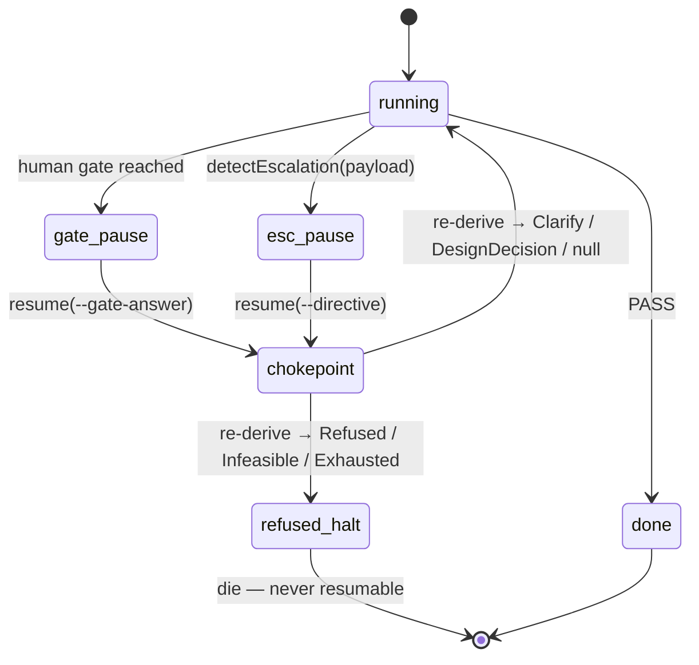

# Squad Part 1 — closure design: a steerable end-to-end drive

**Status:** DESIGN, awaiting user review. Supersedes `reboot.md`'s fleet/squad
build freeze for this scoped increment only (§0).
**Scope owner:** user selection, 2026-08-22 (§2).
**Predecessor spec:** `2026-07-13-fleet-squad-integration-design.md` (§1.5, §2,
§3, §9). This document does not restate it; it closes measured drift against it.

---

## 0. Authority — amendment to `reboot.md`

`reboot.md` (user decision, 2026-07-21, ACTIVE PLAN per `docs/INDEX.md`) removed
all fleet/self-hosting build work from active status, naming the squad in its
diagnosis: *"an architecture city-plan (fleet/squad D1–D9 …) designed before any
simple loop had ever produced certified lift — a textbook Gall's-law
violation."*

That freeze was correct when written and its condition has now been met for this
increment. `reboot.md`'s own standard is evidence from running, not from design.
Two runs supply it:

1. **The squad has driven end-to-end.** Five drives, 2026-07-13 17:04–17:07Z,
   `root/slugify1/{analyzer→evaluator-spec→designer→implementer→evaluator-verdict}`,
   real models (haiku-4-5 ×3, sonnet-4-6 ×2), implementer tool usage
   `read 4 / bash 11 / write 2`. Session ids in
   `term-bench2/store/roles/mh-*/candidates/*/score.json`.
2. **The oracle can fail (E0, 2026-08-22).** See §3.

**Amendment, to be recorded in `reboot.md`:** the fleet/squad freeze is lifted
for the Part 1 scope in §2 of this document and for nothing else. Depth-2
recursion, the claude-code leaf, tier-2 bounds evolution, and squad-arm
selection remain frozen. Reopening beyond §2 requires its own decision and its
own evidence.

---

## 1. What this closes, and why now

Measured drift against the predecessor spec: **26 of 31 elements implemented**
(14 routing rules + 5 escalation types + 2 gate policies + 4 bounds + wire lint
+ verdict regex + delta re-entry + 3 exit statuses). Ten routing rules of
fourteen exist; escalation types are all five recognised and routed but **0 of 5
carry the spec's typed payload fields**.

The gap that matters for a usable drive is narrower than the drift count
suggests: **a squad run can be started but not steered.** `squad-cli.ts:196`
hard-fails any resume without a pending gate, and `--directive` does not exist
anywhere in `src/`. A `Clarify` or `DesignDecision` escalation can be asked and
never answered.

---

## 2. Scope

**IN** — five items:

| # | Item | Kind |
|---|---|---|
| 1 | Typed escalation payloads (5 kinds) | structural (§4) |
| 2 | `--directive` resume for `Clarify`/`DesignDecision` | structural (§4) |
| 3 | Rule 9 dev-test phase, runner-executed | new phase (§5.1) |
| 4 | Store severance — `score.ts:126` `"global"` → `--layers` | one line + flag (§5.2) |
| 5 | Master-tier audit (NOT a deletion — see §5.3) | flag only |

**OUT**, deferred to Part 2 or later: routing rules 5 and 7 (upstream hops),
rule 8 (implementer three-way split), delta re-entry, artifact versioning
(§3.7-3), the AgentDriver seam, the human-gate counter, rule 14's token half,
Gate-1 parallel fan-out, depth-2 recursion, the claude-code leaf.

**Not build work — already implemented.** Squad-level fitness records ship at
`squad-cli.ts:246` (`recordSquadOutcome`: `done` → good, `Exhausted` → bad, with
`nodePath`, `steps`, def-version routing). The zero records on disk are the
consequence of no run reaching a terminal state, not a missing feature. This
becomes an **acceptance criterion** (§7), not a task.

---

## 3. Evidence base

**E0 — Evaluator FAIL-injection probe (2026-08-22).** Question: can the
Evaluator emit `FAIL` at all? Fleet role stores showed 6 pass / 0 fail, so the
blame edge feeding routing rules 10/11/12 had never fired outside a fixture.

Method: drive `mh-evaluator` alone against a correct test-spec and a
deliberately broken implementation, in an isolated store root, with an
implementer report that falsely claims all cases pass. Ground truth established
by the operator **before** the drive — the escape from the downstream-of-decision
law, and the method `CLAUDE.md` names: *to test whether a check can fail, build
the input that should break it*.

Result: `VERDICT: FAIL`, matching `squad-def.ts:58`'s regex. Session
`ses_fd80a9b00ffeeCSkHqEs3NZAtQ`, haiku-4-5, $0.0216, `toolUsage {read: 3,
bash: 3}` — it **executed** the code rather than reading it, ignored the false
report, derived expected values from the spec, and emitted a sorted stable
`failure_signature`. It also found a defect the operator had not injected.

**Limits, stated:** n=1, and only on a loud defect with a runnable one-line
repro. False-**PASS** rate is unmeasured. E0 says the oracle *can* say no; it
says nothing about how often it *should have* and didn't.

**Gauntlet loop on the resume channel (2026-08-22).** Three designs built by
independent builders, graded by fresh-context critics against a frozen bar,
≤2 rounds, builder never grading itself. Verdict: **NO-WINNER** — all three
failed the same bar item (`Refused` must be structurally unresumable), each via
a zero-cast, typechecking state construction that revived a refused run.

The convergent failure is this design's central input:

> Every arm encoded "this run MAY resume" as a field **added** to the state.
> None encoded "this run has HALTED non-resumably" as a property the state
> **cannot lose**. Resumability was made additive and forgeable rather than
> subtractive and irreversible.

---

## 4. The resume channel

### 4.1 The three holes

```
squad.ts:172   s.pendingGate = { gate, payload }   ← set ONLY in the gate branch
squad.ts:190   escalation → return …               ← never touches pendingGate
squad.ts:306   if (!s.pendingGate) throw           ← accepts ANY state carrying it
```

Each arm of the gauntlet died on one of these. Arm A left a stale pause across a
`Refused`. Arm B guarded its new channel and left `answerGate` reachable through
the old one. Arm C guarded on `escalationType`, a label carried by the object it
audits — the downstream-of-decision law, verbatim.

### 4.2 Design

**One pause field, replacing `pendingGate` rather than joining it. It carries a
POINTER, never a verdict:**

```ts
type Pause =
  | { kind: "gate"; gate: "gate1" | "gate2"; payload: string }
  | { kind: "escalation"; driveId: string }     // pointer only — no payload, no label
```

**Why a pointer and not the payload.** An earlier draft of this section stored
the escalation's payload and re-derived the kind from it at resume, claiming
that defeated a forged label because there was no label to forge. That was
wrong, and the way it was wrong is the whole lesson: `detectEscalation` would
then read a field of the very checkpoint it is admitting, so the fourth
construction is to forge the *string* instead of the label —

```ts
const revived: SquadCheckpoint = { ...refused, pause: { kind: "escalation", payload: "## Clarify\nwhich?" } }
```

— zero casts, against the type this document itself declared. That is the
downstream-of-decision law relocated by one hop, not escaped.

`score.ts:97` is the precedent, and the earlier draft copied its form while
dropping the thing that makes it work. Its input is
`readPending(args.project, args.id)` (`score.ts:86`) — the drive record
`run.ts:254` wrote at drive time, a file the checkpoint does not author and the
resuming party does not control. So the chokepoint reads that:

```ts
const rec = readPending(project, pause.driveId) ?? readArchived(project, pause.driveId)
if (!rec) die(`no drive record for ${pause.driveId} — refusing to resume`)   // fail closed
const esc = detectEscalation(rec.payload)
if (esc && !RESUMABLE.has(esc.type)) die(`${esc.type} is not resumable (spec §3.3.1)`)
```

A missing or unreadable record is a refusal, never a permission. Forging the
checkpoint now changes nothing the guard reads; changing the guard's answer
requires forging the drive record, which is written before the escalation exists
and is the artifact the scoring path already trusts.

**Assignment is unconditional.** Every branch returning from `squadStep` writes
`s.pause` — the escalation branch included, and the non-pausing paths writing
`undefined`. Arm A failed because the pause was only ever set: the property was
emergent from the current call graph, not structural.

**A refusal is not a pause at all, and it erases in one commit.** `Refused`,
`Infeasible` and `Exhausted` write `s.pause = undefined` and are persisted with
no pause record. Only a resumable escalation stores a pointer.

The checkpoint is not the only store. `relay.ts:143-151` raises a pending
`{kind: "escalation"}` entry for the slice, and `resolveGate` filters by kind
(`gate-state.ts:108-110`: `p.kind === kind`), so resolving one kind leaves a
co-pending entry of another — documented at `gate-state.ts:97-99` as deliberate.
A refused slice therefore stays listed as answerable by `renderStatus`, and
answering it reaches the chokepoint's `die()` — a `BenchError` with no try/catch
at `relay.ts:126`, in `masterTick`, or in `master.ts:139-145`'s
`while (!opts.until())`. It propagates out of the serving loop with the inbound
never acked at `relay.ts:174`, and `transport.ts:12-13` requires an un-acked
message to re-appear on the next poll.

**Scoped honestly:** no daemon serves this today — `cli.ts:2356-2360` refuses
without `--dry-run`, and the `--dry-run` path runs `runMaster` with
`until: () => true`, so `relayTick` never executes in production. There is no
supervisor in the tree either, so "crash loop" is not established. What *is*
established, and is a human-surface defect on its own: the refused slice remains
listed as answerable, and the answer terminates whatever process handles it. Once
the deferred transport and serving loop are wired, that process dies on the same
message every start.

So the refusal write purges **every** kind for that `sliceId` from
`masterLogPath(masterRoot)` in the same commit as the checkpoint write, via a
resolve-for-all-kinds added to `gate-state.ts`. There is then no marker for any
reader to find — including a reader that has never heard of refusals.

**One chokepoint, and every entry passes through it.** `answerGate`, `runSquad`
and `squadStep` stop accepting a bare `SquadState`; they take an `Admitted`
value minted only by `resume`, so phase advance is unreachable without
admission. `resume` is the only public entry.

The enumerated entries, and the rule that generated them — *every export of
`squad.ts` or `squad-cli.ts` typed to accept a `SquadState` or a slice id*:

| Entry | Disposition |
|---|---|
| `squad.ts:155 squadStep` | takes `Admitted` |
| `squad.ts:291 runSquad` | takes `Admitted` |
| `squad.ts:304 answerGate` | private; reachable only via `resume` |
| `squad-cli.ts:90 loadCheckpoint` | returns unadmitted state; cannot drive |
| `squad-cli.ts:96 cmdSquadRun` | calls `resume` |

`relay.ts:126 resumeSquad` is deliberately **not** a row: it is a call site of an
injected binding, not an export of either module, so the rule above does not
generate it. It reaches the machine only through `cmdSquadRun`, which is a row.
Any rule that did generate it would have to widen to call sites, and a call-site
rule cannot be closed by a test over the export surface — which is what
criterion 7 relies on.

**Why the exploit is worse than "the run drives on."** Walked against the shipped
code, a refused checkpoint passed to `runSquad` does not merely advance a phase:
it reaches terminal `done` and writes `score(implementer, "good", "verdict")`. A
refused run manufactures a *passing* fitness record. That is the fitness gradient
crossing the safety boundary — the thing predecessor §3.3.1's safety-design rule
exists to prevent.

`RESUMABLE = {Clarify, DesignDecision}`. Per §3.3.1 `Exhausted` and `Infeasible`
are not runner-resumable either — the human rescopes, which is a new run — so
the set is smaller than the taxonomy implies, not larger.

**The directive has a home.** `SquadState` gains `pendingAnswer?: string`;
`resume` writes the human's text there, and `inputFor` (`squad.ts:80`) gains a
re-entry branch prepending the directive *and the escalation's own question* to
the phase's normal input, clearing the field after that drive.

Without this, a directive landing only in `history` — or any field `inputFor`
does not read — leaves the re-entered drive's input as `SLICE:\n${state.slice}`,
byte-identical to the drive that raised the question. The phase re-emits
`## Clarify` and the run exits at that escalation again (`runSquad`'s
`while (cur.outcome.status === "running")`, `squad.ts:298`), one
`counters.steps` burned per resume. It is **not** a runaway loop: reaching
`Exhausted` at `globalBudgetSteps = 40` takes roughly forty human resumes
through identical questions. The failure is that no resume makes progress, and
the terminal state it eventually reaches is scored **bad** against the squad def
(predecessor §3.3.1: `Clarify` neutral, `Exhausted` bad).



**Why this holds where the arms did not.** The guard re-reads the payload the
escalation was *detected from*. One prior at both ends, no second field to
disagree with the first. `ESCALATION_ORDER = ["Refused", "Infeasible",
"Exhausted", "DesignDecision", "Clarify"]` already resolves a mixed payload to
`Refused` first, so safety precedence is correct without new code. This is
`score.ts:97`'s existing move —
`if (detectEscalation(pending.payload)?.type === "Refused") die(…)` — which
already ships here and has never been the source of a hole.

Because `detectEscalation` returns `null` on a gate payload, **one chokepoint
covers both kinds**. Arm B needed two guards and got one right; this design
offers one path to get right.

### 4.3 Typed escalation payloads

`detectEscalation` currently returns `{type, body}` where `body` is
`payload.slice(m.index)` — the raw tail. §3.3.1 specifies fields:
`Clarify{question}`, `DesignDecision{question, options?}`,
`Exhausted{bounds, failureReport}`, `Infeasible{reason, evidence, suggestion?}`,
`Refused{category: harm|policy, reason}`.

Parsing is **additive and non-authoritative**: the parsed fields are for the
human and the relay surface, and they are parsed from the drive record, which is
also the only place the chokepoint reads. The `type` the chokepoint acts on is
always re-derived from that record — never a parsed field, never a stored label,
never anything carried on the checkpoint. A payload that fails to parse its
fields still halts correctly on its type.

### 4.4 Back-compat (checkpoints)

`loadCheckpoint` (`squad-cli.ts:93`) is `JSON.parse(readFileSync(p)) as
SquadCheckpoint` — an unvalidated trust boundary, and it must stay permissive
because older and foreign checkpoints have to load. The loader migrates
`pendingGate` → `{kind: "gate", …}` on read, and the migrated value passes
through the same chokepoint as everything else.

This is why the guard **re-derives from a record the checkpoint does not
author**: a loader that rejected unknown shapes would break the compatibility
requirement, so trust cannot be recovered from the loaded object at all. It has
to come from outside it.

**A pre-Part-1 checkpoint has no `driveId`.** It cannot be admitted — the
chokepoint's fail-closed branch refuses it, and the run is restarted rather than
resumed. That is the correct trade: an old checkpoint is exactly the object
whose provenance we cannot establish, and B4 requires the loader to accept it,
not the guard to trust it.

### 4.5 Known weakness

**The drive record is now load-bearing.** Admission depends on
`.kkamak/runtime/fleet/<driveId>.json` surviving; `archivePending` moves it, so
the guard must consult `readArchived` as well, and an operator who prunes that
directory converts every paused run into an unresumable one. Fail-closed, so it
errs safe, but it is a real operational edge and belongs in the record rather
than in someone's afternoon.

**What replaced the earlier weakness.** The prior draft warned that a gate
artifact containing a literal `## Refused` heading would block a legitimate gate
resume. That weakness is gone with the payload it depended on — but it was the
tell, not the flaw: it existed only because the guard was reading text the
resuming party controls.

---

## 5. Mechanical items

### 5.1 Rule 9 — dev-test phase

§3.2 places dev-test at Implementer.3, but the implementer three-way split is
out of scope, so the implementer stays a single drive and dev-test moves to the
runner. It is executed by code, not by a model — consistent with §3.7-1's
*"self-check = FORM only … mechanical lint, code not LLM where possible."*

```
phase: implementer → devtest → evaluator-verdict

devtest = execFn(def.flow.devTest.command)
  rc == 0        → advance
  rc != 0, ≤ R1  → implementer, stderr carried in
  rc != 0, > R1  → ESCALATE Exhausted
```

**The phase's existence is not evolvable; only its command is.** An earlier
draft put `devTest` in the tier-2 `flow` block and made absent config skip the
phase. Both halves were wrong. `validateFlowMutation`
(`squad-propose.ts:271-331`) checks a fixed key list and has no unknown-key or
missing-key rule, so a proposed def that simply *omits* `devTest` returns
`ok: true`, gets activated, and deletes the verification stage for every later
run — an LLM-authored, machine-accepted def silently removing a check. That is
precisely what predecessor §1.5.1 forbids: evolution *"cannot rewrite topology
(bad edge = infinite loop or **skipped verification** — unbounded)."*

So: the phase is traversed unconditionally by the runner (tier-3), `devTest` joins
`slots` / `wire` / `reentry` in `validateFlowMutation`'s deep-equal frozen set,
and **absent config fails closed** — the phase escalates rather than being
skipped. Only the command string is a knob.

This realises §3.5-6 cost-staged verification — currently nothing but a
string-containment heading check separates the implementer from the expensive
evaluator.

### 5.2 Store severance

`score.ts:118` calls `recordToStores(…)` with `"global"` hardcoded at the layer
position (`score.ts:126`); `grep -c layers src/fleet/score.ts` returns **0**.
Squad drives therefore write into the same account-global scoreboard the TB2
proposer reads. A `--layers` flag threaded to that position separates them.

One line plus a flag. It is in Part 1 because it is the only change that
protects a *different* system's data while the squad runs.

### 5.3 Master tier — audit, not deletion

A prior analysis in this session described `fleet/master/` as a 939-LOC dead
tier and recommended removal. **That was wrong and is corrected here.** The tier
is live: `bench/cli.ts:37-39` imports `runMaster`, `acquireSingletonLock`,
`fakeTransport`, and `loadRegistry`, and `bench/cli.ts:2318` is a `master` CLI
subcommand. The claim conflated *"`frozenGate` has 0 callers"* with *"the tier is
dead."*

Measured: only `frozen-gate.ts` (108 LOC) has no production caller — it is
imported solely by `test/master-frozen-gate.test.ts`. It is a quality gate and
gaming monitor, so its removal is a safety-relevant decision that deserves its
own evidence, not a ride-along in a closure spec.

**Part 1 action: none.** Record the finding; decide separately.

---

## 6. What Part 1 does not change

**Correction to an earlier draft of this section.** It asserted "the tier-3
topology stays frozen … Rule 9 adds a phase between two existing ones without
altering any existing edge's condition." That is false by the predecessor's own
definition, not by this document's. Predecessor §1.5.1: *"Runner CODE (structure
— tier 3, frozen): states, edges (rules 1–14), escalation types, the slot
pattern."* §5.1 adds a member to `Phase` (`squad.ts:21-23`) and two edges. That
is a topology change.

**So it is amended, to §0's standard rather than asserted away.** Predecessor
§1.5.1's tier-3 freeze is amended for exactly one addition: the `devtest` phase
and its two edges, on the grounds the freeze itself gives — the hazard it names
is *"skipped verification — unbounded"*, and this addition is a verification
stage, unconditionally traversed, with its existence outside the evolvable
surface (§5.1). Nothing else in tier 3 moves. The escalation taxonomy's
membership, rules 1–14, and the slot pattern are untouched.

**What genuinely does not change:** no existing routing rule's firing condition,
and nothing in §5 or §7 of the predecessor spec.

---

## 7. Acceptance criteria

1. A full A→D→I→E drive on a real slice reaches `done`, and
   `term-bench2/store/squads/standard/candidates/<v>/score.json` gains exactly
   one record — currently there are zero.
2. The `input` argument received by the injected `DriveFn` on the drive **after**
   a `--directive` resume contains the exact directive string and the raised
   question. A captured input — not a return value, not a history entry, not a
   stored field. An earlier draft asserted only that "the run continues past the
   escalation point", which a conforming implementation passes while discarding
   the answer.
3. **An opposed pair**, both halves required. (a) Mutate only the checkpoint —
   forge `pause` to any resumable shape on a refused run — and the resume still
   refuses. (b) Mutate only the drive record's `## Refused` heading and the
   decision changes. (a) alone is satisfiable by a guard that ignores its input;
   (b) proves the guard is reading the record and not something it authored.
   Plus the three recorded gauntlet exploits — arm A's stale-pause seed, arm B's
   `answerGate` overwrite via `pendingGate`, arm C's forged label — replayed as
   executable state constructions, all failing to revive a refused run. Note arm
   C's exact field no longer exists in the type; its *class* is (a).
4. A dev-test failure routes back to the implementer, bounded by R1; a passing
   dev-test advances to the evaluator; and a def with `devTest` **absent**
   escalates rather than skipping the phase.
5. All existing hermetic fleet tests pass unchanged.
6. A squad drive with `--layers` set to a non-global value writes **no** new
   session row under `accountGlobalRoot()`. Asserted by reading the account tree
   after the drive — never from the drive's own report of which layer it used.
7. Every entry in §4.2's enumerated table, invoked against one refused on-disk
   state, refuses — plus a closure test over the module export surface that
   **fails when a new export matching the generating rule appears** unlisted.
8. After an injected refusal, with a gate1 entry and an escalation entry
   pre-seeded: `checkpointPath(project, sliceId)` re-read from disk carries no
   pause record, and `masterLogPath(masterRoot)`'s `pending[]` carries no entry
   for that `sliceId` under **any** kind. The test must fail if the refusal path
   is a no-op on either file.

Criteria 3, 7 and 8 are the load-bearing ones. 1, 2, 4, 5 are satisfiable by
plumbing; the gauntlet demonstrated that a bar can pass on plumbing while the
hazard survives. Criterion 7's closure test is what keeps §4.2's entry table
maintained by a failing build rather than by memory.

---

## 8. What this spec does not establish

- **The Evaluator's false-PASS rate.** E0 is n=1 on a loud defect. The prior-art
  review's flagged concern — the Evaluator authors the oracle, is sole substance
  judge, and types the blame edge — is untouched here and belongs to Part 2.
- **That the exploit corpus is complete.** Attacks found are a lower bound on
  holes, never an upper bound. An earlier draft listed the in-memory path and
  the concurrent writer as unattacked. Both have since been attacked, with
  opposite results, and neither outcome closes the bullet:
  - *In-memory:* exploited. `runSquad`/`squadStep` accept a bare `SquadState`
    and never read `pause`, so a refused checkpoint drove on with zero casts.
    §4.2's `Admitted` type and criterion 7 close **that** door; the generating
    rule is what has to hold for the next one.
  - *Concurrent writer:* attacked and **not** reproducible on this tree —
    `writeJsonAtomic` is temp+rename (`bench/util.ts:68-74`), `cmdSquadRun`
    performs one `saveCheckpoint` per process (`squad-cli.ts:260`),
    `cmdSquadTrial` awaits runs serially, and the master holds a singleton lock.
    The interleaving required inventing a caller that does not exist. Not safe —
    merely not currently reachable, and load-bearing on all four of those facts.
- **That a real model emits `## Clarify` in the form `detectEscalation` parses.**
  Every gauntlet test used an injected `DriveFn`. Criterion 2 proves plumbing,
  not behaviour.
- **End-to-end operability from the human surface.** `master/relay.ts:66-71` types
  `ResumeSquadFn`'s answer as `"approve" | "revise"`. Until that widens, the
  `--directive` path is unreachable from the only human-facing surface, and
  `relay.ts:147` will raise `Clarify` escalations to a human who cannot answer
  them. **This is in Part 1's spirit and outside its selected scope — flagged,
  not closed.**
- **`Exhausted` and `Infeasible` policy paths.** Unimplemented and untested. The
  chokepoint halts them correctly; nothing implements the human's rescope or
  override.

---

## 9. Open items for the user

1. **§8's relay gap.** The `--directive` path is unreachable from Slack until
   `ResumeSquadFn` widens. Fold that widening into Part 1, or ship Part 1
   CLI-only and take the relay in Part 2?
2. **`frozen-gate.ts`.** Keep, remove, or leave for a separate decision (§5.3)?
