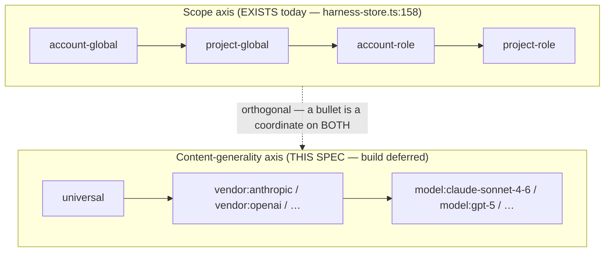
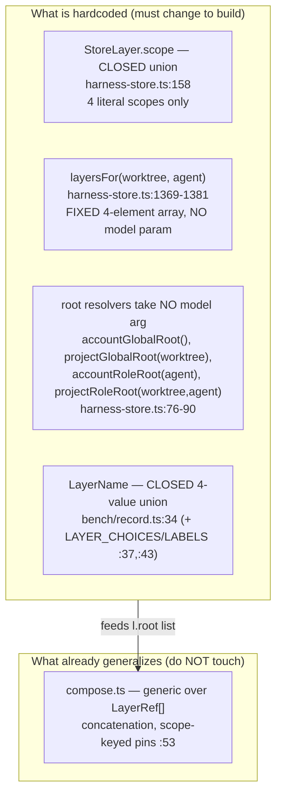

# Target-model / content-generality axis — design SPEC (build deferred)

> **Status: SPEC ONLY.** Nothing in this document is built. No store change, no
> code change, no schema change ships with it. The deliverable is the design +
> a deferral registered in [explicitly-not-now.md](explicitly-not-now.md) §2.4.
> Build is gated on the triggers in that register entry (Gall's law: the simple
> single-model loop must work first).
>
> Companion reading, in order: the mining corpus that motivates the axis
> ([external-prompts-cc-opencode.md](external-prompts-cc-opencode.md)); the
> constraint that pins already-existing model fields
> ([capability-envelope.md](capability-envelope.md) §0, esp. "The fixed
> multiplier is co-adapted to the CURRENT base model"); the merge mechanisms in
> `opencode-plugin/src/compose.ts` and `opencode-plugin/src/harness-store.ts`.

## 0. Why this axis exists

opencode ships **ten per-provider base prompts** that share a common behavioral
base but diverge per vendor/model (`external-prompts-cc-opencode.md`, "the
single most useful signal is opencode's cross-provider diff"). That divergence
is empirical proof that some behavioral rules only earn their place for one
model family — a rule that compensates GPT-5's premature termination, or
Trinity's unreliable batched tool calls, is dead weight or worse on a model
that does not have that failure mode.

Our playbook is currently **model-agnostic**: every account-global bullet is
injected for every model the driver happens to run. The mining doc already
tagged its 22-bullet seed corpus on a target-model axis (UNIVERSAL:17,
VENDOR:2, MODEL:3) precisely because the store has nowhere to *put* that tag
today. Without the axis, a candidate that is gated as helpful on the one model
`ab` happens to run (`anthropic/claude-sonnet-4-6`, cmd-ab.ts:106) is injected
blindly onto every other model — it can silently regress a model that was never
in the evaluation. **This spec designs the missing dimension.**

## 1. Name and disambiguation

The axis is the **target-model / content-generality axis**. It is a property of
**playbook content** (a bullet, a system.md region): *for which slice of the
model population does this rule earn its place?*

It is **explicitly NOT "model"** — that word is already taken, three times over,
by *pinned-assignment* fields that answer a completely different question
("which model executes this slot?"):

| Existing `model` field | Location (verified) | What it pins |
|---|---|---|
| `SlotBinding.model` | `opencode-plugin/src/fleet/squad-def.ts:12`, values at `:31-34` | which model runs each squad slot (analyzer=haiku, designer/implementer=sonnet, evaluator=haiku) |
| `RoleSpec.model` | `opencode-plugin/src/fleet/roles.ts:17` | the fleet role manifest's default model per role |
| `MhConfig.proposerModel` | `opencode-plugin/src/harness-store.ts:236` | the pinned strong model that runs the proposer/curator (STOP guard) |

Those fields select an **executor**. The content-generality axis selects an
**audience for a rule**. They are different levers and must never be conflated
in naming, schema, or discussion.

**Crucially — capability-envelope.md's finding applies here in so many words:**
the squad-structure model pins (`SlotBinding.model`, `RoleSpec.model`) are part
of *the fixed inner-loop multiplier that is co-adapted to the current base
model and frozen from evolution* (capability-envelope.md §0: "The fixed
multiplier is co-adapted to the CURRENT base model … because the structural
tier is frozen from evolution it CANNOT re-adapt"). Those pins are a **different,
frozen lever**. The content-generality axis is a **new, evolvable content
dimension** — it does not touch, thaw, or re-open the frozen structural pins. A
bullet tagged `model:X` changes *what guidance model X receives*, never *which
model runs where*. Anyone reading this spec must come away certain the two are
orthogonal mechanisms that happen to share the English word "model".

## 2. The axis and the coordinate space

Content-generality is a three-level ordering from most-general to most-specific:

```
universal  →  vendor  →  model
(all models)  (a family:  (one model id:
              anthropic,   claude-sonnet-4-6,
              openai, …)   gpt-5, trinity, …)
```

This is **orthogonal to the existing scope axis** the store already has —
`global → role` (and its account/project cross-cut). The scope axis answers
*"which agent role does this rule apply to?"*; the content-generality axis
answers *"which model population does this rule apply to?"*. A bullet's home is
therefore a **coordinate on both axes at once**, not a single tag.



### 2.1 The coordinate space (scope × generality)

Every playbook bullet lands in one cell:

| scope ↓ / generality → | **universal** | **vendor** | **model** |
|---|---|---|---|
| **account-global** | today's whole playbook lives here | new | new |
| **project-global** | (as today) | new | new |
| **account-role** | (as today) | new | new |
| **project-role** | (as today) | new | new |

Only the **universal** column exists today (it *is* the current 4-layer store).
The vendor and model columns are the additive extension. Up to
**4 scopes × 3 generality levels = 12 coordinates** in principle; §5 handles the
budget consequence.

### 2.2 Populating from the seed corpus (day-one occupants)

The mining corpus already supplies the first population — its tags map directly
onto coordinates (all seed bullets are account-global scope, so they populate
the top row):

| Seed bullet (abbrev.) | corpus tag | coordinate |
|---|---|---|
| "Read the exact file before editing it…" | UNIVERSAL | account-global × universal |
| "Lead with the answer, then the reasoning…" | UNIVERSAL | account-global × universal |
| "Prioritize technical accuracy over validating the user's beliefs…" | VENDOR: Anthropic+Meta | account-global × vendor:anthropic *(also Meta lineage — see §2.3)* |
| "For dual-use/security requests, draw the line by context of use…" | VENDOR: Anthropic (safety-owned) | account-global × vendor:anthropic |
| "Persist until the task is fully handled end-to-end…" | MODEL: GPT-5 | account-global × model:gpt-5 |
| "If batched tool results prove unreliable, fall back to one call per message" | MODEL: Trinity-class | account-global × model:trinity |
| "Before using a third-party API, verify current usage against docs…" | MODEL: GPT-4.1/o1/o3 "Beast" | account-global × model:beast-class |

The 17 UNIVERSAL bullets stay in the column the store already supports; the 2
VENDOR and 3 MODEL bullets are the ones the store has **nowhere to put today** —
they are the concrete motivation for building the axis.

### 2.3 One-family-per-coordinate rule (a decided edge case)

A tag like "Anthropic + Meta lineage" spans two vendor families. The axis does
**not** support set-valued vendor coordinates (that is a query-language creep we
reject up front). Such a bullet either (a) sits at `universal` if it genuinely
helps both and harms neither, or (b) is **duplicated** into
`vendor:anthropic` and `vendor:meta` — two bullets, two coordinates, each
independently gate-evolvable. Duplication is cheap and keeps every coordinate a
single scope key (§4). This keeps the resolver a flat lookup, not a matcher.

## 3. THE core design decision — additive, not override

This is the decision a reviewer must be able to read back verbatim.

### 3.1 The two existing merge mechanisms (the tension)

The store today merges layers by **two different mechanisms**, and the axis
must pick which one it extends:

- **Concatenation (additive)** — system.md/tools.md/playbook text.
  `compose.ts` reads each non-empty layer and *pushes* it onto a block list:
  `renderSystemBlocks` (compose.ts:69-80) appends every layer's non-empty
  system text in order, then one combined tool-guidance block; the bench
  variant `renderAgentsMd` (compose.ts:93-103) does the same with labels. There
  is **no replacement** — a more-specific layer can only *add* text after a
  more-general layer. This is pure concatenation over `LayerRef[]`
  (`composeHarness`, compose.ts:51-58).
- **Whole-artifact override** — agent-config.json / env-policy.json.
  `composeAgentConfig` (harness-store.ts:837-846) and `composeEnvPolicy`
  (harness-store.ts:924-933) walk the layer roots and the **most-specific layer
  that has an artifact wins outright — no field-level merging**. A
  project-role env-policy *replaces* the account-global one entirely.

The tension: a model-specific rule that needs to *replace* a universal default
(e.g. Trinity's "one tool call per message" is the **direct inverse** of the
base parallel-tools rule — corpus bullet, tagged MODEL:Trinity) reads like it
wants **override** semantics. But override is the mechanism playbook content
does **not** use today, and introducing it for content is a materially new
capability with its own blast radius (a model:X bullet silently cancelling a
universal bullet is exactly the kind of hard-to-review action the whole project
defers).

### 3.2 The decision: **additive-only for v1**

**A model/vendor bullet REFINES or ADDS; it never contradicts or cancels a
more-general bullet. Replacement semantics are explicitly forbidden in v1 and
deferred.** The axis extends the *concatenation* mechanism (compose.ts), not the
override mechanism (composeAgentConfig/composeEnvPolicy). Injection order is
general → specific: `universal` blocks, then the matching `vendor` blocks, then
the matching `model` blocks — all concatenated, none removed.

### 3.3 The consequence (spelled out, as mandated)

- A `model:X` bullet **can never cancel** a `universal` bullet. Both are
  injected; the model reads both.
- **If a universal bullet actively harms model X, the fix is NOT an override.**
  The fix is **demote-the-universal through the normal gate**: the proposer
  proposes deleting/narrowing the universal bullet (or moving its content down
  to the vendor/model coordinates where it *does* help), and that change is
  gated like any other. The universal bullet does not get silently masked for
  one model — it gets *removed from the universal coordinate on the evidence*.
- Trinity's "one call per message" inverse: under additive-only, both the base
  parallel-tools rule and the Trinity sequential-fallback bullet are present for
  Trinity. This is **tolerated as a known v1 limitation**, not solved. The
  base parallel-tools rule lives in the *driver's own base prompt* (mining doc:
  "Dropped as already-in-base"), which the playbook layers onto and cannot
  delete — so there is nothing in *our* store to override anyway. The Trinity
  bullet's job is to add a fallback instruction; whether the model obeys the
  more-specific instruction is a model-behavior question, not a store-merge
  question. If measurement later shows additive-only is insufficient for a real
  contradiction *inside our store*, that reopens the override deferral (§6 /
  register §2.4) — with evidence, not speculatively.

Additive-only is the Gall's-law choice: it reuses the one merge mechanism the
store already has (concatenation), adds zero new masking/precedence logic, and
keeps every coordinate independently gate-evolvable.

## 4. Extension points (the build-later map)

The hardcoding that blocks the axis is **NOT in compose.ts** — that file is
already generic over `LayerRef[]`/`ComposedLayer[]` and would concatenate a
5th, 6th, or Nth layer without modification (compose.ts:51-58, 69-80). The
hardcoding lives in **harness-store.ts** (the layer-stack builder) and
**record.ts** (the bench mirror):



The build (deferred) is:

1. **Open the scope union / add generality-keyed scope keys.** New coordinates
   need **unique scope keys** so pins (`compose.ts:53`, keyed by `scope`) and
   score routing stay unambiguous. Recommended key shape:
   `account-vendor:anthropic`, `account-model:gpt-5`, `role-vendor:openai:designer`,
   etc. — a coordinate encoded into the existing string scope key, so
   `StoreLayer.scope` widens from a closed union to a validated pattern (or a
   larger closed union enumerated from the live model set).
2. **Thread a `model` parameter through `layersFor`.** Today
   `layersFor(worktree, agent)` returns a fixed 4-element array with no model
   input (harness-store.ts:1369). The axis needs `layersFor(worktree, agent,
   model)` so it can append the vendor/model coordinates that match the model
   being run. The returned array grows from 4 to *4 + (matching vendor layers) +
   (matching model layers)*, still ordered general→specific so concatenation
   order is correct.
3. **New root helpers.** Add `accountVendorRoot(vendor)`,
   `accountModelRoot(modelId)`, and role variants — parallel to the existing
   `accountGlobalRoot()/accountRoleRoot(agent)` family (harness-store.ts:76-90),
   which currently take no model/vendor argument.
4. **Mirror the closed `LayerName` union in bench/record.ts:34** (and
   `LAYER_CHOICES`:37 / `LAYER_LABELS`:43) so bench AGENTS.md assembly and
   `ab --layer` accept the new coordinates.

**Sparse / opt-in is the load-bearing property.** A coordinate that has no
store directory reads as empty and is **skipped** — exactly the existing
behavior (`renderSystemBlocks` pushes only non-empty layers, compose.ts:71-72;
`composeAgentConfig` skips absent artifacts). So a model with no model-specific
bullets pays nothing: `layersFor` appends the coordinate, the resolver finds an
empty/absent store, and concatenation drops it. The axis is therefore
**additive at the storage layer too** — building it does not perturb any
existing universal-only store; those stores keep resolving byte-identically.

## 5. Curation and budget across the axis

Up to **12 concatenated coordinates** (4 scopes × 3 generality levels) is a real
bloat risk, and the playbook is precisely the **ACE anti-bloat mechanism** that
must answer it. The playbook is the authoritative artifact of which system.md is
a rendered view (harness-store.ts:664-668); its curator applies add/update/delete
ops (`applyPlaybookOps`, ~harness-store.ts:722) and its budget is measured by
`activeBulletCount` (harness-store.ts:762-765). The axis must say concretely how
that curation and budget span the new dimension.

**Decision: ONE global budget with coordinate-aware curation** (NOT per-coordinate
budgets).

- **Why not per-coordinate budgets.** The thing the user reads is the *total
  injected prompt for one (model, role) run* — the concatenation of every
  coordinate that resolves for that run. A per-coordinate cap (e.g. "≤5 bullets
  per cell") bounds each cell but not the sum: a model that matches
  universal + vendor + model coordinates could receive 3× the intended budget,
  which is exactly the bloat the ACE mechanism exists to prevent. Per-coordinate
  caps optimize the wrong quantity.
- **The global budget is on the RESOLVED SET.** The bullet-budget the curator
  enforces is the count of active bullets *that actually resolve together for a
  given (model, role)* — i.e. `activeBulletCount` summed over the coordinates
  `layersFor(worktree, agent, model)` returns, not over the whole 12-cell space.
  Two different models never co-inject their model-specific bullets, so the
  store can hold GPT-5 bullets *and* Trinity bullets without either counting
  against the other's budget. The budget bounds what any single run sees.
- **Coordinate-aware curation = generality is a tiebreak signal, not a new
  curator.** The curator already prunes helpful−harmful losers. Across the axis
  it gains one rule: **when a specific bullet is redundant with a more-general
  one, delete the specific (it adds nothing over the general); when a general
  bullet is a net loser but a specific refinement of it wins, that is the
  demote-the-universal path of §3.3 — narrow the general, keep the specific.**
  Curation reads the coordinate but does not fork into 12 independent curators.

This keeps the anti-bloat story a *single* budget over what a run actually sees,
with the new dimension informing curation rather than multiplying it.

## 6. Gate implication — the multi-model panel (explicitly deferred, not hand-waved)

**`ab` today is single-model and cannot honestly gate a "universal" candidate.**
`cmdAb` takes exactly **one** `--model` (cmd-ab.ts:106) and passes that same
model to **both arms** (arm A: runOneTask at cmd-ab.ts:316; arm B: cmd-ab.ts:318).
So a candidate is only ever measured against one model. Calling a candidate that
passed on `claude-sonnet-4-6` "universal" is an **unproven generalization** — it
was never seen by any other model.

Honestly gating the axis needs **two materially new mechanisms**, both deferred:

1. **An N-model panel** — run the `ab` pair across a panel of models
   (one per vendor/model coordinate the candidate claims to serve), not one.
   This is a new runner capability: `ab` must accept a model *set* and produce a
   per-model verdict. It does not exist.
2. **A decision-combination policy** over the panel's per-model verdicts. The
   three candidate policies:
   - **all-accept** (accept only if helpful on *every* panel model),
   - **majority** (accept on a majority of panel models),
   - **worst-case non-regression** (accept iff **no** panel model regresses,
     i.e. helpful-or-neutral everywhere).

   **Recommended policy: worst-case non-regression.** The entire reason the axis
   exists is that a universal bullet can *silently regress* an unmeasured model
   (§0). A gate that permits any regression re-admits that exact failure. A
   `universal` candidate must therefore be *helpful on its target and
   non-regressing on every panel model*; if it regresses one model, the honest
   outcome is to **narrow it to a vendor/model coordinate** (where it helped) —
   which is the additive-only demote path of §3.3, not an override. Majority and
   all-accept are named alternatives but rejected for v1: majority tolerates a
   known regression, and all-accept is too strict for a genuinely-universal rule
   that is merely neutral on some model.

State plainly: **`ab` as built does NOT cover this.** The multi-model panel +
worst-case-nonregression policy is a new mechanism, registered as deferred in
explicitly-not-now.md §2.4. Until it exists, any vendor/model bullet can only be
gated on a single matching model (which `ab` *can* do today — pass that model as
`--model`), and no candidate can be *proven* universal — it can only be *asserted*
universal from a single-model pass, which is the honesty gap the panel closes.

## 7. Incremental build recommendation (simplest first)

Per Gall's law, do **not** build the 12-cell space or the N-model panel first.
The simplest viable increment:

1. **Build `vendor` only, not `model`, first.** Vendor is the coarser, higher-
   population slice (an `anthropic` bullet serves every Anthropic model), so it
   pays off with the fewest coordinates and the seed corpus already has two
   ready occupants (the Anthropic objectivity + dual-use bullets). `model`-level
   coordinates wait until a `vendor` cell demonstrably needs splitting.
2. **Gate the build on two preconditions, both required:**
   - **loop-1 proves the single-model loop works** — i.e. account-global **v1**
     clears its `ab` verdict (the current standing blocker per
     `docs/loop-1-state.md` / `docs/resume.md`). Do not add a second axis before
     the first loop is shown to produce one accepted candidate.
   - **a real second primary-loop model exists** — a vendor axis with only one
     vendor in play is unfalsifiable bookkeeping (there is nothing for a
     `vendor:X` bullet to be *scoped away from*). The mining doc's own
     discipline applies: *measure what the loop discovers before hand-seeding;*
     do not populate vendor/model coordinates until a second model is actually
     being run and the divergence is observable.
3. **The seed corpus populates the axis on day one** — once built, the 2 VENDOR
   + 3 MODEL seed bullets move from "nowhere to put them" into their
   coordinates, and loop-1's discovered v1 playbook is diffed against the corpus
   (mining doc "Action"): bullets the loop found itself validate the loop;
   bullets it missed become seed candidates carrying their generality tag.

## 8. Acceptance self-check

The three questions a reviewer must answer from this spec alone:

- **Additive or override?** → §3.2: **additive-only for v1**; override forbidden
  and deferred; the fix for a harmful universal is demote-through-the-gate (§3.3).
- **How does curation span the axis?** → §5: **one global budget on the
  resolved set** (the coordinates that co-inject for a given model+role), with
  coordinate-aware curation (generality as a redundancy/tiebreak signal), **not**
  per-coordinate budgets.
- **What is the panel decision-policy?** → §6: an N-model panel (deferred) with
  **worst-case non-regression** as the recommended combination policy; `ab`
  today does not cover it.
